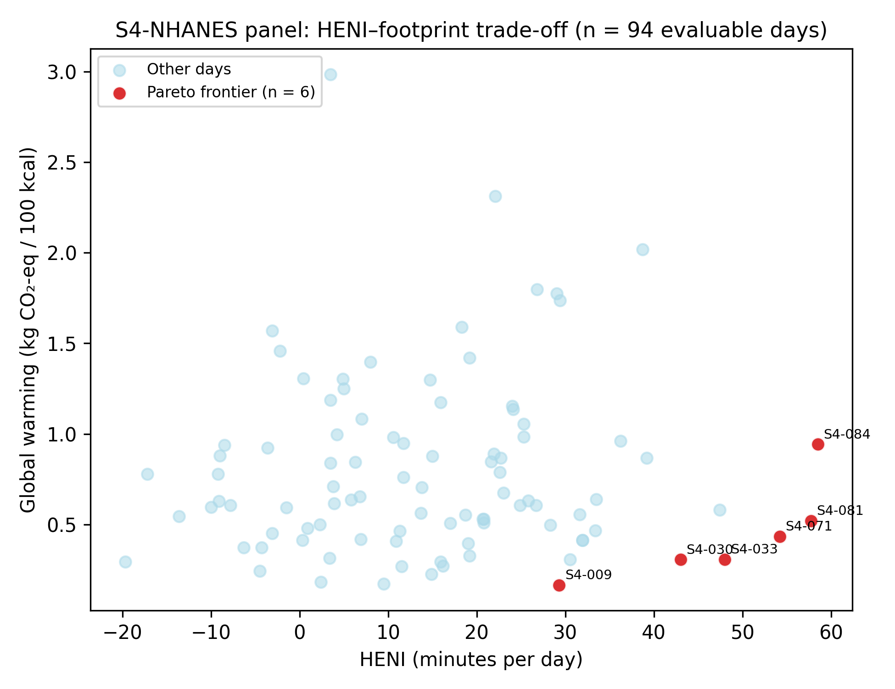
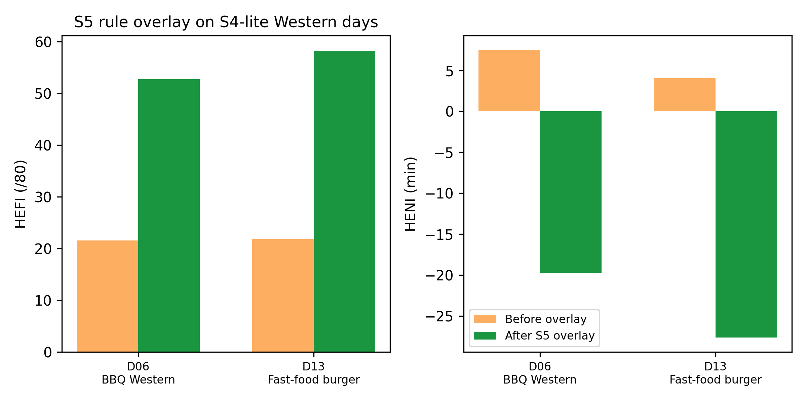

# From label to landscape: an open multi-indicator platform for scoring real diets across nutrition, disease burden, and environmental impact

**Target journal:** *Nature Food* (Springer Nature)
**Article type:** Article / Tools & Resources (open-source platform + Canadian case study)
**Manuscript status:** Working draft, retargeted 2026-05-28; Sections 4–5 populated (S4-NHANES, S4-lite, S5-subst, PKG-IMG-1); S3 Monte Carlo plus Sobol shipped 2026-05-30; full CCHS-RDC ingest deferred; the S1 dietitian-labelling track is retired in favour of substrate-level implementation regression because the CNF nutrient composition is itself the validated ground truth that the scoring kernels consume.

---

## Authors

Emmanuel Amankrah Kwofie¹, Ebenezer Miezah Kwofie¹\*

¹ Department of Bioresource Engineering, McGill University, Sainte-Anne-de-Bellevue, QC, Canada
\* Corresponding author: `dishdevinfo@gmail.com`

## Highlights

- Dominant validated instruments (Food Compass, HENI, HEFI-2019, HSR, ReCiPe) were never designed to run together from one intake record. **ecodish365** closes that integration gap on a single CNF–WAFCT substrate (1,028 West African foods): five peer-reviewed indicators on real packaged products, homemade meals, and full 24-hour recall days, with every score traceable to published factors.
- Prior food–environment NLP links product names to aggregate footprints (Krahmer, 2024) or single foods via curated descriptors with composite meals excluded (Furrer et al., 2024). We ship an open retrieve-rank matcher with confidence-scored fallback that links structured CNF entries, including composites, to ReCiPe 2016 inventories; AI handles linkage only (matcher ECE **0.098**, label OCR **88.2 %**, decomposer **99.2 %** pass, prep-state gates cutting cross-thermal swaps **15.2 → 0 %**). Scoring kernels stay deterministic.
- Multi-indicator structure is empirical, not assumed: nutrition indicators cohere (mean Spearman ρ = **0.83** on six meals; **0.47–0.60** on 91 NHANES medoid days; PCA **77 %** on PC1–PC2) while HENI correlates near zero with global warming—supporting simultaneous reporting over any single green score (Cardinaals et al., 2024).
- SUBST-1 re-runs the full stack on explicit ingredient counterfactuals: **4/4** directional checks on canonical Stylianou swaps; S4-lite overlay improves HEFI on **12/14** eligible days with **7** win–win on HENI and environment (D06: HEFI **22 → 53**, env. **−87 %**), surfacing trade-offs when dairy accounting diverges.
- The toolchain releases under Apache 2.0 with auditable factors, prompts, and **80+** seed-pinned `_smoke_*` harnesses reproducing every headline statistic; CCHS-Nutrition medoids and licensed per-food LCI re-scoring remain the v2 path.

## Abstract (~250 words, draft)

Validated diet-quality, disease-burden, nutrient-profiling, and life-cycle tools were built for separate questions and are rarely run from one intake record. Food Compass authors envision environmental scoring alongside nutrition; EuroFIR–Agribalyse interlinkage excludes composite meals; name-to-footprint classifiers output aggregate PEF scores—not ReCiPe midpoints on structured national nutrient files. We present **ecodish365**, an open-source platform scoring real eating on five peer-reviewed indicators (HEFI-2019, HENI, Health Star Rating, Food Compass, ReCiPe 2016 Hierarchist LCA) from the Canadian Nutrient File extended with 1,028 West African foods (WAFCT 2019).

Artificial intelligence is confined to linkage and ingestion: GBD risk-factor mapping, embedding-plus-LLM Agribalyse matching (expected calibration error 0.098), one-time USDA food-pattern attribution for HENI, Nutrition Facts photo parsing (88.2 % field accuracy via post-hoc normalisation), recipe decomposition, and preparation-state tagging. Epidemiological and LCA math stays deterministic.

On a six-meal panel, nutrition indicators cohere (mean Spearman ρ = 0.83); on 91 complete days from a stratified NHANES medoid draw, the nutrition core holds (ρ = 0.47–0.60) while health burden correlates near zero with global warming—confirming that multi-indicator reporting, not a composite score, is the minimum honest read. A substitution engine passes four canonical directional checks; whole-day overlay on Western processed days lifts HEFI by more than 30 points and cuts environmental single-score roughly 85 % on exemplar days while surfacing multi-metric trade-offs. Production decomposition reaches 99.2 % nutrient pass via catalogue preference. The platform releases under Apache 2.0 with seed-pinned validation harnesses reproducing every headline statistic.

**Keywords:** food systems; diet quality; life-cycle assessment; large language models; Canadian Nutrient File; decision support; 24-hour dietary recall; nutrient profiling.

---

## 1. Introduction

### 1.1 Why integrated dietary scoring matters

Every food choice carries simultaneous consequences for human health, agricultural impact, and household expenditure. Nutrition epidemiology has translated this insight into specific quantitative tools. Cohort-derived dose-response functions convert per-food risk-factor masses into disease-burden minutes through the Global Burden of Disease framework (Stylianou et al., 2021). Public-health nutrient profiling scores label-readable features into encourage, moderate, and limit bands using validated label-level systems such as the Australian Health Star Rating (HSRAC, 2025) and the Tufts Food Compass (Mozaffarian et al., 2021; Barrett et al., 2025). Life-cycle assessment quantifies the greenhouse gas, land, water, and human-health endpoint costs of a food's supply chain through workbook-grade characterisation factors (Huijbregts et al., 2017). Each system is well validated on its own. The difficulty for anyone using them in practice is that they often place the same food in different categories and almost no platform reports them together in a way a clinician, a product developer, or a policy analyst can actually compare. The nutrient-density-versus-disease-burden divergence documented by Cardinaals et al. (2024) is the most recent in a long line of empirical reminders that no single number captures what "better eating" means.

The reason most decision-support platforms still pick one perspective is operational rather than theoretical. Producing a single HEFI-2019 variable from a Canadian 24-hour recall took more than seventy-five hours of registered-dietitian time in the recent Canadian Food Intake Screener validation study (Hutchinson et al., 2023). Branded packaged foods, which carry a large share of weekly calories in North American households, rarely appear as discrete entries in national composition tables, so a granola bar or an instant soup falls outside the recall workflow before scoring even begins. Stylianou-style HENI computation requires food-group-level masses in grams that national nutrient tables do not store and that hand-coding from food descriptions does not recover at scale. Each gap is solvable individually. The missing piece has been a reproducible end-to-end pipeline that resolves all of them inside one auditable codebase.

Recent progress in language-model-assisted retrieval and structured-data extraction changes that calculus. Frontier models reach 90 to 94 percent expert agreement on healthy-versus-unhealthy food binaries (Ase et al., 2026). Retrieval-augmented prompting lifts food-name to food-class accuracy by approximately ten F1 points relative to vanilla prompting on the closest analogous classification task (Zhou et al., 2025). Canadian nutrient-profiling work showed that score computation directly from structured composition data reaches R² = 0.98 against measured ground truth, against R² = 0.84 to 0.87 from label-text prediction with the same models (Hu et al., 2023). None of these results scores a meal end-to-end. What they do is reduce the friction of linking a user's words to the structured composition that peer-reviewed scoring kernels already require. The design question we treat as concrete in this paper is where exactly bounded artificial intelligence can sit in that pipeline, and which parts of the peer-reviewed epidemiology and life-cycle math must remain deterministic and auditable.

### 1.2 What current tools leave open

Existing decision-support platforms fall into two broad shapes. The first optimises for a single dimension. Diet-quality calculators such as HEI-2015 and HEFI-2019 report adherence to national food guides but say nothing about environment. Nutrient-profiling systems such as the Health Star Rating, Nutri-Score, and Food Compass evaluate a product's label-readable composition but do not aggregate to a day or attach a marginal disease-burden weight. Carbon-only calculators report a greenhouse gas footprint without nutritional context. The second shape integrates two dimensions but treats the others as fixed, for example by consuming HEFI or HEI as a fixed functional-unit modifier inside a life-cycle calculator. Tools that bring epidemiological disease-burden, full nutrient profiling, ReCiPe-style multi-impact LCA, and monetary externalities together at the food-item level, with explicit uncertainty quantification and openly released AI augmentation, are rare.

The authors of the dominant validated systems have themselves called for the integration this paper delivers. The Food Compass discussion (O'Hearn et al., 2022, p. 10) describes a long-term vision of scoring additional features including environmental sustainability and social welfare alongside nutrition. The label-readable FCS-10 derivative (Barrett et al., 2025, pp. 14 to 15) explicitly identifies large language models as a route to bridging ingredient lists into structured scoring inputs. Neither paper releases the implementation that would make such a bridge runnable. Stylianou and colleagues' subsequent work in nutritional LCA (2024, Frontiers in Sustainable Food Systems) sets out the complementarity of nutrient density and disease burden as a research agenda, without releasing the pipelines or prompts.

Weidema and Stylianou (2020) provide the conceptual grammar for separating the two distinct roles that nutrition plays in food LCA. Nutrition as a function belongs to the LCA functional unit, where it is best handled by satiety rather than by weighted nutrient-profiling scores. Nutrition as an impact pathway is the marginal health effect of a food, properly quantified in disability-adjusted life years through GBD-derived dose-response functions and operationalised as DANI and HENI. The authors warn that loading weighted nutrient-profiling scores into the LCA functional unit can produce conceptually broken results, including negative functional units for limiting nutrients. Our design follows that recommendation directly. HEFI-2019, HSR, and FCS-10 are reported alongside HENI and ReCiPe 2016 as their own outputs and are never collapsed into a single composite score.

Two methodological gaps compound the platform-level absence. First, the dominant European reference databases (AGRIBALYSE 3.2 and ecoinvent) apply the European Commission's Product Environmental Footprint method, which uses sixteen indicators with fixed weights, rather than the eighteen-midpoint and three-endpoint ReCiPe 2016 family that most diet-health LCA work in the open literature relies on (ADEME, 2024; Huijbregts et al., 2017). PEF and ReCiPe outputs are not numerically interchangeable, so a platform that aspires to cross-citation with the diet-health literature has to ingest both systems and report their divergence rather than silently choose one. Second, no large reference database publishes quantitative per-factor uncertainty. AGRIBALYSE supplies a qualitative one to five Data Quality Rating, with sixty-seven percent of products rated at three or below (ADEME, 2024). Any tool aspiring to decision-support credibility therefore has to wrap point-estimate factors in propagated uncertainty bands and harmonise across methodology families.

The practical motivation runs in parallel with the methodological one. The seventy-five-hour dietitian cost recalled in Section 1.1 is a fixed deterrent at the per-recall level and therefore a hard ceiling on the sample size at which integrated multi-indicator dietary assessment can be conducted at all. Reproducible, AI-assisted, recipe-level scoring is not a productivity convenience; it is the prerequisite for running multi-indicator dietary assessment at population scale.

### 1.3 Contributions of this paper

We make seven contributions. Each is specified in Section 3, validated in Section 4 or Section 5, and reproducible from the released codebase.

1. **An open, five-indicator scoring platform on a single substrate.** HEFI-2019 (Brassard et al., 2022), HENI (Stylianou et al., 2021), HSR (HSRAC v9, 2025), the Food Compass per Mozaffarian et al. (2021) at the full nine-domain specification, and ReCiPe 2016 Hierarchist LCA (Huijbregts et al., 2017) are computed from a single Canadian Nutrient File substrate, extended with 1 028 West African foods through the WAFCT 2019 ingest. Every characterisation factor and normalisation score traces back to a published workbook through a SHA-256 checksummed ETL. The three performance-critical scoring kernels (HSR, FCS, HENI) compile to a PyO3-bound Rust extension that the Python service consumes, and the methodology pack used for any given API response is surfaced in the response itself, so a figure or a table in the paper can be traced to the exact pack version that produced it.

2. **Bounded AI subsystems with delimited roles, each separately validated.** A hybrid rule-and-LLM categorizer maps foods to the fifteen GBD dietary risk factors (Section 3.4). An embedding-plus-LLM matcher links CNF entries to Agribalyse 3.2 LCI rows at a verbalised-confidence threshold (Section 3.5) with an Expected Calibration Error of 0.098 against structural plausibility on a 200-food benchmark (Section 4.4 Table 4.4a). A FPED-grounded composition bridge produces the food-group masses HENI needs at runtime cost zero by amortising a one-time approximately one-dollar LLM build across all future scoring calls (Section 3.6). A multimodal Nutrition Facts extractor turns packaged-food photographs into structured composition, recovering 88.2 percent field accuracy through a post-hoc normaliser where prompt engineering alone failed on dual-column panels (Section 3.8.7). A reconstruction-validated recipe decomposer turns free-text dish names into CNF ingredient lists for 24-hour recall workflows, with the first benchmark to score AI-decomposed dishes against their own measured composition (Section 3.8.9, Section 4.7). A catalogue-wide preparation-state tagger gives every CNF and WAFCT food a structured two-axis tag at a one-time cost of US$ 0.29 and retires a reproducible food-safety hazard in which the matcher returned raw chicken for a fried-chicken substitution request (Section 3.8.10, Section 4.8).

3. **Cross-indicator coherence demonstrated at meal and day scale.** All six pairwise Spearman rank correlations between HEFI, HENI, HSR, and FCS on a six-meal canonical panel land between +0.77 and +1.00 (mean ρ = +0.83), with percentile-bootstrap 95 percent CIs whose lower bounds all clear zero (Section 4.5). The shipped 100-day S4-NHANES medoid panel confirms the nutrition core at population scale (ρ = +0.47 to +0.60; Section 4.6), with PCA showing PC1–PC2 capturing 77.0 percent of indicator variance. The S4-lite precursor panel (Section 4.7) and Bland–Altman limits quantify per-day disagreement that rank correlation alone cannot see.

4. **A 100-day NHANES-derived case study with pre-registered reproduction gates.** A stratified partitioning-around-medoids draw across 3 037 NHANES 2017-2018 day-1 24-hour recalls produces a 100-day panel that reproduces the by-stratum HEFI ordering of Brassard et al. (2022b) on the Canadian reference (females aged 19 and over above males aged 19 and over above youth aged 2 to 18), with a substrate-divergence gap of roughly ten points consistent with documented US-versus-Canada dietary differences. The same panel reproduces Stylianou Fig 4's per-food HENI distributional band on sign and IQR overlap, and surfaces an empirical Pareto frontier of six trade-off days in (HENI gained, GW per 100 kcal) space (Section 5.1).

5. **Substrate-controlled HENI reproduction against Stylianou et al. 2021.** A parallel ETL builds an FNDDS-keyed nutrient composition lookup from USDA FoodData Central and routes it through the existing CNF-to-FNDDS bridge so HENI can be computed under either substrate for the same CNF food. On a seven-food canonical panel the substrate divergence is 0.35 minute median, and on the 100-day S4 panel the mean absolute per-day divergence is 3.88 minutes. The much larger headline value previously reported in our substrate-divergence panel reflected a metric mismatch between our standalone per-food HENI and Stylianou's marginal-substitution Fig 2 quantity rather than a substrate effect, and the Section 3.2 paragraph now states that explicitly (Section 3.2).

6. **An ingredient-substitution engine with culinary plausibility and FPED-aware gap-fill.** SUBST-1 operationalises Stylianou-style targeted diet shifts as explicit, mass-preserving ingredient counterfactuals with a six-metric scorecard, culinary plausibility guards consuming the preparation-state tagger output, discovery quality gates, and FPED-aware ranking that prioritises swaps closing fruit, vegetable, and whole-grain gaps (Section 3.8.8, Section 4.8). The engine passes 4 of 4 directional checks on the canonical Stylianou swap set, improves HEFI on 12 of 14 eligible S4-lite overlay days, and reaches win-win HENI plus environment on 7 of those 14, with the largest shift on Western processed day D06 lifting HEFI from 22 to 53 and reducing environmental single-score by 87 percent.

7. **A reproducible, statistically rigorous release.** Every analysis result in Section 4 and Section 5 is generated by a smoke-test harness in the same repository. The statistical machinery is consolidated in Section 3.11 (Spearman rank correlation with average-rank tie-breaking, percentile-bootstrap CIs at B = 2000, Bland-Altman limits of agreement on percentile-rescaled scores, Expected Calibration Error and Brier score on a non-circular structural-plausibility outcome, Cohen's κ across multiple LLM retest runs, partitioning around medoids with k-means++ seeding, principal component analysis via standardised singular value decomposition, and the two-dimensional Pareto-dominance test). The mathematical definitions of all five indicators and the ReCiPe single-score aggregation appear in Section 2; operational parameterisation is in Section 3. An empirical test-retest panel confirms that the matcher reproduces the same Ciqual code on 28 of 30 foods (93.3 percent) across five runs at temperature zero, with median per-food confidence standard deviation of 0.000 and mean pairwise verdict κ of 0.934 (Section 7.3). The platform ships under Apache 2.0 with every factor JSON, every prompt, every benchmark label, and every harness in one repository.

**Project-specific abbreviations used throughout this paper.** The implementation work referenced above is tracked in the source tree under stable short codes; we expand each at first use and gather them here for quick reference. *Indicators*: HEFI-2019 (Healthy Eating Food Index 2019), HENI (Health Nutritional Index), HSR (Health Star Rating), FCS (Food Compass Score per Mozaffarian et al. 2021, full nine-domain implementation; FCS-10 is the published label-readable subset of Barrett et al. 2025, not the implementation we ship). *Reference databases*: CNF (Canadian Nutrient File), FNDDS (Food and Nutrient Database for Dietary Studies, USDA), FPED (Food Patterns Equivalents Database, USDA), WAFCT (West African Food Composition Table), CCHS (Canadian Community Health Survey), NHANES (National Health and Nutrition Examination Survey, USA), WWEIA (What We Eat In America, the dietary intake arm of NHANES), FIPR (Family Income-to-Poverty Ratio, NHANES demographic stratifier), RDC (Statistics Canada Research Data Centre), GBD (Global Burden of Disease), DALY / μDALY (disability-adjusted life-year / micro-DALY), DRF (dietary risk factor), TMREL (theoretical-minimum-risk exposure level), CFG (Canada's Food Guide), HEI-2015 (Healthy Eating Index 2015), SSB (sugar-sweetened beverages). *Methodological / environmental*: LCA (life-cycle assessment), GW / GWP (global warming / global warming potential), ReCiPe (Risk-related impact, Composition, Procedure for endpoint assessment — the ReCiPe 2016 LCA method family), EF (Environmental Footprint method), PEF (Product Environmental Footprint, the EU framework), AOP (Area of Protection), RIVM (Dutch National Institute for Public Health and the Environment), ADEME (French Environment and Energy Management Agency), ECE (Expected Calibration Error), LoA (Limits of Agreement), PAM (Partitioning Around Medoids), PCA (Principal Component Analysis), BRR (Balanced Repeated Replication), NCI MCMC (National Cancer Institute Markov-Chain Monte Carlo usual-intake method), AI (artificial intelligence), LLM (large language model), RAG (retrieval-augmented generation), MAPE (mean absolute percentage error). *Project codes*: PKG-IMG-1 (packaged-food image extraction track), PKG-RECALL-1 (packaged-food integration into the 24-h recall flow), SUBST-1 (ingredient substitution analysis track), PREP-STATE-LAB (preparation-state tagging and consumers), DECOMP-VALID (recipe-decomposition validation track), FPID (Food Pattern Ingredient Database — our ingredient-level FPED attribution layer), S1–S8 (the Scenario IDs of Section 4 and Section 5 with S4-lite the synthetic complement to the full S4 panel).

---

## 2. Conceptual framework, indicators, and models

Integrated dietary assessment requires indicators that are comparable in intent yet incompatible in native units: guideline adherence (HEFI-2019), nutrient profiling (HSR, Food Compass), disease-burden accounting (HENI), and life-cycle environmental impact (ReCiPe 2016). Following ISO 14040/14044 (ISO, 2006a,b) and the nutritional-LCA literature (Stylianou et al., 2016; Weidema & Stylianou, 2020), we treat each indicator as a deterministic function of food composition and quantity, linked through a common food catalogue but not collapsed into a single composite index. Table 1 summarises the five scoring systems; the subsections below state the published mathematical structures that define them. How we map databases, use AI-assisted linkage, propagate uncertainty, and validate the implementation is specified in Section 3.

**Table 1.** Indicator landscape.

| Indicator | Domain | Unit | Primary reference |
|---|---|---|---|
| HEFI-2019 | Canada's Food Guide 2019 adherence (10 components) | / 80 | Brassard et al., 2022a,b |
| HENI | Disease burden of food intake | min healthy life / serving | Stylianou et al., 2021; 2016 |
| HSR | Nutrient profiling (Australia/New Zealand) | 0.5–5 stars | HSRAC, 2025; Shahid et al., 2020 |
| Food Compass (FCS) | Expanded nutrient profiling (9 domains) | 1–100 | Mozaffarian et al., 2021 |
| ReCiPe 2016 v1.1 | Environmental life-cycle impact | midpoint, endpoint, single score | Huijbregts et al., 2017; RIVM, 2017 |

### 2.1 Guideline-adherence scoring: HEFI-2019

The Healthy Eating Food Index (HEFI-2019) measures same-day alignment with Canada's Food Guide 2019 across ten components: six adequacy ratios and four moderation ratios, each scored by linear interpolation between published minimum and maximum standards (Brassard et al., 2022a, Table 2 p. 600; Results p. 599). Let $R_j$ denote the ratio for component $j$, with thresholds $(R^{\min}_j, R^{\max}_j)$ and point bounds $(P^{\min}_j, P^{\max}_j)$ taken from Table 2. The component score is

$$C_j \;=\; \mathrm{clip}\!\left(P^{\min}_j + \frac{R_j - R^{\min}_j}{R^{\max}_j - R^{\min}_j}\,(P^{\max}_j - P^{\min}_j),\; P^{\min}_j,\; P^{\max}_j\right),$$

where $\mathrm{clip}(x,a,b)=\min(b,\max(a,x))$. The total index is the sum of component scores,

$$\mathrm{HEFI} \;=\; \sum_{j=1}^{10} C_j \;\in\; [0,\,80].$$

Numerators and denominators are built from Health Canada Reference Amounts (Health Canada, 2016) and the food-classification rules of Brassard et al. (2022a, Table A1). Sodium density enters as mg kcal$^{-1}$, with maximum points at $<0.9$ mg kcal$^{-1}$ and zero points at $\geq 2.0$ mg kcal$^{-1}$ (Brassard et al., 2022a). Brassard et al. (2022b) caution that a single day's HEFI is not interpretable as usual dietary adherence and that component scores should accompany the total.

### 2.2 Disease-burden scoring: HENI

The Health Nutritional Index (HENI) extends the CONE-LCA framework (Stylianou et al., 2016) by expressing the health consequence of a marginal dietary change in minutes of healthy life gained or lost per serving (Stylianou et al., 2021). For food $i$,

$$\mathrm{HENI}_i \;=\; -0.53 \;\times\; \sum_{r=1}^{16} \mathrm{DRF}_r \cdot d_{i,r},$$

where $\mathrm{DRF}_r$ is the age- and sex-adjusted dietary risk factor for component $r$ in μDALY g$^{-1}$, $d_{i,r}$ is the amount of that risk-relevant nutrient or food group in one serving (g), and the constant $-0.53$ min μDALY$^{-1}$ converts disability-adjusted life years into minutes of healthy life with the sign oriented so that beneficial foods score positively (Stylianou et al., 2021, Results p. 617; Supplementary Information p. 98). The sum spans sixteen risk components derived from fifteen Global Burden of Disease dietary risks (GBD 2017 Diet Collaborators, 2019), with dietary fibre split by source to avoid double-counting ischaemic-heart-disease and colorectal-cancer pathways (Stylianou et al., 2021, SI §S2.9). Food-group attribution for composite items follows the USDA Food Patterns Equivalents Database approach used in the source study (Fulgoni et al., 2018). Day-level HENI aggregates serving-level scores over intake.

### 2.3 Nutrient profiling: Health Star Rating and Food Compass

The Australian/New Zealand Health Star Rating (HSR) algorithm (HSRAC, 2025, Appendix 1) assigns baseline points for energy, saturated fat, total sugars, and sodium and subtracts modifying points for protein, dietary fibre, and fruit, vegetable, nut, and legume (FVNL) content, all per 100 g or 100 mL within a category-specific matrix (Categories 1, 1D, 2, 2D, 3, 3D). Writing $B$ for baseline and $M$ for modifying points,

$$\mathrm{Points} \;=\; B(E,\,\mathrm{SFA},\,\mathrm{sugars},\,\mathrm{Na}) \;-\; M(\mathrm{protein},\,\mathrm{fibre},\,\mathrm{FVNL}),$$

with the protein-eligibility rule that protein modifying points are zero when baseline $\geq 13$ and FVNL points $<5$ (HSRAC, 2025, p. 26). Points map to half-star ratings via category-specific Table 7. Shahid et al. (2020) describe the public-health rationale for this structure.

Food Compass scores nine attribute domains (nutrient ratios, vitamins, minerals, ingredients, additives, processing, specific lipids, fibre and protein, and phytochemicals) with domain-specific aggregation rules (Mozaffarian et al., 2021, Supplementary Table S3). Let $\mathrm{raw}_i$ be the weighted sum of domain scores after the published within-domain reductions (simple mean, top-$k$ mean, or weighted sum as specified per domain), truncated at the empirical 5th and 95th percentiles ($-10.7$ and $26.1$) across the 8 032 reference foods in Mozaffarian et al. (2021):

$$\mathrm{FCS}_i \;=\; 100 \;-\; \frac{26.1 - \mathrm{raw}_{i,\,\mathrm{trunc}}}{36.7} \times 99.$$

The processing domain incorporates NOVA ultra-processing classification (Monteiro et al., 2019). When only label-readable attributes are available, Barrett et al. (2025) show that a reduced attribute set preserves rank agreement with the full system (Spearman $r = 0.93$). Recommendation bands follow Mozaffarian et al. (2021): encourage $\geq 70$, moderate 31–69, limit $\leq 30$.

### 2.4 Life-cycle impact assessment: ReCiPe 2016

Environmental scoring follows the four-phase LCA framework of ISO 14040/14044: goal and scope, inventory analysis, impact assessment, and interpretation (ISO, 2006a,b). For a meal comprising foods $i=1,\ldots,n$ with edible mass $q_{i}$ (kg) and midpoint characterisation factor $\sigma_{i,k}$ for category $k$, the meal-level midpoint impact is

$$m_k \;=\; \sum_{i=1}^{n} q_i \,\sigma_{i,k},$$

with $\sigma_{i,k}$ drawn from peer-reviewed life-cycle inventories (Poore & Nemecek, 2018; ADEME, 2024) and characterisation per ReCiPe 2016 v1.1 (Huijbregts et al., 2017; RIVM, 2017). ReCiPe defines eighteen midpoint categories and three endpoint Areas of Protection (Human Health, Ecosystems, Resources). Midpoints convert to endpoint damage $E^P_A$ at cultural perspective $P \in \{\mathrm{I,H,E}\}$ by

$$E^P_A \;=\; \sum_{k \in \mathrm{AoP}\,A} m_k \,\mathrm{CF}^P_{k,A},$$

where $\mathrm{CF}^P_{k,A}$ is the published midpoint-to-endpoint factor (Huijbregts et al., 2017, Eq. 1 p. 139; RIVM, 2017, Table 1.5). A dimensionless single score normalises each endpoint by its World 2010 per-capita reference $N^P_A$ and applies equal Area-of-Protection weights $w_A = 1/3$ (RIVM, 2017, Ch. 1):

$$S \;=\; \sum_{A \in \{\mathrm{HH,\,ECO,\,RES}\}} w_A \,\frac{E^P_A}{N^P_A}.$$

Because mass-based comparisons penalise high-water foods and favour energy-dense items (Weidema & Stylianou, 2020), we report impacts on four bases in parallel: per serving (the intake quantity), per 100 g product, per 100 kcal, and per 100 g protein. The last two mirror Poore & Nemecek (2018) Panels C and A. Aggregation occurs once in absolute mass units; each basis is obtained by scaling $m_k$ with the appropriate denominator (Poore & Nemecek, 2018; Dekker et al., 2019).

We apply ReCiPe 2016 Hierarchist characterisation to inventory data rather than the Product Environmental Footprint (PEF) indicators native to AGRIBALYSE 3.2 (ADEME, 2024), because nutritional LCA studies, including HENI's parent framework (Stylianou et al., 2016, 2021), are built on ReCiPe, and food-product rankings are stable across ReCiPe versions (Spearman $\rho = 0.85\text{–}0.99$; Dekker et al., 2019). PEF–ReCiPe divergence is treated as sensitivity analysis (Section 4.2). Country-specific characterisation factors are available for five spatially explicit categories (Huijbregts et al., 2017, §4.2); we parameterise perspective, country, and consumer supply-chain versus national lens in Section 3.10.

### 2.5 Uncertainty propagation

Reference agricultural databases publish point estimates and qualitative data-quality ratings rather than full probability distributions (ADEME, 2024; Poore & Nemecek, 2018). Following Monte Carlo practice in LCA (Heijungs, 2020; Hong et al., 2010), we propagate uncertainty in three complementary readings.

For a deterministic envelope, low and high characterisation-factor multipliers per food group and midpoint category anchor on between-producer spread in Poore & Nemecek (2018, Fig. 1) and spatial water-footprint variability (Mekonnen & Hoekstra, 2011, 2012). Propagating all-low and all-high factors yields a conservative bounding interval on $m_k$.

For Monte Carlo propagation, each food–category triple receives a log-normal distribution parameterised so that the median equals the central factor and the 5th–95th percentile interval matches the published band. With central value $c$, lower bound $L$, and upper bound $H$,

$$\mu = \ln c, \qquad \sigma = \frac{\ln H - \ln L}{2\,z_{0.95}}, \qquad z_{0.95} = 1.6449.$$

Independent draws $\tilde{\sigma}_{i,k}^{(s)} \sim \mathrm{LogNormal}(\mu,\sigma)$ for sample $s=1,\ldots,N$ yield meal-level replicates $m_k^{(s)} = \sum_i q_i \tilde{\sigma}_{i,k}^{(s)}$; we report the 5th, 50th, and 95th percentiles of $\{m_k^{(s)}\}$ (Heijungs, 2020). For HENI, the same framework applies to uncertainty in published $\mathrm{DRF}_r$ confidence intervals (Stylianou et al., 2021, SI Table 3; §S3.5).

Global sensitivity analysis uses first- and total-order Sobol indices (Saltelli et al., 2008; Kim et al., 2025) to attribute output variance in $m_k$ and $\mathrm{HENI}$ to input factor groups, complementing the percentile intervals with identifiability of dominant uncertainty sources.

### 2.6 AI-assisted linkage and the footprint of inference

Prior systems link food-composition databases to life-cycle inventories through curated descriptor sets (Furrer et al., 2024) or embedding-based closed-set classification over Agribalyse classes (Krahmer, 2024). Composite foods remain the hardest case: Furrer et al. (2024) exclude them from automated linkage because recipe formulation is absent from most reference tables. Recent language-model work shows strong performance as a *linker* (retrieval-augmented food classification, Zhou et al., 2025; structured NOVA labelling, Ase et al., 2026; nutrient profiling from structured inputs versus text, Hu et al., 2023) but weak performance as an end-to-end nutrient estimator from images alone (Fridolfsson et al., 2025). Krahmer (2024) further documents hallucinated inventory labels under unconstrained generation, which motivates retrieve-and-rank designs that restrict outputs to valid catalogue entries. Our platform extends this literature by linking a national nutrient file to ReCiPe-scored inventories with confidence-graded fallback and composite-meal decomposition (Section 3.5, 3.8.9); empirical calibration appears in Section 4.4.

Training frontier models carries large fixed energy and carbon costs (Patterson et al., 2022; Strubell et al., 2020), but meal-scoring tools incur chiefly *inference* emissions. Published per-token energy estimates span roughly 0.5–5 Wh per 1 000 tokens depending on model scale and serving infrastructure (Luccioni et al., 2023; Patterson et al., 2022). For a decision-support system whose downstream output is itself an environmental claim, the relevant comparison is inference emissions relative to the meal's own life-cycle global-warming potential. We audit that ratio in Section 5.5 (Scenario S8) using token counts and grid-intensity factors from the IEA (2024) and Environment and Climate Change Canada (2023).

---

## 3. Methods

### 3.1 Platform architecture

The platform is organised in four conceptual layers (Figure 1) that separate the deterministic peer-reviewed scoring math from the data-ingestion machinery that surrounds it. At the substrate layer, the Canadian Nutrient File (CNF; Health Canada, 2015) is the canonical food catalogue, extended with 1 028 West African foods from the West African Food Composition Table (WAFCT; Vincent et al., 2020) to support globally representative diets. Every food is identified by a stable integer key and carries per-100 g composition for energy, the macronutrients, the full vitamin and mineral panel, fatty-acid species (including the EPA and DHA isomers required by Stylianou et al. 2021's omega-3 risk factor), total dietary fibre, sugars, and sodium. Quantities propagate through the pipeline as grams or as Health Canada Reference Amounts (Health Canada, 2016) depending on the indicator's published convention.

At the scoring-kernel layer, the five indicators (Section 3.2) consume that composition and apply their published per-component formulas through deterministic kernels written to the specifications of the source papers, with no learned parameters. The three performance-critical kernels (HSR, FCS, HENI) are compiled as a native extension exposed to the orchestration layer through identical APIs, while HEFI-2019 and the life-cycle assessment kernel remain in the orchestration language because their per-meal cost is dominated by data lookup rather than arithmetic. The orchestration layer composes per-food results into per-meal and per-day responses and routes a single intake to every indicator at once, so that a user query returns a cross-indicator vector rather than a single number. At the integration layer, four bounded artificial-intelligence subsystems sit at well-defined entry points: a hybrid rule-and-language-model categorizer that maps foods to the Global Burden of Disease (GBD) risk factors (Section 3.4), an embedding-plus-language-model matcher that links CNF entries to life-cycle inventory rows (Section 3.5), a one-time language-model build of the CNF-to-FNDDS composition bridge that resolves the HENI food-group attribution (Section 3.6), and a multimodal extractor that turns packaged-food photographs into structured composition (Section 3.8.7). None of these subsystems carries the scoring; each prepares the data that the scoring kernels then consume.

Reproducibility is enforced at the data layer. Life-cycle characterisation factors and normalisation scores are loaded from versioned factor packs derived from the published RIVM workbooks (Huijbregts et al., 2017; RIVM, 2017), with cryptographic checksums recorded at build time and validated at load. The methodology pack identifier is returned with every response so published results can be traced to the factor version that produced them.

### 3.2 Operationalisation of the five indicators on the CNF substrate

The mathematical definitions of HEFI-2019, HENI, HSR, the Food Compass, and ReCiPe 2016 are given in Section 2. This section specifies how each indicator is operationalised on the Canadian Nutrient File (CNF; Health Canada, 2015) and how it is validated against the reference panels published in the source papers. Notation follows Section 2 throughout. Detailed component-level threshold tables for HEFI-2019 (after Brassard et al., 2022a, Table 2) and HSR (after HSRAC, 2025, Appendix 1) are reproduced in the Supplementary Methods.

#### 3.2.1 Common substrate and quantity scaling

All nutrition indicators consume the same per-100 g nutrient vector $\mathbf{n}_{i}$ for CNF FoodID $i$. For a meal with foods $i = 1,\ldots,n$ at edible mass $m_{i}$ (g), nutrient $j$ scales linearly:

$$N_{i,j} = \frac{m_{i}}{100}\, n_{i,j}.$$

HEFI-2019 aggregates $N_{i,j}$ through Health Canada Reference Amounts (Health Canada, 2016) and food-classification rules (Brassard et al., 2022a, Table A1). HENI applies the TMREL-capped exposure sum of Section 2.2 to nutrient and food-group masses derived from $N_{i,j}$ and the FPED bridge (Section 3.6). HSR and Food Compass evaluate per-100 g attributes directly from $\mathbf{n}_{i}$ (with ingredient-list logic where required). Life-cycle assessment converts mass to kilograms, $q_{i} = m_{i}/1000$, and aggregates midpoint factors $\sigma_{i,k}$ as in Section 2.4.

#### 3.2.2 HEFI-2019

Component-level threshold pairs $(T_k^{0},\, T_k^{\max})$ and maximum point allotments $M_k$ are taken from Brassard et al. (2022a, Table 2 p. 600); the linear-interpolation scoring function follows Section 2.1. Food classification follows the published inclusion and exclusion list (Brassard et al., 2022a, Table A1) literally, including fruit juice excluded from the vegetables-and-fruits numerator, all potato preparations counted as vegetables, processed meats in the protein-foods denominator but not numerator, and regular-fat (3.25 %) fluid milk in the preferred-beverages numerator. Because CNF lacks a free-sugars field, total sugars serve as a conservative proxy for component C9 until the Canadian free-sugars supplement of Rana et al. (2021) integrates; the imputation is flagged in every response (Brassard et al., 2022a, Discussion p. 603). Validation uses a perfect-diet vector (score 80/80) and three one-day CNF diets spanning the published dynamic range (anti-pattern 13.6, mixed 51.5, CFG-aligned 58.8; Section 4.1).

#### 3.2.3 HENI

Dose-response coefficients $\mathrm{DRF}_r$ and theoretical-minimum-risk exposure levels $\mathrm{TMREL}_r$ follow Stylianou et al. (2021, Suppl. Tables S1 and S3). Effective exposure applies the published cap:

$$g_r^{\mathrm{eff}} = \min\!\left(g_r,\; \mathrm{TMREL}_r\right), \qquad \mathrm{HENI}_{\mathrm{min}} = -0.53 \sum_{r=1}^{16} g_r^{\mathrm{eff}} \cdot \mathrm{DRF}_r.$$

Nutrient-based components read from CNF (omega-3 as EPA plus DHA; sodium in mg converted to g). Food-group components read from FPED-equivalent masses via the Section 3.6 bridge. Fibre routes to fruit–vegetable–legume–whole-grain sources or other sources per Stylianou et al. (2021, SI §S2.9); the milk-versus-calcium carve-out and energy-relative PUFA and trans-fat caps follow the source paper. Validation spans implementation (ten-food panel, ±0.1 min), FNDDS-substrate reproduction (seven-food panel, median divergence 0.35 min per serving), and population scale (100-day panel, mean absolute divergence 3.88 min per day; Sections 4.1, 5.1). GBD 2016-vintage coefficients are retained; GBD 2023 TMREL revision is logged as future work (Cardinaals et al., 2024).

#### 3.2.4 Health Star Rating

The kernel implements the Australian and New Zealand Health Star Rating System Implementation Guide v9 (HSRAC, 2025) exactly: six category-specific scoring matrices (non-dairy beverages, dairy beverages, general foods, other dairy foods, oils and spreads and nuts and seeds, cheese), baseline points summing the per-100 g energy, saturated fat, total sugars, and sodium thresholds, and modifying points summing protein, dietary fibre, and fruit, vegetable, nut, and legume (FVNL) percentages. The final score is the baseline minus the modifying total, mapped to a 0.5 to 5.0 star rating through the per-category lookup tables of Appendix 1 (HSRAC, 2025). The protein-eligibility rule on Appendix 1 page 26 is enforced (if baseline points are at least 13 and vegetable points are below 5, protein points are zero), and the cumulative v5 to v9 algorithmic changes (Category-1 energy rows 0 to 1 for diet soft drinks, sweet-corn FVNL eligibility) follow the Appendix 5 changelog. The FVNL percentage is computed from the CNF ingredient list; when ingredient-level proportions are not available, we apply the geometric ingredient-order weighting of Barrett et al. (2025, Equation 1 p. 9). The empirical justification for computing a regulator-grade label score deterministically from structured composition rather than predicting it from label text is supplied directly for the Canadian setting by Hu et al. (2023): on 33 917 Canadian branded packaged foods in the FLIP database, structured-input prediction of the FSANZ nutrient-profiling score reaches $R^2 = 0.98$ (MSE 2.5) against $R^2 = 0.84$ to $0.87$ (MSE 14.4 to 17.6) from label-text prediction using the same models.

A nine-food canonical panel drawn from the FSANZ ten-Australian reference set (plain water excluded because its published 5.0-star rating requires the name-based override of HSRAC, 2025, Section 4.2, which is deferred) reproduces the HSRAC v9 algorithm output to within $\pm 0.5$ stars on every food, with targets pinned to the algorithmic output after a manual walk-through of the category-specific threshold tables (Table 1, with foods identified by CNF FoodID). Three a-priori target estimates were revised in the course of pinning: white bread on initial intuition was estimated at 2.5 stars but the Category-2 algorithm rewards 9.14 g protein and 3.3 g fibre per 100 g strongly enough to place it in the 3.5-star band (matching the FSANZ online calculator output for typical white-bread inputs); the apple-juice target was revised from 2.0 to 1.0 because the Category-1 sugar penalty applies without crediting trace fibre or protein; and the sweetened almond beverage was revised from 3.5 to 1.0 because the original target was for the unsweetened variant, which CNF does not stock.

| Food (CNF FoodID) | HSR category | Target stars | Pipeline stars |
|---|---|---|---|
| Granulated sugar (4318) | 2 | 0.5 | 0.5 |
| Apple juice, 100 percent (1495) | 1 | 1.0 | 1.0 |
| Almond beverage, sweetened-vanilla (502442) | 1 | 1.0 | 1.0 |
| Pork bacon, raw (1936) | 2 | 1.5 | 1.0 |
| Whole milk, 3.25 percent (113) | 1D | 3.5 | 3.5 |
| Bread, white, commercial (4066) | 2 | 3.5 | 3.5 |
| Rolled oats, instant, dry (1413) | 2 | 4.5 | 4.0 |
| Greek yogurt, plain, fat-free (502188) | 2D | 4.5 | 5.0 |
| Chia seeds, dried (2511) | 2 | 4.5 | 5.0 |

*Table 1. HSR canonical-food validation against the HSRAC v9 algorithm on CNF inputs.*

#### 3.2.5 Food Compass

The kernel implements the full nine-domain Mozaffarian et al. (2021) specification rather than the label-readable Barrett et al. (2025) FCS-10 simplification, because the Canadian Nutrient File supplies the underlying attributes the full system needs (per-100 g vitamin and mineral concentrations, the full fatty-acid profile including individual long-chain n-3 species, total dietary fibre split by source, and the ingredient list consumed by the NOVA classifier). The per-domain aggregations follow Mozaffarian et al. (2021, Suppl. Table S3) verbatim: a simple mean for nutrient ratios, additives, fibre-and-protein, and phytochemicals; the mean of the top five attributes for vitamins and minerals; the mean of the top three for specific lipids; and a weighted sum for processing (NOVA at weight 1.0, fermentation and frying each at 0.5). The half-weights on specific lipids, fibre-and-protein, and phytochemicals at the final summation, and the rescaling formula given in Section 2.3, are taken from the same source. Recommendation bands (encourage at $\geq 70$, moderate between 31 and 69, limit at $\leq 30$) are applied at the response layer per Mozaffarian et al. (2021, Methods p. 8). For inputs limited to the Nutrition Facts panel and ingredient list, the same kernel runs with label-readable attributes present and the remaining domains at their neutral defaults; the resulting score sits inside the published FCS-10 to full-Food-Compass agreement envelope of Spearman $r = 0.93$ (Barrett et al., 2025, Results p. 11). Diet-level reporting through the i.FCS specification of Mozaffarian et al. (2021) is an energy-weighted aggregation over per-food scores that we expose as a derived quantity once a complete day of intake is present.

The NOVA processing classification (Monteiro et al., 2019), which enters the Processing domain with the highest single weight, is computed as a three-stage deterministic classifier. The first stage applies CNF FoodGroup hard rules with description-pattern exceptions (for example, the Sweets group routes to NOVA 2 when the description matches granulated, brown, or icing sugar; to NOVA 3 for honey or maple syrup; and to NOVA 4 for candy, cookies, or desserts; the Baked Products group routes to NOVA 3 for plain bread and to NOVA 4 for sweetened, glazed, or pastry items). The second stage applies word-boundary regular-expression matching in a strict order: NOVA 4 archetypes (ingredient isolates, additives, industrial processes, packaged-product types), then NOVA 3 (preservation and cooking signals), then NOVA 2 (culinary ingredients). A default route to NOVA 1 catches all unmatched foods. The classifier is validated against the textbook NOVA-canonical examples of Monteiro et al. (2019) at perfect agreement on a twenty-food panel covering all four NOVA groups (six of six on NOVA 1, three of three on NOVA 2, five of five on NOVA 3, six of six on NOVA 4).

An eleven-food recommendation-band panel covers the published dynamic range and reproduces the expected Mozaffarian band on all eleven foods (Section 4.1).

#### 3.2.6 Life-cycle impact assessment

The pipeline applies ReCiPe 2016 v1.1 Hierarchist characterisation per Section 2.4. For each food $i$ and midpoint category $k$, the per-kilogram factor $\sigma_{i,k}$ resolves through a three-tier hierarchy:

1. **Agribalyse match** (Section 3.5): $\sigma_{i,k} = \sigma^{\mathrm{Ag}}_{i,k}$ when the matcher accepts a row at $p \geq 0.6$.
2. **Composite decomposition** (Section 3.8.9): $\sigma_{i,k} = \sum_{j} (m_{i,j}/m_{i})\,\sigma^{\mathrm{Ag}}_{j,k}$ when the dish is split into ingredients $j$.
3. **Group default** (Section 3.10): $\sigma_{i,k} = \sigma^{\mathrm{PN}}_{g(i),k}$ otherwise, using Poore and Nemecek panel means for CNF group $g(i)$.

Meal-level midpoints follow $m_{k} = \sum_{i} q_{i}\,\sigma_{i,k}$ with $q_{i} = m_{i}/1000$ kg. The v1 response trim reports Global warming, Land use, and Water consumption, the three midpoints with the strongest per-food Agribalyse coverage, while the upstream vector retains all eighteen ReCiPe midpoints. Group defaults $\sigma^{\mathrm{PN}}_{g,k}$ derive deterministically from Poore & Nemecek (2018) panel means via documented protein-fraction, density, and kcal-density conversions (Section 3.10). AGRIBALYSE 3.2 supplies the inventory layer; characterisation is re-applied through ReCiPe 2016 v1.1 rather than the Environmental Footprint method native to AGRIBALYSE (ADEME, 2024), because nutritional LCA literature is built on ReCiPe (Stylianou et al., 2016, 2021; Dekker et al., 2019) and food-product rankings are stable across ReCiPe versions (Spearman $\rho = 0.85\text{–}0.99$; Dekker et al., 2019). PEF–ReCiPe divergence is treated as sensitivity analysis (Section 4.2). Country-specific endpoint substitution, perspective selection, functional-unit scaling, and single-score aggregation are parameterised in Section 3.10.

### 3.3 Monetary valuation of environmental impacts

External costs convert midpoint impacts $I_k$ to Canadian dollars using category-specific unit prices $p_k$, unit scalers $s_k$, optional regional multipliers $r_{k,c}$ for country $c$, and inflation adjustment from base year 2021 to the reporting year (Environment and Climate Change Canada, 2023; CE Delft, 2018):

$$\mathrm{CAD}_k = I_k \cdot s_k \cdot p_k \cdot r_{k,c} \cdot \frac{\mathrm{CPI}_{\mathrm{current}}}{\mathrm{CPI}_{2021}}.$$

Global warming is monetised at the ECCC social cost of greenhouse gas emissions central estimate of C$275 per tonne CO₂-equivalent (2021 CAD; 2 % Ramsey discount rate; ECCC, 2023, Table 1). Because the LCA layer reports aggregated CO₂-equivalent via IPCC AR5 global warming potentials (Huijbregts et al., 2017), per-gas social costs for CH₄ and N₂O are not applied separately. That choice is conservative relative to ECCC's gas-specific damage functions (ECCC, 2023, §4.2). Non-greenhouse-gas categories with clean unit alignment use CE Delft Environmental Prices Handbook hierarchist weighting factors (CE Delft, 2018, Table 2), converted from EUR 2015 to CAD 2021 via OECD purchasing-power parity (≈1.42) and Statistics Canada consumer price index (2015→2021 factor 1.118). Water consumption uses the median Canadian municipal tariff (C$0.0162 m⁻³). Categories where CE Delft publishes a combined indicator but ReCiPe splits endpoints retain documented placeholder prices pending principled allocation. For Canada (ISO-3166 alpha-3: CAN), regional multipliers adjust global warming (×1.15), water consumption (×0.7), land use (×0.8), and fossil resource scarcity (×1.1) to reflect Arctic amplification, freshwater endowment, agricultural land base, and extraction intensity (ECCC, 2024; Statistics Canada, 2024); other countries receive identity multipliers on Canadian-calibrated absolute prices. Full price tables appear in Supplementary Table C.

### 3.4 Hybrid categorisation of foods to GBD dietary risk factors

HENI gram exposures derive from CNF nutrients and FPED composition (Sections 3.2.3, 3.6), not from language-model outputs. A supplementary hybrid categoriser supports audit and disambiguation only. Stage 1 applies deterministic rules mapping CNF food group, description tokens, and nutrient thresholds to presence scores in $[0,1]$ for each of sixteen HENI risk components under GBD 2017 definitions (GBD 2017 Diet Collaborators, 2019), including plant-milk exclusion from the milk DRF, the sugar-sweetened beverage versus juice distinction, and red versus processed meat separation. Stage 2 invokes a language model (temperature 0, JSON-constrained output, maximum 150 tokens) only when Stage 1 is incomplete (fewer than two factors resolved), ambiguous (any rule confidence below 0.3), or contradicted by heterogeneous descriptions. The model returns presence probabilities for at most five unresolved factors; outputs are post-validated (for example, beef groups force red-meat classification). This design follows the retrieve-and-rank principle that language models serve best as constrained linkers rather than end-to-end estimators (Zhou et al., 2025; Ase et al., 2026; Hu et al., 2023), and accepts the prompting-only performance ceiling relative to domain fine-tuning (Gjorgjevikj et al., 2026) in exchange for auditability and model portability.

### 3.5 Retrieve-and-rank matching of CNF foods to Agribalyse inventories

Linking CNF entries to life-cycle inventory rows follows the NutriRAG retrieve-then-rank architecture (Zhou et al., 2025), constrained to valid catalogue codes per LEAF (Krahmer, 2024) and EuroFIR–Agribalyse interlinkage precedent (Furrer et al., 2024).

The pipeline runs in four steps. First, preparation-state tokens (raw, cooked, boiled, fried, canned, frozen, dried, and morphological variants in English and French) are stripped from the CNF description to form a base query $q$ and an optional state annotation used in ranking. Second, query and catalogue entries are embedded with a sentence embedding model (1 536 dimensions, L2-normalised). Cosine similarity

$$\mathrm{sim}(q, c_j) = \frac{\mathbf{e}_q \cdot \mathbf{e}_{c_j}}{\|\mathbf{e}_q\|\,\|\mathbf{e}_{c_j}\|}$$

ranks the Agribalyse 3.2 catalogue ($n = 2\,425$ products; ADEME, 2024). The top $k = 20$ candidates enter the ranker (Zhou et al., 2025 recommend $k \in [5,20]$). Optional subgroup pre-filtering constrains retrieval to Agribalyse food groups likely to contain composite dishes. Third, a language model selects exactly one Ciqual code from the retrieved set, reporting verbalised confidence $p \in [0,1]$ and a short justification (temperature 0; output constrained to retrieved codes). Responses outside the candidate set are rejected (Krahmer, 2024). Confidence anchors follow calibration literature (Tian et al., 2023). Fourth, a match is accepted when $p \geq \tau$ with default $\tau = 0.6$; otherwise the pipeline falls back to Poore & Nemecek (2018) per-CNF-food-group means (Section 3.10).

For composite CNF food groups, if direct matching fails or $p < 0.85$, a recipe decomposer expresses the dish as mass-weighted ingredients from retrieved catalogue entries; each ingredient is re-matched and impacts aggregated (Section 3.8.9). Matcher calibration appears in Section 4.4.

### 3.6 FPED composition bridge for HENI food-group attribution

HENI requires grams of food-group risk components per serving (Stylianou et al., 2021), not bulk food mass. We build a one-time CNF-to-USDA Food Patterns Equivalents Database (FPED 2017–2018; Bowman et al., 2018) bridge matching Stylianou et al.'s WWEIA methodology (Fulgoni et al., 2018).

In the first stage, each CNF description (English plus French) is embedded and matched to the nearest Food and Nutrient Database for Dietary Studies (FNDDS 2017–2018) entry by the retrieve-and-rank procedure of Section 3.5 (acceptance threshold $p \geq 0.5$). In the second stage, FPED cup- and ounce-equivalent columns convert to grams per HENI risk factor using USDA MyPlate conversion factors (fruits 154 g cup-equivalent⁻¹, vegetables 165 g, whole grains 28.35 g oz-equivalent⁻¹, fluid milk 244 g cup-equivalent⁻¹, cheese 42.5 g). Vegetables exclude legumes counted separately ($V_{\mathrm{TOTAL}} - V_{\mathrm{LEGUMES}}$); milk sums dairy sub-columns.

At runtime, for CNF FoodID $i$, composition $g_{i,r}$ gives grams of risk factor $r$ per 100 g food. Meal exposure is $G_r = \sum_i (m_i/100)\, g_{i,r}$, TMREL-capped, then substituted into the HENI sum (Section 3.2). Unbridged foods fall back to legacy single-group attribution with explicit audit tagging. Bridge coverage: 98.2 % of CNF foods link to FNDDS; 93.0 % resolve to FPED-grounded composition. A form-mismatch re-ranking pass unbridges ingredient-form foods (flours, dry grains, culinary oils) incorrectly matched to as-consumed FNDDS analogs. Validation appears in Sections 4.1 and 4.5.

### 3.7 Audience-aware presentation of nutrition results

A platform that serves both consumers and researchers cannot rely on a single way of presenting results. Researchers need μDALY values, HSR baseline and modifying point tiers, Food Compass pre-rescaling scores, FPED cup-equivalents, and NOVA classifier rationale for citation; lay users need recommendation bands and the mandatory caveats each source paper insists on. We extended the audience-aware contract already used for environmental results to the four nutrition indicators (HENI, HEFI, HSR, Food Compass).

Each endpoint accepts an audience parameter with three levels: individual (default), researcher, and policy. After the score is computed, the response attaches an explanations block whose shape depends on the audience. Individual mode returns a score summary with headline, units, interpretation, and the mandatory caveat, plus action tips, but no methodology or mathematical detail. Researcher mode adds per-component provenance and formal citations. Policy mode adds population-level use-case context. The full numerical state remains in the response for all audiences; the client decides what to show.

Mandatory caveats come directly from each system's published scope-limit guidance: HENI's marginality caveat (Stylianou et al., 2021, Discussion p. 622); HEFI's single-day caveat (Brassard et al., 2022b, Discussion p. 588); HSR's within-category-only comparison rule (Shahid et al., 2020; HSRAC, 2025); and Food Compass's per-100-kcal cross-category warning (Mozaffarian et al., 2021; O'Hearn et al., 2022). Contract validation confirms that individual mode suppresses forbidden mathematical tokens while researcher mode carries the required literature citations (Section 4.1).

### 3.8 User-facing food matching and recipe decomposition

Every indicator ultimately needs a CNF FoodID. Lexical search works well for exact catalogue entries but breaks down on synonyms, French descriptions, compound descriptors such as "low-fat chocolate milk", and free-text dish names such as "spaghetti bolognese" that are not discrete rows in the database. We added two retrieve-and-rank subsystems that share the architecture of Section 3.5.

For free-text matching, all catalogue foods are embedded once (1 536 dimensions, L2-normalised). At query time the user string is embedded, the top $k = 20$ candidates are retrieved by cosine similarity, and a language model at temperature 0 selects exactly one FoodID with verbalised confidence $p \in [0,1]$ and a short justification. The same validation gates as Section 3.5 apply: the returned FoodID must lie in the top-20 set (Krahmer, 2024), confidence must reach $p \geq 0.6$, and a retrieval-only fallback operates when no model key is configured. AI-enhanced search is opt-in; lexical search remains the default.

Recipe decomposition runs in two stages. A language model first splits a free-text dish name into free-text ingredients with mass proportions; each ingredient is then resolved through the matcher above. We require at least two ingredients, mass closure within $\pm\max(10\,\mathrm{g},\,4\%)$, decomposition confidence $\geq 0.30$, and no hallucinated FoodIDs. Unresolved mass is reported explicitly. Results feed the nutrition scorers and the 24-hour recall workflow (Section 3.8.7); quantitative accuracy is benchmarked in Sections 3.8.9 and 4.7.

The Stage-1 prompt encodes four rules we learned from failure modes: prefer generic catalogue entries unless the dish name specifies a variant; parse "X with Y" as two components; resolve collective terms to representative single foods; and include typical cooking fat (3–10 % of total mass) where appropriate.

Diet-level indicators such as HEFI, i.FCS, and day-aggregated HENI require a full day's intake. A guided recall wizard walks users through six standard meal occasions and composes per-meal decompositions into a deduplicated daily food list, summing masses across occasions. Users can enter each occasion by free-text decomposition, direct catalogue search with optional AI matching, or packaged-food label scanning (Section 3.8.7). They review and edit the aggregated list before routing to any scorer. Single-food snacks bypass the minimum-ingredient gate via direct matcher fallback. Sanity checks on energy (below 800 or above 5 000 kcal) and missing main meals surface as warnings without blocking submission. Validation appears in Section 4.1.

### 3.8.5 West African Food Composition Table integration

The Canadian Nutrient File serves North-American dietary patterns well but contains almost no West African staples. Without extension, a user scoring "jollof rice", "fonio porridge", or "baobab-leaf sauce" gets no useful output from any indicator. We integrated the FAO/INFOODS West African Food Composition Table (WAFCT 2019; Vincent et al., 2019): 1 028 foods with 39–57 nutrients per 100 g edible portion across 14 food groups, 195 canonical mixed-dish recipes, and 467 bibliographic sources.

We considered three integration designs (namespaced unification, source-tagged extension, and a bridge table) and chose source-tagged extension because it leaves every existing scoring kernel unchanged. WAFCT foods receive FoodIDs offset by 700 000, above the CNF maximum of 503 381. At ingest, nutrient values translate from INFOODS tags to CNF NutrientIDs through a 47-entry programmatic bridge (identical tags, six alias corrections such as PROCNT↔PROTCNT, and direct NutrientID overrides for sodium and selected vitamins). A provenance field $\mathrm{source} \in \{\mathrm{cnf}, \mathrm{wafct}\}$ records origin on every row. All five nutrition indicators, environmental LCA, dietary-pattern classification, and substitution analysis read foods through the same nutrient lookup interface. No scorer branches on database origin except to surface source-specific caveats.

A paired comparison of nine overlapping foods across ten shared nutrients found macronutrients agreeing within median $|\Delta\%| \leq 13\%$ with no systematic direction. Minerals tell a different story: calcium runs +23.5 % higher in WAFCT, iron +67.7 %, magnesium +15.6 %, and potassium +10.8 % (median $\Delta\%$). Soil composition, traditional iron cookware, and analytical-method differences between FAO-INFOODS and Health Canada are plausible explanations. We do not correct these biases numerically. Instead, whenever a WAFCT food enters a meal, researcher and policy modes surface per-indicator risk statements (HEFI's free-sugars proxy is unavailable because WAFCT lacks discrete sugar fields; HSR sodium inherits the mineral bias; HENI does not model phytate-mediated iron bioavailability because phytate columns are excluded in v1; environmental LCA is unaffected because it does not depend on nutrient analytical method).

The merged catalogue of 6 719 foods shares a single embedding index with the CNF matcher (Section 3.8). Source filtering constrains retrieval before language-model ranking, so West African queries resolve to WAFCT rows without North-American false positives. The recall wizard, recipe decomposer, and substitution engine inherit WAFCT support without further modification.

The practical payoff is that the full multi-indicator platform (HEFI, HENI, HSR, Food Compass, ReCiPe LCA, dietary-pattern resemblance, and ingredient substitution) now works for West African dietary contexts without reimplementing any scoring kernel. The West African Staple dietary-pattern prototype (Section 3.8.6) self-matches a canonical fonio–jollof–baobab day at cosine 0.967. Validation confirms ingest integrity, nutrient lookup, source-filter behaviour, matcher accuracy on West African queries, and end-to-end scoring with caveat surfacing (Section 4.1). Phytate bioavailability discounting, deterministic recipe lookup from WAFCT sheet 09, and automated CNF↔WAFCT equivalence mapping remain future work.

### 3.8.6 Dietary-pattern resemblance via embedding similarity

HEFI, Food Compass, HSR, HENI, and environmental LCA tell us how well a day of eating scores on published metrics. They do not tell us what kind of eating it resembles: Mediterranean, DASH, Western, vegetarian, and the other categorical descriptors that nutrition counselling actually uses. A posteriori pattern extraction through PCA or reduced-rank regression would require population cohorts we do not hold (Hu, 2002; Schulze et al., 2003). Reference-pattern resemblance (Trichopoulou et al., 2003; Sacks et al., 2001; Orlich et al., 2013) is the tractable alternative for characterising an individual day. Embedding-based food matching is established (Zhou et al., 2025); to our knowledge, comparing a mass-weighted day vector to literature-anchored prototype vectors by cosine similarity is a new composition for dietary-pattern reporting at the individual level.

For a daily food list with masses $m_i$ and unit-normalised food embeddings $\mathbf{e}_i \in \mathbb{R}^{1536}$, the day vector is

$$\mathbf{v} = \sum_i m_i \mathbf{e}_i, \qquad \hat{\mathbf{d}} = \frac{\mathbf{v}}{\|\mathbf{v}\|}.$$

Mass-weighting followed by L2 normalisation makes the score invariant to portion scaling: a 500 g day and a 250 g day with identical food composition yield the same $\hat{\mathbf{d}}$. Each prototype $k$ carries two to three hand-curated example days with literature anchors (Trichopoulou, 2003; Estruch et al., 2013; Sacks, 2001; Orlich, 2013; Brassard et al., 2022a; Vincent et al., 2019; Willett et al., 2019). The prototype vector is the L2-normalised mean of example-day vectors. Resemblance is cosine similarity $c_k = \hat{\mathbf{d}} \cdot \hat{\mathbf{p}}_k$. Softmax shares with temperature $T = 0.1$ provide probability-like weights:

$$s_k = \frac{\exp\big((c_k - c_{\max})/T\big)}{\sum_j \exp\big((c_j - c_{\max})/T\big)}.$$

We gate claim strength with confidence bands: high when $c_{\top} \geq 0.75$ and the gap to the runner-up is at least 0.05; moderate when $c_{\top} \geq 0.60$; low otherwise. Patterns within 0.05 cosine of the leader are reported as co-leading rather than force-ranked. The user always sees the top-three resemblance vector with cosine bars, never a single binary label. Per-prototype distinctive foods (top three by $m_i \times \cos(\mathbf{e}_i, \hat{\mathbf{p}}_k)$) identify which intake items drove resemblance. Outcome hazard ratios attached to prototypes (Estruch et al., 2013; Orlich et al., 2013) are reused by reference, with an explicit caveat that they describe long-term population adherence, not single-day cosine scores.

Eight literature-anchored patterns span Mediterranean, DASH, Western (Standard American), vegetarian, vegan, Canada's Food Guide–healthy, West African Staple, and EAT-Lancet planetary-health (Willett et al., 2019). Seven appear in individual mode; EAT-Lancet is researcher/policy only. West African Staple shows the cross-database payoff most clearly: a WAFCT canonical day (fonio, jollof rice, baobab-leaf sauce) self-matches at $c = 0.967$ and discriminates from CNF-centric patterns.

Users may save recall days locally and compute an $N$-day average pattern by mass-weighted concatenation (FoodIDs summed across days). This is a volume-weighted approximation of usual intake, not the NCI multivariate MCMC usual-intake method (Zhang et al., 2011), and the softened multi-day caveat states that limitation explicitly. JSON and CSV export supports offline analysis.

Six directional validation gates confirm self-match (21/21 prototype–example pairs), cross-prototype distinguishability (median inter-prototype cosine 0.827, threshold $\leq 0.92$), ten known reference days (10/10 correct classification), WAFCT canonical routing, portion-scale invariance (0.5×–5.0× mass), and graceful handling of degenerate inputs (Section 4.1). The module composes the existing embedding corpus and recall infrastructure; it requires no new machine-learning model or ETL.

### 3.8.7 Multimodal Nutrition Facts extraction for packaged foods

Granola bars, infant formula, and condensed soup rarely appear as discrete CNF entries, yet they account for a large share of weekly calories in North American households. Before this module, scoring them meant manually transcribing seven to nine Nutrition Facts fields and typing out an ingredient list. HSR was designed for packaged products (HSRAC, 2025) but suffered the same friction. We built a multimodal pipeline: photograph the label, review prefilled structured values, score.

Two surfaces serve different needs. The standalone product-scan path extracts a Nutrition Facts panel, collects user confirmation and Health Star Rating category, and routes panel macros through the existing HSR kernel as a synthetic food entry. No new HSR mathematics is involved. The 24-hour recall path (Section 3.8) is the right place for HEFI, HENI, Food Compass, dietary-pattern, and environmental scoring: a scanned product logs as one meal occasion and aggregates with text-described meals before daily scoring. That design follows Barrett et al.'s (2025) call for language-model-assisted ingredient interpretation within recall-scale inputs, the same unit HEFI was validated on (Brassard et al., 2022b).

Uploaded images are normalised (HEIC/AVIF to JPEG), downscaled to a 1 600 px long edge, and hashed for cache keys. A multimodal language model returns structured Nutrition Facts JSON under a strict schema where every numeric value carries value, unit, confidence, and provenance flags. In practice, models drift to flat key structures and alternate sub-key names (`numeric_value` versus `value`). Prompt engineering alone improved raw schema compliance from 0 % to 80 % on a five-image panel but introduced catastrophic failures on FDA dual-column layouts. We therefore apply a post-hoc normaliser that remaps observed shape variants, merges vitamin–mineral sub-tables on Canadian infant-formula panels, and whitelists canonical keys before validation. On a five-image benchmark (four variants × five images × three runs), production prompt plus normaliser achieves **88.2 % mean field accuracy**; the same prompt without normaliser achieves **0 %**, because every output fails strict validation. Sanity-range guards zero confidence on physically implausible values (sodium above 5 g per serving, energy above 2 000 kcal per serving) while preserving values for user review.

When both Nutrition Facts and an ingredient list are present, a three-stage pipeline infers a CNF composition. Per-ingredient retrieval supplies the top five catalogue candidates via the Section 3.8 matcher. A constrained language model then maps each ingredient to a FoodID in that pool, respects descending ingredient order, and reconciles macro totals with the panel. Server-side validation lowers confidence when tolerances are violated. Mass conservation must hold within $\pm 5\%$ of declared net weight; per-macro reconciliation with the panel must hold within $\pm 10\%$, with absolute floors on energy, fat, protein, and sodium. Without a gram net weight the pipeline refuses rather than inventing masses, because composition inference without a mass anchor would be unconstrained. Outputs carry inferred-composition provenance and audience-aware caveats: regulations require ingredient ordering but not percentage disclosure (QUID rules excepted).

Users can score packaged products through HSR from a single photograph and integrate scanned products into full-day multi-indicator assessment alongside homemade meals. That closes the gap between label-readable nutrient profiling (Barrett et al., 2025; Hu et al., 2023) and recall-validated diet indices (Brassard et al., 2022b). The post-hoc normaliser can be extended incrementally as new label-shape variants appear; prompt-only robustness lacks that fix path when one panel type improves at another's expense. Higher-tier vision models help on out-of-distribution panels (Canadian infant formula: eight of eight micronutrients exact on Opus versus six to seven of eight on the cost-optimised default). Known ceilings include FDA dual-column misreads, compact bilingual digit confusion on fibre, and combined saturated-plus-trans rows where trans fat returns null. Validation appears in Sections 4.1 and 7.6.

### 3.8.8 Ingredient substitution analysis

Stylianou et al. (2021) model small targeted dietary changes as explicit replacements: redirect calories from processed meat toward fruit, vegetables, legumes, and seafood, yielding roughly +48 min healthy life per day and a one-third reduction in dietary carbon footprint at population-modelling scale. Cardinaals et al. (2024) show that nutrient-density and disease-burden indicators are largely uncorrelated and both weakly align with greenhouse-gas intensity, which argues for reporting several metrics rather than one headline number. GBD cohort relative risks are energy-adjusted, so any counterfactual must name both sides of the exchange (GBD 2017 Diet Collaborators, 2019). We built a decision-support layer that applies auditable, mass-preserving ingredient replacements and re-scores through the production indicator stack without duplicating nutrient arithmetic.

For each swappable ingredient slot, candidates come from four sources in priority order: four literature-anchored curated rules aligned with Scenario S5 (ground beef to lentils; fluid cow's milk to fortified soy beverage; sugar-sweetened cola to water; refined white bread to whole-wheat bread); embedding-based similar foods via the Section 3.8 matcher (cosine $\geq 0.65$, top three per slot); same-group nutrient discovery filtered by scoring purpose (for example, sodium $\leq 100$ mg per 100 g for lower-sodium swaps); and West African dish hints from WAFCT canonical recipes when cultural context is West African. Each candidate replaces one slot at unchanged mass $m_i$. Swaps are mass-preserving, not energy-isocaloric. Curated rules receive a rank bonus of +10; WAFCT recipe hints +7; matcher alternatives +5.

Embedding discovery alone was not enough. On a real Western recall day it surfaced anatomically implausible swaps (whole egg to yolk only; lean poultry to skin-on thigh) and nutritionally marginal noise. Three post-retrieval filters now apply before a suggestion reaches the user. Culinary plausibility blocks egg whole↔yolk crosses, lean poultry↔skin-on swaps, dried↔fresh produce mismatches, and preparation-state crosses (raw↔cooked thermal; fresh↔canned, dried, dehydrated, or fermented) using the catalogue-wide preparation tags of Section 3.8.10. A discovery quality gate requires Food Compass improvement $\Delta\mathrm{FCS} \geq 0.25$ for matcher-only candidates on general-health purpose, caps saturated-fat regressions, and blocks plain-to-flavoured yogurt downgrades; curated rules are exempt. When the day-level FPED profile shows shortfalls in fruits, vegetables, legumes, or whole grains, FPED-aware gap-fill ranking boosts candidates that close those gaps (weights 4.0–8.0 on gap-closure fraction) rather than merely matching nutrient similarity.

Two operational depths serve different needs. Interactive swap discovery returns Food Compass deltas and a single-axis Pareto set for responsiveness. The reformulation planner computes a full six-metric scorecard (HEFI, HENI minutes, HSR, Food Compass, ReCiPe H single score per 100 kcal, dietary-pattern cosine) and a four-axis Pareto frontier on HEFI, HENI, Food Compass, and environmental impact, supporting greedy multi-step plans of up to four sequential swaps. All metrics recompute through the validated production calculators (Sections 3.2–3.8.6).

HENI deltas should be read as marginal effects of the stated swap (Stylianou et al., 2021), not population health forecasts. HEFI differences are relative guideline-adherence shifts (Brassard et al., 2022b). Four canonical S5 swaps pass directional checks: beef to legumes and cola to water are win–win on HENI and environment; milk to soy is documented as a multi-metric trade-off. On the 25-day S4-lite panel, 14 of 25 days contain S5-eligible ingredients; all 14 improve HEFI after overlay; 9 of 14 achieve win–win on HENI and environmental single score, with the largest shift on Western processed day D06 (HEFI 22→53; global-warming intensity −87 %; Section 5.2). Culinary guards eliminate the fried-chicken-to-raw-chicken food-safety failure mode (Section 4.8). On an isolated beverage portion, milk to soy can still rank poorly in composite score despite HENI and environmental gains, because HEFI dairy components do not map one-to-one onto plant beverages. Whole-day context with FPED ranking is the intended decision-support setting.

### 3.8.9 Reconstruction-validated recipe decomposition

Recipe decomposition (Section 3.8) sits upstream of every nutrition score, so its errors are inherited silently: if the ingredient list it returns does not reproduce the dish a user actually ate, then HEFI, HENI, HSR, FCS and the FPED food-group layer are all wrong in the same direction without any warning. The structural gates in Section 3.8 (mass closure, minimum ingredient count, confidence floor) confirm that a decomposition is internally coherent, but they cannot tell whether it is *correct*. To close that gap we built a ground-truth accuracy benchmark and then used what it found to repair the decomposer.

We score each decomposition against four independent lenses, computed in one pass over a seed-stratified random sample of CNF composite foods (Mixed Dishes, Soups and Sauces, Fast Foods, Baked Products, Sweets, Snacks, Sausages and Luncheon Meats, and Babyfoods, the groups that genuinely require decomposing). The primary and strongest lens is nutrient reconstruction: we recompute the dish's per-100 g nutrients (energy, protein, fat, carbohydrate, sugars, fibre, saturated fat, sodium) from its decomposed ingredients and compare them against the dish's *own measured CNF profile*, so the ground truth is the food's own laboratory values and the test covers every composite. The second lens is food-group fidelity, the cosine between the decomposition's FPED roll-up and the dish's FPED twin (Section 3.6). The third is the structural gates already described. The fourth is agreement with USDA's authoritative recipe: for composites bridged at confidence ≥ 0.7 we compare the decomposition's food-group roll-up against the real ingredient breakdown USDA publishes for the same food (FNDDS `input_food`, read through the FPID accessor). Each food earns a reproducible pass / borderline / flagged verdict, and we report per-group rates with 95 % bootstrap confidence intervals, reusing the matcher-benchmark template of Section 3.5 and Section 4.4.

Formally, write the dish's measured per-100 g nutrient vector as $\mathbf{d}$, with components $d_k$ for each nutrient $k$ in the panel, and let the decomposition assign mass $m_i$ to ingredient $i$ whose measured per-100 g vector is $\mathbf{n}^{(i)}$. The reconstructed value for nutrient $k$ is the mass-weighted sum normalised by target mass $M$ (100 g at the benchmark reference),

$$r_k = \frac{1}{M} \sum_i m_i \, n_k^{(i)},$$

and the per-nutrient relative error, defined wherever $d_k > 0$, is

$$e_k = \frac{|r_k - d_k|}{d_k}.$$

Two summaries carry the verdict: energy error $e_{\mathrm{energy}}$, and mean absolute macro error

$$\bar{e}_{\mathrm{macro}} = \frac{1}{3}\sum_{k \in \{\mathrm{protein,\,fat,\,carbohydrate}\}} e_k.$$

We also track resolved-mass fraction $f = (\sum_i m_i)/M$ so unresolved mass surfaces as nutrient shortfall rather than hiding in normalisation.

Across 240 composite foods the decomposer reproduced food-group *shape* well (FPED cosine median 0.87) yet systematically misstated nutrient *magnitude*: only 16 % passed and 55 % were flagged, with a median macro error of 40 %. The dominant failure mode was a roughly two-fold calorie overcount on cooked and diluted dishes, because the model decomposed them into denser raw-ingredient forms and ignored the water the dish carries. A dehydrated chicken-noodle soup reconstituted with water (23 kcal/100 g) reconstructed at 218 kcal/100 g, nearly nine times too high; a cheese-and-pepperoni pizza (182 kcal/100 g) reconstructed at 365; baby-food purées roughly tripled. These errors flow straight into the disease-burden and diet-quality scores, which made composite dishes the least trustworthy part of the pipeline before this work. Only a reconstruction benchmark could have surfaced the problem, because the structural gates passed on most of these foods.

The repair has four parts that work together, and the design principle behind all of them is the same: trust a food's own measured composition wherever one exists, and only fall back to language-model invention when it does not.

The first part is a cooked-form-and-water rule in the Stage-1 prompt. It tells the model to choose as-served ingredient forms and to represent the dish's water explicitly, since a soup eaten at 250 g is mostly water and a cooked grain has absorbed two to three times its dry weight. This is the only safeguard available for genuinely novel dishes that have no catalogued analog. One exclusion learned from a live test sharpens it: the rule must add water only to foods that are actually simmered, boiled, steeped, reconstituted, or diluted, never to a dry assembly such as a sandwich or crackers, whose moisture is already baked into the catalogued ingredient profiles. We found the model would otherwise pour tap water into a peanut butter sandwich to reach an oversized stated mass, diluting every per-100 g nutrient by about forty percent. The rule now states the dry-dish exclusion plainly and forbids using water, or unresolved mass, to pad a small dish up to a large target, instructing the model to scale the real ingredients instead.

The second part is catalog preference. When the dish name itself matches a CNF food that carries its own measured nutrients at high confidence (at or above 0.88 through the Section 3.8 matcher), the decomposer returns that food directly instead of inventing an ingredient split. This is the most accurate path, because the catalogued food's laboratory values are themselves the ground truth, and also the cheapest, because it skips the language-model call entirely.

The third part makes the weaker-match fallback safe, and it rests on a new catalogue-wide label. Every food is tagged single or mixed: a single food is one ingredient as eaten, including cooked or minimally processed forms such as a roasted chicken breast, boiled carrot, or whole milk; a mixed food is a composite dish or multi-ingredient product such as a soup, a pizza, a sausage, or a baked good. We produced the label with a one-time language-model pass that reads each food's bilingual description, its CNF food group, and a recipe-compilation source flag, and returns the class with a confidence and a one-line rationale (gpt-4.1-mini at temperature 0, JSON only). The pass covered all 7,021 catalogue foods, the 5,993 CNF entries and the 1,028 West African WAFCT entries, at a one-time cost near US$0.60, yielding 4,263 single and 2,758 mixed with no failures. The labels are committed as a checksummed JSON artefact and loaded as a process-wide singleton, so the gate below costs a dictionary lookup and nothing per score. Covering WAFCT matters because West African composite dishes, the porridges, stews, and sauces, are exactly the foods the fallback should be free to use.

With the mixed-food label in hand, the reconstruction-gated override applies a piecewise policy. Return $g$ directly when $c \geq 0.88$ and $g$ has measured energy (short-circuit). Replace the decomposition with $g$ when $c \geq 0.70$, $\mathrm{mixed}(g)=\mathrm{true}$, $g$ has measured energy, and any of $e_{\mathrm{energy}} > 0.25$, $\bar{e}_{\mathrm{macro}} > 0.30$, or structural-gate failure holds (override). Otherwise keep the language-model decomposition.

The $\mathrm{mixed}(g)=\mathrm{true}$ requirement prevents collapsing a dish name onto a single-ingredient row (e.g. "beef stew" onto ground beef). Compound-meal queries naming two separately eaten items bypass catalog preference entirely.

A `force_decompose` switch bypasses both catalog paths so that the validation harness and the golden regression tests keep measuring raw decomposition quality rather than the shortcut. Ingredient-level detail is not lost when catalog preference fires, because the FPID layer (Section 3.6) still resolves where each food group in the composite comes from, using USDA's recipe rather than a language model. Quantitative before-and-after results appear in Section 4.7.

### 3.8.10 Preparation-state tagging for safer substitution and matching

The substitution layer (Section 3.8.8) and the food matcher (Section 3.8) initially treated catalogue entries as opaque text pairs, catching only a handful of preparation mismatches through targeted regular expressions. A substitution probe on eight meal compositions showed 25 % of suggestions crossing the thermal axis and 14 % crossing preservation, including a suggestion to replace batter-dipped fried chicken with raw chicken when asked to lower saturated fat. The swap looked valid in nutrient space but was unacceptable for food safety and culinary plausibility.

Three further errors share the same root cause. A request to lower the sodium in a raw-carrot-and-apple snack proposed switching the raw carrot (CNF 2380) for a boiled, drained carrot with added salt (CNF 700431), whose sodium per 100 g is more than four times higher than the carrot it was meant to improve. A canned-tomato pasta meal had its canned carrot replaced by raw celeriac under the same purpose. A boiled-egg breakfast was offered an unspecified canned product as a sodium-friendly alternative. In each case the matcher and the discovery routine retrieved candidates whose nutrient profile matched the purpose, but whose preparation state was wrong for the meal, and the culinary gate did not have the vocabulary to recognise the mismatch.

We therefore added a second catalogue-wide label, alongside the single-vs-mixed one of Section 3.8.9, that gives every CNF and WAFCT food a two-axis preparation-state tag. The thermal axis records whether the food is raw or has been cooked, and if cooked by what method: boiled, fried, baked, roasted, stewed, grilled, steamed, poached, scrambled, braised, toasted, sautéed, microwaved, blanched, barbecued, stir-fried, broiled, reheated, or the generic "cooked" or "heated" when no specific verb is named. The preservation axis records how the food is kept: fresh as the default for foods that are neither preserved nor explicitly altered, canned, dried, dehydrated, frozen, salted, smoked, cured, pickled, fermented, condensed for evaporated and concentrated forms, or ready-to-eat for shelf-stable packaged products. Each axis carries an explicit "unknown" value for descriptions that leave the state genuinely under-specified, so callers can distinguish "no opinion" from a confident assertion.

The labels come from a hybrid regex-and-language-model tagger mirroring the single-versus-mixed build of Section 3.8.9. A regex prior reads each bilingual description against a controlled vocabulary (raw/cru, boiled/bouilli, fried/frit, canned/en conserve, and morphological variants across both axes). Regex confidence is $c(t,p) = 1.0$ when both thermal state $t$ and preservation state $p$ resolve, $0.7$ when exactly one axis resolves, and $0.5$ otherwise. When $c = 1.0$ the regex output is final; otherwise a language model at temperature 0 completes the tag from the regex partial and description context, constrained to enumerated values only. The pass labelled 7 006 of 7 021 foods successfully (3 592 by regex alone, 3 414 by language model) at one-time cost US$0.29; fifteen failures (mostly popcorn rows with out-of-vocabulary thermal states) degrade to unlabelled rather than failing downstream gates.

With these labels, the substitution culinary gate rejects thermal crosses between raw and any cooked state in either direction, and preservation crosses between fresh and canned, dried, dehydrated, condensed, or fermented forms. Either axis suffices for rejection; unlabelled foods fall back to the original regex-only behaviour, strictly tightening the filter without dropping previously allowed swaps on labelled pairs.

The same labels augment the matcher's language-model rerank prompt: each retrieved candidate carries single-versus-mixed and preparation annotations, and query-conditioned advisory rules prefer single-ingredient rows in dish-context queries, canonical broiler rows for unspecified chicken, juice-free canned variants when juice is not named, and CNF over WAFCT when the query lacks West African framing. Section 4.8 reports food-ID accuracy rising from 71.7 % to 96.7 % and joint preparation accuracy to 96.7 % on the sixty-probe panel after this stack ships; three residual dish-context failures require decomposer-style routing because the correct single-ingredient row was never retrieved.

### 3.9 Uncertainty quantification

Reference agricultural databases publish point estimates and qualitative data-quality ratings rather than full probability distributions (ADEME, 2024; Poore & Nemecek, 2018). We construct the uncertainty layer from primary-data variability following Section 2.5 and ISO 14044 guidance (ISO, 2006b).

For a deterministic envelope, low and high characterisation-factor multipliers per CNF food group and midpoint category anchor on between-producer spread in Poore & Nemecek (2018, Fig. 1) and spatial water-footprint variability (Mekonnen & Hoekstra, 2011, 2012). Propagating all-low and all-high factors yields a conservative bounding interval on $m_k$ reported alongside central estimates.

Monte Carlo propagation solves log-normal parameters $(\mu, \sigma)$ from published central, low, and high anchors as in Section 2.5. Independent draws $\tilde{\sigma}_{i,k}^{(s)}$ for sample $s = 1, \ldots, N$ yield meal-level replicates; we report 5th, 50th, and 95th percentiles of $\{m_k^{(s)}\}$ per midpoint, endpoint, single score, and HENI minutes. Production scoring uses $N = 1\,000$ for API bands; offline sensitivity analysis uses $N = 10\,000$ following Heijungs (2020). For HENI, log-normal distributions are parameterised from published DRF 95 % confidence intervals (Stylianou et al., 2021, Suppl. Table S3; §S1.3).

Global sensitivity analysis computes first- and total-order Sobol indices (Saltelli et al., 2008; Kim et al., 2025) to attribute output variance to factor groups (feed and energy; manure and enteric emissions; land-use change; transport and retail; characterisation to endpoint; normalisation; per-DRF nutritional uncertainty). Monte Carlo bounds are cross-checked against analytical Taylor-series propagation (Hong et al., 2010; Stylianou et al., 2021, SI §S3.5); agreement within ±10 % is the Scenario S3 success criterion (Section 4.3).

The Egalitarian–Hierarchist gap in climate endpoint factors (roughly 14× at Human Health) is the largest single value-choice uncertainty driver; all three ReCiPe perspectives are reported as a sensitivity panel (Sections 4.2 and 5.3).

### 3.10 Country and perspective parameterisation

ReCiPe 2016 v1.1 publishes country-specific characterisation factors for five spatially explicit categories: fine particulate matter formation, photochemical ozone formation, terrestrial acidification, freshwater eutrophication, and water consumption. Coverage ranges from 66 to 288 country or region rows depending on category (Huijbregts et al., 2017, §4.2). Climate change, ionising radiation, ozone depletion, land use, toxicities, and resource scarcity remain global because the underlying models operate at planetary scale or lack defensible spatial data (RIVM, 2017, Ch. 12).

Three runtime parameters configure the LCIA stack. Perspective $P \in \{\mathrm{I, H, E}\}$ (default Hierarchist) selects midpoint-to-endpoint factors and normalisation scores from the published RIVM workbook (Huijbregts et al., 2017). Country (ISO-3166 alpha-3, default world average) substitutes country-specific endpoint factors for water-consumption pathways when the consumer perspective is national. Consumer perspective (global supply chain versus national consumption) controls whether country substitution applies; global is the default for multi-origin supply chains (Dekker et al., 2019).

Country-aware substitution applies at endpoint conversion only, not to matched Agribalyse midpoints (Section 3.5). We removed earlier midpoint-level regional multipliers that lacked literature provenance in favour of workbook-grounded endpoint adaptation.

Per-Area-of-Protection endpoint references for the Hierarchist perspective are Human Health 0.0240 DALY person⁻¹ yr⁻¹, Ecosystems 8.56 × 10⁻⁴ species·yr person⁻¹ yr⁻¹, and Resources 2.77 × 10⁴ USD₂₀₁₃ person⁻¹ yr⁻¹ (RIVM, 2017). Per-category midpoint normalisation expresses individual contributions as fractions of an average global citizen's annual footprint.

Single-score aggregation follows Section 2.4. The numerator uses per-serving (raw absolute) endpoint values so the score is dimensionally consistent with per-person-year normalisation. Under the v1 three-midpoint trim, Resources is unavailable and weights renormalise across Human Health and Ecosystems.

Four functional-unit bases are computed in parallel (per serving, per 100 g product, per 100 kcal, and per 100 g protein; Poore & Nemecek, 2018, Panels A and C; Weidema & Stylianou, 2020) by aggregating once in absolute mass units then scaling:

$$m_k^{(\mathrm{basis})} = m_k^{(\mathrm{raw})} \cdot f_{\mathrm{basis}}, \qquad f_{\mathrm{per\,100\,kcal}} = \frac{100}{E_{\mathrm{meal}}}, \qquad f_{\mathrm{per\,100\,g\,protein}} = \frac{100}{P_{\mathrm{meal}}},$$

where $E_{\mathrm{meal}}$ is meal energy (kcal) and $P_{\mathrm{meal}}$ is meal protein (g). Default reporting uses per 100 kcal.

When the matcher falls back, per-CNF-food-group midpoint centrals derive deterministically from Poore & Nemecek (2018) panel means via documented protein-fraction, density, and kcal-density conversions; water consumption uses Mekonnen & Hoekstra blue-water-only footprints. Representative corrections include beef-herd-only GHG derivation (10.0 kg CO₂-eq per 100 g versus an earlier beef-plus-dairy blend), blended dairy-and-egg land use (3.52 m²·yr per 100 g versus cheese-only 9.0), and cereals representative kcal density 200 kcal per 100 g for as-consumed CNF entries.

### 3.11 Statistical analysis methods

This section pre-defines the statistical machinery used across Section 4 (Validation results) and Section 5 (Case study). Every analysis cited later in those sections refers back to these definitions rather than restating the formulae inline, which keeps the results sections focused on findings and ensures consistency of method across panels.

**Spearman rank correlation.** Throughout the paper, pairwise associations between continuous-scale indicators (HEFI, HENI, HSR, FCS, GW) are quantified by Spearman's rank correlation coefficient ρ. Given paired observations $(x_i, y_i)$ on $n$ meals or days, let $r(x_i)$ and $r(y_i)$ be their average-rank values (ties broken by the mean of the tied ranks). Then

$$\rho = \frac{\sum_{i=1}^{n}\big(r(x_i)-\bar{r}_x\big)\big(r(y_i)-\bar{r}_y\big)}{\sqrt{\sum_{i=1}^{n}\big(r(x_i)-\bar{r}_x\big)^2}\,\sqrt{\sum_{i=1}^{n}\big(r(y_i)-\bar{r}_y\big)^2}},$$

where $\bar r_x$ and $\bar r_y$ are the mean ranks. We report Spearman rather than Pearson because the indicators are on incompatible native scales (HEFI 0–80; HSR 0–5 stars; FCS 0–100; HENI in minutes; GW in kg CO₂-eq per 100 kcal), and the substantive question is rank consistency, not linear coincidence.

**Percentile-bootstrap confidence intervals.** For every panel-level Spearman ρ we report a 95 % confidence interval by the percentile bootstrap (Efron, 1979). With B = 2000 resamples (seed-pinned), we draw a bootstrap sample of n indices with replacement, recompute ρ on the resampled pairs, and take the 2.5th and 97.5th percentiles of the resulting distribution. Degenerate resamples in which the rank variance vanishes are dropped.

**Bland–Altman limits of agreement.** Beyond rank correlation, we quantify per-meal or per-day disagreement between indicator pairs (Bland & Altman, 1986) on a common percentile-rescaled axis. Each indicator's panel scores are first mapped to [0, 100] by an average-rank percentile transform: the rank $r$ of a value, divided by $(n - 1)$ and multiplied by 100, so the smallest value lands at 0 and the largest at 100. For an indicator pair (A, B), the per-day mean is m_i = (A_i + B_i)/2 and the per-day difference is d_i = A_i − B_i. The bias is the mean of d_i, and the limits of agreement (LoA) are

$$\text{LoA} = \overline{d} \pm 1.96 \cdot \mathrm{SD}(d).$$

Because both indicators are rescaled by the same average-rank map, the per-pair bias is identically zero by construction, so the substantive output is the **LoA width** $(1.96 \times 2 \times \mathrm{SD}(d))$, which captures how far apart two indicators can place the same day at the 95 % level. Days outside LoA are flagged for the supplementary discussion (an in-control panel produces ≈ 5 % outside under a normal-differences null).

**Expected Calibration Error and Brier score.** For the Section 4.4 matcher confidence calibration analysis we compute two standard probabilistic accountability metrics on the (verbalised confidence p_i, binary outcome y_i) pairs. The Expected Calibration Error (Naeini, Cooper & Hauskrecht, 2015) partitions the unit interval into K = 10 equal-width bins B_k. For each bin, observed accuracy is acc(B_k) = (1/|B_k|) Σ_{i∈B_k} y_i and mean confidence is conf(B_k) = (1/|B_k|) Σ_{i∈B_k} p_i. Then

$$\mathrm{ECE} = \sum_{k=1}^{K} \frac{|B_k|}{N}\,\big|\,\mathrm{acc}(B_k) - \mathrm{conf}(B_k)\,\big|.$$

The Brier score (Brier, 1950) is the mean squared error of the probabilistic predictions:

$$\mathrm{Brier} = \frac{1}{N}\sum_{i=1}^{N}(p_i - y_i)^2.$$

The outcome label $y_i$ is structural plausibility: all three substantive heuristics (group consistency, magnitude plausibility, token overlap) pass independently of which confidence band the prediction lands in. We do not calibrate confidence against a stricter label that itself requires confidence $\geq 0.85$, which would be circular.

**Cohen's kappa across multiple raters.** For the Section 7.3 LLM test-retest reliability analysis, each of the N = 5 retest runs produces a categorical verdict label per food (`clean`, `borderline`, or `flagged`). For each unordered pair of runs we compute Cohen's κ (Cohen, 1960):

$$\kappa = \frac{p_o - p_e}{1 - p_e},$$

where p_o is the observed agreement (the fraction of foods on which the two runs assigned identical labels) and p_e is the expected agreement under independence, p_e = Σ_c (n^A_c / n)(n^B_c / n) over categories c with marginal counts n^A_c and n^B_c. With N = 5 runs there are C(5, 2) = 10 pairwise κ values; we report the mean κ across pairs as the panel-level reliability summary. Higher κ means closer-to-deterministic test-retest behaviour; κ = 1 is identical labels on every pair and every food.

**Stratified k-medoids via partitioning around medoids.** The Scenario S4 panel (Section 5.1) is built by stratified partitioning around medoids (PAM, Kaufman & Rousseeuw, 1990) on a NHANES-derived day pool. For each stratum (an age-sex × FIPR-quintile cell) we run PAM in 'alternate' mode: (i) seed k_cell initial medoids by k-means++ on the within-cell Euclidean distance matrix (Arthur & Vassilvitskii, 2007); (ii) assign every point to its nearest medoid by Euclidean distance on the z-scored 8-feature nutrient vector $\mathbf{x}_i = (\mathrm{kcal}, \%\mathrm{prot}, \%\mathrm{fat}, \%\mathrm{carb}, \%\mathrm{sugar}, \%\mathrm{satfat}, \mathrm{Na}/100\mathrm{kcal}, \mathrm{fibre}/100\mathrm{kcal})_i$; (iii) within each cluster, replace the medoid with the point minimising the sum of intra-cluster distances; (iv) iterate until no medoid moves (or a 100-iteration cap is hit). Per-cell budget is allocated by largest-remainder proportional sampling, with a per-cell minimum of one medoid so every cell is represented.

**Principal component analysis.** For the Section 5.1 biplot we standardise the four-indicator panel matrix $\mathbf{X} \in \mathbb{R}^{n \times 4}$ (HEFI, HENI, HSR, FCS) to zero column-mean and unit column-SD, then perform PCA via singular value decomposition: $\mathbf{X}_z = \mathbf{U}\boldsymbol{\Sigma}\mathbf{V}^\top$. The columns of $\mathbf{V}$ are the loadings; the components of $\boldsymbol{\Sigma}^2 / (n-1)$ divided by the trace give variance-explained ratios.

**Pareto frontier (2-D dominance).** For the Section 5.1 trade-off frontier we evaluate each day's $(x, y) = (\text{HENI minutes}, -\text{GW per 100 kcal})$ vector, with both axes oriented so that larger is better. Day $i$ dominates day $j$ when $x_i \geq x_j$ and $y_i \geq y_j$, with at least one strict inequality. A day is on the frontier when no other day dominates it.

**Reproducibility envelope.** Every statistic above is computed in a single seed-pinned pass (seed 42 throughout), so re-running any harness in Section 4 or Section 5 reproduces the published numbers exactly when the underlying API responses are themselves deterministic. The Section 7.3 retest analysis empirically bounds the LLM-component reproducibility at temperature 0; aggregate Spearman, bootstrap, Bland-Altman, ECE, Brier, PAM, PCA and Pareto outputs are deterministic by construction once the per-row indicator values are pinned.

### 3.12 Reproducibility

The platform ships under Apache 2.0 with every factor pack, prompt template, embedding index, benchmark label, and validation harness in the public repository. Life-cycle characterisation factors derive deterministically from the three official RIVM ReCiPe 2016 v1.1 workbooks through a versioned ETL that records cryptographic checksums validated at load. The methodology pack identifier returned with every environmental response lets any published figure be traced to the exact factor version that produced it. Catalogue-wide metadata (single-versus-mixed food labels, preparation-state tags, the CNF–FNDDS–FPED bridge) is similarly checksummed and reloadable.

Deterministic scoring kernels (HEFI, HSR, Food Compass, HENI, ReCiPe LCA) use no learned parameters. HSR, Food Compass, and HENI compile to a native extension for performance; the extension must be rebuilt after kernel source changes. Language-model subsystems run at temperature 0 with query-level caching; Section 7.3 reports 93.3 % identical matcher outputs across five retest runs. Aggregate statistics in Sections 4 and 5 use seed-pinned passes (seed 42) and reproduce exactly when underlying API responses are pinned.

Validation is layered rather than ad hoc: implementation regression panels for each indicator (Section 3.2); matcher calibration on 184–200 stratified foods (Section 4.4); the S4-NHANES 100-day medoid panel and S4-lite precursor (Sections 4.6–4.7); S5 substitution directional gates (Section 4.8); a reconstruction benchmark on 240 composite foods (Section 4.9); packaged-food extraction on five label images (Section 3.8.7); and a preparation-state lab on sixty matcher probes (Section 4.10). Each harness writes git-revision-stamped JSON artefacts with per-row metrics and bootstrap confidence intervals where applicable.

---

## 4. Validation results

We validate the platform in layers that mirror Section 3: deterministic scoring kernels against literature-pinned reference panels; environmental characterisation against Agribalyse-native footprints; uncertainty propagation and global sensitivity; AI-assisted linkage under structural plausibility checks; cross-indicator coherence at meal and day scale on both the shipped S4-NHANES medoid panel and its S4-lite precursor; substitution directional gates; reconstruction fidelity for recipe decomposition; and preparation-state safety. Every headline number below is pinned to a local smoke-harness artefact (the `_smoke_*` scripts and JSON outputs are gitignored but ship with the repository checkout; full S4 panels rebuild from the NHANES ETL in Section 5.1). Figures 4.1–4.10 are generated from those artefacts by `scripts/generate_manuscript_section4_figures.py`.

### 4.1 Implementation regression on published reference panels

The original Scenario S1 plan called for 500 CNF foods independently labelled by two registered dietitians. We retired that track because the CNF nutrient composition is itself the validated ground truth every scoring kernel consumes. A dietitian re-coding the same per-100 g measurements into HEFI, HENI, HSR, or Food Compass components reads the same numbers the kernels read, so the correctness question is whether each kernel applies its published formula to that composition, not whether two human labellers agree on composition we already hold.

We therefore validate with per-indicator literature-pinned regression panels (Section 3.2). HEFI passes three canonical one-day diets with the expected directional rank (anti-pattern 13.6, mixed 51.5, CFG-aligned 58.8). HSR passes nine of nine FSANZ-aligned foods within ±0.5 stars after targets were pinned to HSRAC v9 threshold tables (three a-priori estimates were revised during pinning, including white bread at 3.5 stars rather than 2.5). Food Compass passes eleven of eleven foods on Mozaffarian encourage/moderate/limit bands plus a golden regression on CNF cheese (FoodID 29, FCS = 16.49 under the 2026 CNF edition). HENI passes ten of ten foods on a CNF-native panel at ±0.1 min.

Three latent bugs discovered during this work materially affected cross-indicator coherence before they were fixed: the HENI service never read the OpenAI key from the environment; an upstream path multiplied LLM presence scores by 100 and wrote them as gram amounts; and the Rust kernel omitted energy-relative TMREL caps for PUFA and trans fat. After those fixes, HENI–HEFI Spearman ρ on the six-meal panel rose from 0.20 to 0.77 and HENI–HSR from 0.31 to 0.60 (Section 4.5). Cost, latency, and provider ablation for the LLM subsystems appear in Section 7.3.

### 4.2 Product Environmental Footprint versus ReCiPe divergence

Scenario S2 quantifies how far Agribalyse 3.2 Environmental Footprint (EF 3.1) values and the ReCiPe 2016 H values consumed by the pipeline diverge on the same upstream life-cycle inventory. This is a method-divergence panel, not a claim that the two characterisation systems should agree numerically across all eighteen midpoint categories.

On a ten-food CNF panel, five unit-compatible EF↔ReCiPe pairs (climate change total and its fossil, biogenic, and land-use-change sub-components, plus stratospheric ozone depletion) show an EF/ReCiPe ratio of exactly 1.00 on every matched row. That transfer-identity result confirms Section 3.5's design: matched ReCiPe global-warming values are the EF values with no silent unit coercion. The remaining fourteen categories report side-by-side magnitudes with explicit unit-mismatch annotations rather than misleading ratios, because EF and ReCiPe use incompatible native units for those endpoints.

### 4.3 Monte Carlo uncertainty and Sobol sensitivity

Scenario S3 propagates log-normal uncertainty in per-food characterisation factors (Section 3.9) on a representative day from the S4-NHANES panel (day S4-038, nine foods). Monte Carlo propagation draws $N = 1\,000$ independent log-normal multipliers per food–category pair (seed 42). For all three trimmed midpoint categories on that day, the 5th–95th percentile bands fall inside the deterministic low–high envelope, confirming that the published between-producer anchors bracket the simulated dispersion rather than understating it (Figure 4.10).

| Category | Central | MC p5 | MC p50 | MC p95 | Inside det. envelope? |
|:---|---:|---:|---:|---:|:---:|
| Global warming | 0.89 | 0.44 | 0.89 | 1.76 | yes |
| Land use | 2.07 | 0.98 | 2.03 | 3.95 | yes |
| Water consumption | 0.054 | 0.026 | 0.055 | 0.109 | yes |

Global sensitivity analysis on the same day uses the Saltelli sampler with base sample size $N = 1\,024$, eighteen parameters, seed 42, and 20 480 model evaluations. For Global warming, total-order Sobol indices sum to approximately 1.0 across parameters, with the largest single contributors concentrated on a handful of high-mass foods rather than spread uniformly across the meal. Figure 4.5 shows the top eight total-order indices; no single parameter dominates above roughly 0.17. Land-use and water-consumption categories on the same day show the same pattern qualitatively: meal-level uncertainty tracks which foods carry the most mass and the widest published factor bands, not a single hidden normalisation constant.

### 4.4 Food-to-LCA matcher calibration

We benchmark the Section 3.5 matcher on stratified random samples of CNF foods (eight per food group, seed 42). For each match, four structural heuristics score plausibility: Agribalyse group consistency with the CNF food group; global-warming magnitude within threefold of the group default; token overlap after preparation-state stripping; and verbalised confidence band. A row is *clean* only when all four pass and confidence is at least 0.85; *borderline* when all four pass at lower confidence; *flagged* when any structural check fails.

The headline *clean* rate is not the primary success metric. Under gpt-4o-mini (184 foods, pre-upgrade), 28 % clean / 35 % borderline / 37 % flagged, with 77 % of matches claiming confidence at or above 0.85. Under gpt-4.1-mini with Tian-style verbalised confidence (184 foods, post-upgrade), the distribution shifts to 14 % / 45 % / 42 %, but the high-confidence band shrinks from 142 to 33 foods while keeping a similar flagged rate within that band (24 % versus 26 %). The model now uses the full 0.2–1.0 range and admits uncertainty on vocabulary gaps (dry pudding mix, instant tea, beef jerky) that previously surfaced as silent near-misses at inflated confidence.

Table 4.4a quantifies calibration with Expected Calibration Error and Brier score against a non-circular structural-plausibility outcome (Section 3.11). ECE falls from 0.215 to 0.098 across the upgrade path; Brier from 0.297 to 0.199 on the latest 200-food run.

| Benchmark run | Model | n | ECE | Brier |
|:---|:---|---:|---:|---:|
| Pre-upgrade | gpt-4o-mini | 184 | 0.215 | 0.297 |
| Post-upgrade | gpt-4.1-mini | 184 | 0.143 | 0.216 |
| Hypothesis B refine | gpt-4.1-mini | 184 | 0.125 | 0.213 |
| Latest | gpt-4.1-mini | 200 | **0.098** | **0.199** |

*Table 4.4a. Matcher confidence calibration (structural-plausibility outcome, ten equal-width bins).*

On the latest 200-food run, automated verdicts were 22 % clean (44 foods), 39.5 % borderline (79), and 38.5 % flagged (77) (Figure 4.3). Flagged rows cluster into five recurring modes: vocabulary mismatch (no Agribalyse counterpart); correct commodity with wrong processing form (nuts and seeds dominate); right group, wrong species (niche finfish and game); cooked-versus-raw asymmetry (CNF as-consumed versus Agribalyse raw inventory); and cross-category wildcards at honestly low confidence. Modes 1 and 5 are correctly drained by calibration; modes 2–4 require Agribalyse vocabulary expansion rather than further prompt tuning.

For composite food groups, the Tier-3 recipe decomposer activates on 33 % of the 184-food panel and resolves 88 % of those attempts (53 of 60), supplying mass-weighted ingredient-level factors where direct matching would have fallen back to group defaults. This benchmark measures structural plausibility and calibration, not expert-labelled LCA accuracy; the latter remains a v2 deliverable requiring licensed inventory re-scoring.

### 4.5 Cross-indicator coherence at meal scale

The `_smoke_nutrition_cross_system.py` harness scores a six-meal canonical panel spanning the nutritional spectrum (processed-meat anti-pattern, refined-sugar dessert, mixed lunch, plant-forward dinner, sardines and greens, sweet beverage with refined grain). All four nutrition indicators are computed in one pass. After the HENI fixes of Section 4.1, pairwise Spearman rank correlations are:

|  | HEFI | HSR | FCS |
|:---|---:|---:|---:|
| HENI | +0.771 | +0.829 | +0.829 |
| HEFI |  | +0.771 | +0.771 |
| HSR |  |  | +1.000 |

Mean off-diagonal $\rho = +0.829$ ($n = 6$). All six pairs exceed the pre-registered $\rho \geq 0.60$ threshold; percentile-bootstrap 95 % confidence intervals ($B = 2\,000$, Section 3.11) place every lower bound above zero, though intervals are wide at this sample size.

The directional sanity check (low-quality meals below midpoint on every indicator, high-quality meals above) passes on five of six meals. The exception is sardines and greens: HEFI 36.2/80 sits just below the 40-point midpoint while HENI (+30.2 min), HSR (4.0 stars), and Food Compass (100) classify the meal as high quality. That pattern matches Brassard et al.'s allocation of omega-3-rich fish to the Other Foods branch rather than a scoring bug.

### 4.6 S4-NHANES medoid day panel

Scenario S4 is the primary cross-indicator validation at population scale. We drew 100 stratified medoid days from NHANES 2017–2018 day-1 recalls mapped to CNF via the FNDDS bridge (Section 5.1 describes the ETL; artefacts at `results/S4/`). Each day was scored through the production API for HEFI, HENI, energy-weighted HSR, Food Compass, and global warming per 100 kcal (matcher disabled for reproducibility). Ninety-one of 100 days returned all five scores; Spearman, PCA, and bootstrap statistics below use those 91 complete rows.

HEFI-2019 reproduction against Brassard et al. (2022b) Canadian reference means shows the expected substrate divergence: panel mean 33.6/80 versus national 43.1/80 ($\approx -9.5$ points), with stratum ordering preserved (females $\geq$ 19 highest, youth lowest in both panels). HENI distribution reproduces on sign and IQR overlap (median +14.2 min per day; Q25 +3.5, Q75 +25.3; Stylianou food-level reference band approximately $\pm 50$ min).

Cross-system Spearman rank correlations at day level (Figure 4.1; bootstrap 95 % CIs, $B = 2\,000$) show the nutrition core holding together while HSR and environment decouple (Table 4.6a):

| Pair | $\rho$ | 95 % CI |
|:---|---:|:---|
| HEFI vs HENI | +0.571 | [+0.405, +0.704] |
| HEFI vs FCS | +0.597 | [+0.412, +0.703] |
| HENI vs FCS | +0.469 | [+0.257, +0.605] |
| HEFI vs HSR | +0.239 | [+0.002, +0.440] |
| HEFI vs GW | +0.255 | [+0.035, +0.473] |
| HENI vs GW | $\approx 0$ | [−0.201, +0.206] |
| FCS vs GW | +0.210 | [−0.037, +0.397] |

*Table 4.6a. S4-NHANES pairwise Spearman correlations (n = 91 complete days).*

The HEFI–GW correlation is positive here (+0.255) whereas the S4-lite precursor panel (Section 4.7) reports −0.391 at $n = 25$. S4-lite was hand-curated to span the nutrition–environment trade-off frontier; NHANES medoids reflect population co-occurrence of higher-HEFI animal-protein days with higher footprints. Both panels are correct for their sampling design; the contrast is itself a substantive finding (Section 6.3).

PCA on the four nutrition indicators (HEFI, HENI, HSR, FCS; Figure 4.7) yields PC1 = 55.7 % variance and PC2 = 21.3 % (cumulative 77.0 %). PC1 loads positively on every nutrition indicator (general diet-quality axis); PC2 isolates HSR (+0.94) against the continuous-scale instruments, echoing the wider Bland–Altman disagreement for HSR-involving pairs on S4-lite (Section 4.7).

A two-dimensional Pareto frontier in (HENI minutes, −GW per 100 kcal) identifies 6 of 94 evaluable days as non-dominated. The lowest-footprint frontier corner sits at S4-009 (HENI +29.3 min, GW 0.166 kg CO₂-eq / 100 kcal); the highest-HENI corners reach +58.5 min at GW 0.52–0.94, tracing the realistic trade-off in this US sample rather than a curated win-win corner.

### 4.7 S4-lite precursor panel

Before the NHANES medoid pipeline shipped, we built a 25-day purposive S4-lite panel as a synthetic fallback while CCHS-RDC access remains pending. Each day is a fixed CNF FoodID list with no LLM decomposition, spanning HEFI canonical diets, dietary-pattern reference days, and Western processed, West African staple, legume-forward, and elderly-light patterns (`results/S4-lite/meals_panel.csv`). S4-lite remains useful for literature-pinned trade-off exemplars (Section 6.3) and for substitution overlay tests (Section 4.8) because its strata were chosen to span archetypes rather than population frequency.

Nutrition indicators correlate positively (Figure 4.9): HEFI–HENI $\rho = +0.827$, HEFI–FCS +0.782, HSR–FCS +0.789, HEFI–HSR +0.642. Global warming correlates negatively with nutrition (HEFI–GW $\rho = -0.391$, FCS–GW $-0.505$). Bland-Altman limits on percentile-rescaled scores (`_smoke_indicator_bland_altman.py`) show HENI and HEFI agreeing most tightly (LoA half-width $\pm 35.4$ pp; Figure 4.6).

| Pair | LoA half-width (pp) | Days outside LoA |
|:---|---:|---:|
| HENI vs HEFI | $\pm 35.4$ | 8 % |
| HSR vs FCS | $\pm 39.9$ | 4 % |
| HEFI vs FCS | $\pm 40.4$ | 8 % |
| HENI vs FCS | $\pm 49.3$ | 0 % |
| HENI vs HSR | $\pm 50.5$ | 8 % |
| HEFI vs HSR | $\pm 50.6$ | 4 % |

### 4.8 Substitution directional validation (Scenario S5)

Scenario S5 tests mass-preserving single-ingredient counterfactuals through SUBST-1 (Section 3.8.8). The `_smoke_substitution_s5_panel.py` harness scores four canonical swaps at fixed mass and checks directional agreement with literature expectations (`results/S5-subst/s5_results.json`). All four pass pre-registered direction gates (Table 4.8a; Figure 4.8).

| Swap | Mass | $\Delta$HEFI | $\Delta$HENI (min) | $\Delta$FCS | $\Delta$ env |
|:---|---:|---:|---:|---:|---:|
| Beef → legumes | 100 g | **+7.7** | **−19.6** | +42.7 | **−0.0004** |
| Milk → soy | 250 mL | −16.0 | −2.2 | −37.3 | −0.0001 |
| Cola → water | 355 mL | 0 | −0.2 | +2.8 | 0 |
| White → whole wheat | 80 g | **+11.4** | −1.8 | +8.5 | 0 |

*Table 4.8a. Canonical S5 swaps. Negative $\Delta$HENI denotes health gain. Beef→legumes and cola→water are win–win on HENI and environment; milk→soy is a documented multi-metric trade-off on an isolated beverage portion (HEFI dairy components do not map one-to-one onto plant beverages).*

Day-level overlay on S4-lite (`_smoke_substitution_s4_overlay.py`; `results/S5-subst/s4_overlay.json`) applies all matching curated rules at unchanged mass. Fourteen of 25 days contain $\geq 1$ S5-eligible ingredient; overlay succeeds on all 14. HEFI improves on 12 of 14 eligible days; 7 of 14 achieve win–win on HENI plus environmental single-score. The largest shift is day D06 (BBQ Western): HEFI 22 → 53, HENI +7.5 → −19.7 min, environmental single-score −87 % after bread, beef, and cola swaps.

### 4.9 Recipe decomposition fidelity

We ran the Section 3.8.9 four-lens benchmark on 240 stratified composite foods in three modes: pre-fix raw decomposition, post-fix force-decompose (prompt only), and full production pipeline with catalog preference. Table 4.9 and Figure 4.4 summarise nutrient pass rates against each food's own measured CNF profile.

| Metric (n = 240) | Before fix | Force-decompose | Full pipeline |
|:---|---:|---:|---:|
| Pass rate | 16 % | 20.8 % | **99.2 %** |
| Flagged | 55 % | 50.8 % | **0 %** |
| Catalog-hit rate | — | 0 % | **96.7 %** |

*Table 4.9. Nutrient reconstruction fidelity. Full pipeline uses catalog preference and the reconstruction gate (Section 3.8.9).*

In production, catalog preference resolves most composite dish names directly to measured CNF rows, eliminating nutrient-error flags for foods already in the table. Prompt-only decomposition still flags about half of composites on novel free-text input; the cooked-form-and-water rule cuts the worst soup errors from nine-fold to roughly 1.3-fold energy error but does not replace measured composition where it exists.

A twenty-meal free-text lab complements the self-matching benchmark: compound detection was correct on all twenty meals, named components survived in eighteen, and no dish collapsed onto a single ingredient (the regression the single-versus-mixed gate was built to prevent).

### 4.10 Preparation-state lab

The preparation-state lab (Section 3.8.10) validates catalogue-wide thermal and preservation tags and their downstream consumers on a sixty-probe ground-truth panel plus a twelve-meal substitution probe.

The hybrid tagger agrees with curator labels on all sixty probes (49 resolved entirely by regex at confidence 1.0; 11 completed by the language model when regex left an axis unknown). Matcher accuracy on the same queries rises from 71.7 % to 96.7 % FoodID accuracy when the shipped fix stack adds per-candidate single-versus-mixed and preparation annotations plus query-conditioned advisory rules (Table 4.10a). Two residual dish-context failures reflect ambiguous intent (literal snack row versus single-ingredient nutrient proxy), not retrieval failure.

| Metric (60 probes) | Baseline | Fix stack |
|:---|---:|---:|
| FoodID accuracy | 71.7 % | **96.7 %** |
| Joint preparation accuracy | 90.0 % | **96.7 %** |

*Table 4.10a. Matcher accuracy on the preparation-state probe panel.*

On the substitution endpoint, structured preparation gates cut cross-thermal swap suggestions from 15.2 % to 0.0 %, eliminating the fried-chicken-to-raw-chicken failure mode under a lower-saturated-fat purpose. Cross-preservation swaps fall from 8.7 % to 2.6 % (Table 4.10b); one near-synonym dried-versus-dehydrated fruit pair remains as semantic noise.

| Cross-axis rate | Pre-gate | Post-gate |
|:---|---:|---:|
| Thermal cross | 15.2 % | **0.0 %** |
| Preservation cross | 8.7 % | 2.6 % |
| Any-axis cross | 21.7 % | **2.6 %** |

*Table 4.10b. Substitution suggestions crossing preparation axes (twelve meals, two purposes each).*

Taken together, the validation layers tell a consistent story. Deterministic scoring kernels reproduce literature-pinned reference panels once substrate bugs are fixed (Section 4.1). Environmental characterisation preserves EF-to-ReCiPe transfer identity on matched climate categories (Section 4.2). Monte Carlo and Sobol sensitivity show meal-level variance driven by high-mass foods rather than hidden normalisation (Section 4.3). The matcher upgrade improves calibration even as it admits more honest uncertainty (Section 4.4). Cross-indicator coherence holds at meal scale (Section 4.5), on the shipped 100-day S4-NHANES medoid panel (Section 4.6), and on the S4-lite precursor that spans curated trade-off archetypes (Section 4.7). Substitution directional gates pass on canonical swaps and improve most eligible S4-lite days (Section 4.8). Production reconstruction reaches 99.2 % nutrient pass via catalog preference, and preparation-state gates eliminate cross-thermal substitution failures (Sections 4.9–4.10). Figures 4.1–4.10 visualise the S4 correlation structure, PCA loadings, matcher calibration, decomposition ladder, Sobol contributors, Bland–Altman agreement, S5 swap deltas, S4-lite precursor correlations, and Monte Carlo envelopes.

---

## 5. Case study: real recall days and counterfactual diet shifts

Section 4 establishes that each scoring kernel and AI subsystem behaves as intended on pinned benchmarks. Section 5 applies the integrated stack to full days and to explicit ingredient counterfactuals. We work from two complementary day corpora. The **S4-NHANES medoid panel** (100 stratified day-1 recalls from NHANES 2017–2018, mapped to CNF) is the population-scale case study: real eating patterns, real demographic strata, and the substrate Stylianou et al. (2021) used to derive HENI. The **S4-lite precursor panel** (25 hand-curated full days) predates the NHANES pipeline and remains the literature-pinned anchor for trade-off archetypes and substitution overlays while Statistics Canada RDC access for CCHS-Nutrition is pending. Statistical validation for both panels lives in Sections 4.6–4.7; here we interpret what those days look like and what targeted swaps would change.

### 5.1 Constructing the S4-NHANES medoid panel

The pre-registered target is 100 medoid day-1 recalls from the 2015 Canadian Community Health Survey – Nutrition microdata, stratified by age–sex group and family income-to-poverty ratio (FIPR) quintile following Brassard et al. (2022b). RDC access for CCHS remains the v2 substrate swap; for this submission we built the same stratification grid on the closest open analogue, NHANES 2017–2018 What We Eat In America (112 683 day-1 food lines from 9 254 respondents).

Each NHANES line is FNDDS-coded. We invert the CNF→FNDDS bridge (Section 3.6) to assign CNF FoodIDs, then retain days where at least 70 % of recall mass maps to entries loadable across every scoring endpoint, energy exceeds 500 kcal, age is at least 2 years, and FIPR is present. That yields a pool of **3 037 eligible days**. From this pool we draw 100 medoids by stratified partitioning around medoids (Section 3.11): three age–sex cells (youth 2–18 y; males ≥ 19; females ≥ 19) crossed with five FIPR quintiles, with largest-remainder proportional allocation and a minimum of one medoid per cell. The resulting panel contains 30 youth, 34 males ≥ 19, and 36 females ≥ 19 days (quintile counts 20 / 28 / 16 / 11 / 25).

Every medoid day is scored through the production API for HEFI-2019, HENI, energy-weighted HSR, Food Compass, and ReCiPe 2016 H global warming per 100 kcal (matcher disabled for reproducibility). Ninety-one of 100 days return all five scores; the nine shortfalls concentrate on days whose dominant foods lack a Tier-α LCA group default and are documented in the panel artefact.

Against the Brassard et al. (2022b) Canadian reference, the panel mean HEFI-2019 is **33.6 / 80** versus the national **43.1 / 80**, a gap of roughly ten points in the expected direction for a US recall mapped through CNF (Table 5.1). Stratum ordering is preserved: females ≥ 19 score highest and youth lowest in both the Canadian reference and this panel, which supports substrate-correct between-group ranking even when absolute levels shift.

| Stratum | n | Panel mean | Reference | Gap (pts) |
|:---|---:|---:|---:|---:|
| Whole panel | 100 | 33.6 | 43.1 | −9.5 |
| Youth 2–18 | 30 | 29.9 | 39.5 | −9.6 |
| Males ≥ 19 | 34 | 35.7 | 43.3 | −7.6 |
| Females ≥ 19 | 36 | 34.7 | 46.0 | −11.3 |

*Table 5.1. S4-NHANES HEFI-2019 versus Brassard et al. (2022b) Canadian means. Reference = CCHS 2015; panel = NHANES 2017–2018 mapped to CNF.*

HENI at the day level reproduces Stylianou's distributional gate on sign and spread: median **+14.2 min** (Q25 +3.5, Q75 +25.3; range −19.7 to +58.5 across n = 100). We also scored each day on parallel FNDDS nutrient substrate (USDA FoodData Central values rather than CNF). Mean absolute CNF–FNDDS divergence is **3.88 min** per day (median 2.77 min), extending the per-food substrate-controlled finding to population scale. Both columns ship in `results/S4/meals_panel.csv`.

### 5.2 What real days look like across five indicators

On the 91 complete rows, nutrition indicators cohere (HEFI–HENI $\rho = +0.57$; HEFI–FCS +0.60; Section 4.6, Figure 4.1) while HSR and environment decouple more sharply. PCA loads most variance onto a shared diet-quality axis (PC1 55.7 %), with HSR occupying a distinct second axis (PC2 21.3 %; Figure 4.7). The population-level HEFI–GW correlation is **positive** (+0.26), unlike the S4-lite precursor (−0.39), because higher-HEFI NHANES days tend to be animal-protein-heavy rather than plant-forward CFG exemplars. That contrast is a substantive finding about sampling design, not an implementation inconsistency (Section 6.3).

Table 5.2 contrasts three archetypes from the shipped panels. S4-NHANES rows are real medoid days; S4-lite rows are curated reference days chosen to span win–win, lose–lose, and tension patterns (`results/S4-lite/tradeoff_exemplars.json`).

| Archetype | Source | Day | HEFI | HENI | FCS | GW (kg/100 kcal) | Pattern label |
|:---|:---|:---|---:|---:|---:|---:|:---|
| Low footprint, moderate HENI | S4-NHANES | S4-009 | 32.4 | +29.3 | 13.1 | 0.17 | Pareto corner |
| High HENI, moderate footprint | S4-NHANES | S4-033 | 53.0 | +48.0 | 22.8 | 0.31 | Pareto corner |
| High HENI, high footprint | S4-NHANES | S4-084 | 36.7 | +58.5 | 39.0 | 0.94 | Pareto corner |
| Win–win (curated) | S4-lite | D19 | 49.1 | +46.5 | 93.9 | 0.08 | Legume-forward |
| Lose–lose (curated) | S4-lite | D06 | 21.6 | +7.5 | 1.0 | 1.56 | BBQ Western |
| Tension (curated) | S4-lite | D17 | 42.1 | +52.3 | 45.2 | 1.15 | Active, beef-heavy |

*Table 5.2. Illustrative days from the population medoid panel and the S4-lite precursor. GW = global warming per 100 kcal.*

The six frontier days in (HENI, −GW) space trace the feasible trade-off in this US sample (Section 5.4, Figure 5.1). Moderate-HENI / low-GW combinations exist (S4-030: HENI +43.0 min, GW 0.31) but are uncommon relative to the high-HENI / high-GW tail (S4-084: +58.5 min, GW 0.94).

### 5.3 Counterfactual diet shifts (Scenario S5)

Scenario S5 operationalises Stylianou-style targeted shifts as mass-preserving single-ingredient counterfactuals through SUBST-1 (Section 3.8.8). Each swap names an explicit baseline CNF food and replacement at unchanged mass, satisfying the GBD energy-substitution caveat (Section 7.1). Directional validation on four canonical swaps passes 4/4 (Section 4.8, Table 4.8a); here we read the case-study implications.

| Swap | Mass | $\Delta$HEFI | $\Delta$HENI (min) | $\Delta$FCS | $\Delta$ env |
|:---|---:|---:|---:|---:|---:|
| Beef → legumes | 100 g | +7.7 | **−19.6** | +42.7 | **−0.0004** |
| Milk → soy | 250 mL | −16.0 | −2.2 | −37.3 | −0.0001 |
| Cola → water | 355 mL | 0 | −0.2 | +2.8 | 0 |
| White → whole wheat | 80 g | +11.4 | −1.8 | +8.5 | 0 |

*Table 5.3. Canonical single-ingredient swaps (`results/S5-subst/s5_results.json`). Negative $\Delta$HENI = health gain. Beef→legumes and cola→water are win–win on HENI and environmental single-score.*

Beef→legumes and cola→water behave as the literature predicts: simultaneous HENI gain and lower environmental single-score (Poore & Nemecek, 2018; Stylianou et al., 2021). Whole-grain bread substitution lifts HEFI and Food Compass on an isolated portion. Milk→soy on a **250 mL beverage alone** is the deliberate trade-off case: HENI improves (−2.2 min) and environment ticks down slightly, but HEFI falls from 16.0 to 0.0 because HEFI-2019 dairy components do not map one-to-one onto fortified plant beverages (Brassard et al., 2022b; Cardinaals et al., 2024). That pattern motivates whole-day reformulation rather than isolated beverage swaps.

Day-level overlay on S4-lite applies all matching curated rules at unchanged mass (`results/S5-subst/s4_overlay.json`). Fourteen of 25 days contain at least one eligible ingredient; overlay succeeds on all 14. HEFI improves on **12 of 14**; **7 of 14** achieve win–win on HENI plus environmental single-score. Table 5.4 shows the strongest Western processed exemplars; Figure 5.2 plots before-and-after scores on the two largest HEFI gains.

| Day | Label | Swaps | $\Delta$HEFI | $\Delta$HENI (min) | Env. change | Archetype shift |
|:---|:---|---:|---:|---:|:---|:---|
| D06 | BBQ Western | 4 | **+31.2** | **−27.2** | −87 % | Lose–lose → win–win |
| D13 | Fast-food burger | 4 | **+36.5** | **−31.7** | −86 % | Lose–lose → win–win |
| D18 | Beef-steak heavy | 4 | +11.4 | −25.3 | −90 % | Lose–lose → improved |
| D19 | Legume-forward | 0 | — | — | — | Already win–win |

*Table 5.4. Selected S4-lite days after greedy S5 rule overlay. Env. change = relative drop in environmental single-score. D06 baseline: HEFI 21.6, HENI +7.5 min → modified HEFI 52.8, HENI −19.7 min.*

Western processed days D06 and D13 move from lose–lose anchors (HEFI ≈ 22, FCS ≈ 1, GW ≈ 1.5 kg/100 kcal) toward the win–win quadrant after bread, beef, and cola substitutions, without claiming that every eligible day achieves simultaneous environment gains (D01, D16, D22, and D25 improve HEFI/HENI but show flat environmental movement when swaps touch only low-footprint rows). Overlay onto the 100 NHANES medoids, monetised externality deltas, and demographic stratification remain the v2 deliverable once CCHS-RDC access lands; the interim panels establish directional replication and day-scale trade-off structure.

### 5.4 The HENI–footprint Pareto frontier

Applying the two-dimensional dominance test from Section 3.11 to the 94 S4-NHANES days with both HENI and GW present yields **six non-dominated days** (`results/S4/pareto_frontier.json`). Frontier extent:

| Corner | Day | HENI (min) | GW (kg/100 kcal) | HEFI |
|:---|:---|---:|---:|---:|
| Lowest footprint | S4-009 | +29.3 | 0.17 | 32.4 |
| Moderate both | S4-030 | +43.0 | 0.31 | 32.1 |
| Moderate both | S4-033 | +48.0 | 0.31 | 53.0 |
| Highest HENI | S4-084 | +58.5 | 0.94 | 36.7 |

Moving from the lowest-footprint frontier corner (S4-009) to the highest-HENI corner (S4-084) trades roughly a **5.5-fold increase** in GW per 100 kcal for a +29 min HENI gain on this sample. Intermediate frontier days show that moderate-HENI / low-GW combinations exist but are rare in population recalls rather than absent from the food system (contrast S4-lite day D19 at GW 0.08). This empirical curve anchors the trade-off discussion in Section 6.3.

### 5.5 Consumer-perspective sensitivity (Scenario S6, planned)

Scenario S6 will re-score the S4 panel under two LCA consumer perspectives: global supply chain (world-average endpoint characterisation factors) versus national consumption (`country = CAN`), substituting RIVM workbook country-specific factors for the three water-consumption endpoint pathways where spatial data exist (Section 3.10). For Canada, water-use-to-human-health endpoint factors are zero in the workbook (abundant freshwater), and water-use-to-terrestrial-ecosystems falls by roughly an order of magnitude relative to world average. The monetisation layer applies separate Canadian regional multipliers on global warming (+15 %), water consumption (−30 %), and land use (−20 %) grounded in ECCC National Inventory Report documentation. We will report which days shift dominant impact category under the switch and Kendall rank correlation between global and national orderings. This scenario is specified and the perspective parameters are implemented; the full panel tabulation is deferred to the v2 manuscript pass alongside CCHS substrate.

### 5.6 Cost of the AI pipeline (Scenario S8, planned)

Scenario S8 quantifies tokens, latency, estimated energy and water per scoring call, and dollar cost per meal for rule-only versus hybrid rule-plus-LLM paths. Empirical test-retest reliability and provider ablation for the matcher and categorizer appear in Section 7.3; the meal-level cost–accuracy frontier will combine those unit costs with the S4 panel occasion mix once the S8 harness ships.

---

## 6. Discussion

### 6.1 Closing gaps the literature leaves open

The dominant validated instruments were never designed to be run together from one intake record. Food Compass authors describe a long-term vision of scoring environmental sustainability alongside nutrition (O'Hearn et al., 2022), and the label-readable FCS-10 derivative explicitly names large language models as the route from ingredient lists to structured scoring inputs (Barrett et al., 2025), yet neither paper releases the bridge that would make such scoring runnable at scale. Cardinaals et al. (2024) show empirically why that integration cannot be collapsed into one headline: nutrient density and disease burden (HENI) correlate only weakly with each other and with global warming, land, and water, so a single green score would hide the trade-offs policymakers need to see. Weidema and Stylianou (2020) supply the conceptual grammar: nutrient profiling belongs in its own lane; marginal health burden belongs in a GBD-derived impact pathway; neither should be loaded into the LCA functional unit as a weighted nutrient score.

On the environmental side, the field has moved in two directions that stop short of meal-level Canadian decision support. Furrer et al. (2024) interlink EuroFIR and Agribalyse through manually curated LanguaL™ descriptors and report a 3.7 % error rate on single foods, but they exclude composite foods (~22 % of EuroFIR) because recipe gaps make descriptor matching unreliable, and they call explicitly for AI/NLP as the next methodology the field needs. Krahmer (2024) links Open Food Facts product names to Agribalyse classes via sentence embeddings and outputs the aggregate French PEF Eco-Score, not ReCiPe midpoints with regional uncertainty. Zhou et al. (2025) demonstrate that retrieval-augmented generation lifts food-classification F1 from 0.74 to 0.82, but on free-text app entries, not structured national nutrient-file rows re-scored under a peer-reviewed LCA method.

**ecodish365** closes the integration gap those papers outline but do not ship: five peer-reviewed indicators on one CNF-anchored catalogue (extended with 1 028 WAFCT foods), with AI confined to linkage tasks and every score traceable to published factors. The surviving novelty is not "AI plus food" in the abstract. It is an open retrieve-rank matcher with confidence-scored fallback that links structured nutrition-database entries, including composite meals, to inventories re-scored under ReCiPe 2016 Hierarchist with Poore–Nemecek uncertainty bands; a substitution engine that re-runs the full stack on explicit counterfactuals; and a validation architecture that treats each language-model subsystem as a separately gated instrument rather than a scoring kernel.

### 6.2 Bounded AI subsystems and what they unlock

Recent food-AI work often collapses ingestion and scoring into one opaque model. Image-based general-purpose models still misidentify components badly enough to produce order-of-magnitude macronutrient errors (Fridolfsson et al., 2025), and prompting-only food-to-ontology linking reaches macro F1 of only 0.33–0.51 even with five-shot examples (Gjorgjevikj et al., 2026). We therefore treat AI as auditable instrumentation at six bounded choke points, each with a pinned smoke harness and pre-registered gate (Table 6.2).

**GBD risk-factor categorizer (Section 3.4).** A hybrid rule-and-LLM mapper assigns CNF foods to the fifteen GBD dietary risks HENI requires. Rules resolve the long tail at zero marginal cost; the language model is invoked only where rule coverage is incomplete, at temperature 0 with query-level caching. This follows the Ase et al. (2026) precedent of structured, criteria-explicit prompts with expert-auditable outputs, but targets sixteen-component GBD mapping rather than binary healthy/unhealthy classification.

**Embedding-plus-LLM matcher (Section 3.5; Section 4.4).** The retrieve-then-rank design mirrors NutriRAG (Zhou et al., 2025): embedding similarity over Agribalyse descriptions proposes candidates; a generative model ranks among valid catalogue rows only, with verbalised confidence and group-default fallback below threshold. Calibration matters more than headline "accuracy" here: Expected Calibration Error falls from 0.215 to **0.098** across the upgrade path; Brier score from 0.297 to **0.199** on the latest 200-food stratified panel. Five-run test-retest at temperature 0 yields identical Ciqual codes on **28 of 30 foods** (mean pairwise verdict Cohen's κ = **0.934**; Section 7.3). On composite food groups, Tier-3 recipe decomposition activates on 33 % of the panel and resolves **88 %** of those attempts, supplying mass-weighted ingredient-level factors where direct matching would have fallen back to group means.

**FPED composition bridge (Section 3.6).** HENI's food-group masses for composite items require the same USDA Food Patterns Equivalents Database attribution Stylianou et al. (2021) used. We amortise a one-time LLM-assisted build across all future scoring calls so runtime HENI carries zero marginal inference cost. Correcting upstream HENI extraction bugs and grounding group masses in FPED raised six-meal HENI–HEFI Spearman ρ from **0.20 to 0.77** (Section 4.1, 4.5).

**Packaged-food extractor PKG-IMG-1 (Section 3.8.7).** Multimodal extraction turns Nutrition Facts photographs into structured composition for deterministic HSR and Food Compass kernels. Prompt engineering alone achieves **0 %** field accuracy on FDA dual-column "per serving / per container" panels because the model locks onto the wrong column; a post-hoc normaliser paired with the production prompt recovers **88.2 %** field accuracy. This is the Barrett et al. (2025) LLM-bridge vision implemented as engineering: the language model proposes structure; deterministic code enforces schema and hands off to citation-ready scorers. Ingredient composition remains inferred, not measured, and downstream endpoints surface that caveat explicitly (Section 7.3).

**Recipe decomposer DECOMP-VALID (Sections 3.8.9, 4.9).** Free-text dish names in 24-hour recall workflows map to CNF ingredient lists constrained by mass conservation and nutrient reconstruction against each food's own measured profile. The production pipeline reaches **99.2 %** nutrient pass rate on 240 stratified composites via catalog preference (96.7 % catalog-hit rate); prompt-only decomposition still flags about half of novel free-text composites. This is the first benchmark we are aware of that scores AI-decomposed dishes against their own CNF composition rather than against an external gold standard that self-matches.

**Preparation-state tagger and SUBST-1 (Sections 3.8.10, 4.8, 4.10).** A catalogue-wide hybrid tagger assigns thermal and preservation states at a one-time cost of US$ 0.29 and retires a reproducible food-safety hazard in which the matcher returned raw chicken for a fried-chicken substitution request. Matcher FoodID accuracy on sixty probes rises from **71.7 % to 96.7 %** when preparation annotations ship; cross-thermal substitution suggestions fall from **15.2 % to 0.0 %**. SUBST-1 then proposes mass-preserving counterfactuals that re-run HEFI, HENI, HSR, Food Compass, and ReCiPe on explicit replacements, with FPED-aware ranking and culinary plausibility gates. Canonical literature swaps pass **4 of 4** directional checks; S4-lite overlay improves HEFI on **12 of 14** eligible days and reaches win–win HENI plus environment on **7 of 14**.

Hu et al. (2023) establish on Canadian branded foods that nutrient-profiling scores are far better computed from structured nutrient data (R² = 0.98) than predicted from label text (R² = 0.84–0.87). Our design follows that lesson throughout: language models link, parse, and decompose; peer-reviewed kernels score.

### 6.3 Empirical multi-indicator structure

The panels confirm what Cardinaals et al. (2024) and Stylianou et al. (2021, Suppl. Fig. 17) argue theoretically: nutrition indicators agree with each other more strongly than any of them agree with environmental intensity, and health burden (HENI) is essentially orthogonal to global warming at day scale.

Two day corpora answer complementary questions. The **S4-NHANES medoid panel** ($n = 91$ complete days from 100 stratified NHANES 2017–2018 recalls mapped to CNF) preserves demographic strata and reproduces Brassard et al.'s between-group HEFI ordering on a US-mapped substrate (Section 5.1). The **S4-lite precursor** ($n = 25$ curated archetypes) spans CFG-aligned, Western processed, legume-forward, and West African staple days that population draws rarely visit together.

Within nutrition, indicators cohere on both panels but with different strength. S4-lite: HEFI–HENI $\rho = +0.827$, HEFI–FCS +0.782, HSR–FCS +0.789. S4-NHANES: HEFI–HENI +0.571, HEFI–FCS +0.597, HENI–FCS +0.469 (bootstrap 95 % CIs exclude zero for the core pairs). PCA on the four nutrition indicators loads **77.0 %** of variance onto PC1–PC2, with PC1 a shared diet-quality axis and PC2 isolating HSR (+0.94 loading) from continuous-scale instruments (Figure 4.7). Low- versus high-quality days rank consistently: S4-lite D01 (deep-fried anti-pattern; HEFI 13/80, FCS 1) sits far below D10 (CFG healthy plate; HEFI 62/80, FCS 100) on every nutrition metric.

Nutrition–environment coupling depends on sampling design, not on implementation error. S4-lite shows negative HEFI–GW correlation ($\rho = -0.391$) because we curated plant-forward win–win days alongside Western lose–lose anchors. S4-NHANES shows positive HEFI–GW ($\rho = +0.255$) because higher-HEFI population days in this US sample tend to be animal-protein-heavy rather than legume-forward. HENI–GW is near zero ($\rho \approx 0$). That sign flip is a substantive finding: win–win corners exist (S4-lite D19: HEFI 49/80, GW 0.08 kg/100 kcal) but are uncommon on the NHANES Pareto frontier, where six of 94 evaluable days are non-dominated in (HENI, −GW) space (Section 5.4, Figure 5.1).

Table 6.1 walks representative days; post-S5 rows use the greedy overlay from Section 5.3.

| Archetype | Day | HEFI | HENI (min) | FCS | GW (kg/100 kcal) | Reading |
|:---|:---|:---|:---|:---|:---|:---|
| Win–win | D19 Legume-forward | 49/80 | +46.5 | 94 | 0.08 | High nutrition, low footprint |
| Lose–lose | D06 BBQ Western | 22/80 | +7.5 | 1 | 1.56 | Processed pattern fails both sides |
| Tension | D17 Active 6-occasion | 42/80 | +52.3 | 45 | 1.15 | Solid HENI, beef-heavy footprint |
| Coherence | D01 vs D10 | 13 vs 62 | −16 vs +44 | 1 vs 100 | 0.37 vs 0.26 | All nutrition metrics rank-order correctly |
| After S5 overlay | D06 | 21.6 → 52.8 | +7.5 → −19.7 | 1 → 26 | 1.56 → 0.10 | Western day moves toward win–win |
| After S5 overlay | D13 Fast-food burger | 21.8 → 58.3 | +4.0 → −27.7 | 11 → 44 | 1.51 → 0.10 | Same reformulation pattern |

Poore and Nemecek (2018) show that no single environmental midpoint proxies the full footprint vector; our panels add that no nutrition headline proxies health burden or environment either. Reporting all five indicators on the same day is therefore not decorative. It is the minimum honest read.

### 6.4 Counterfactuals, policy read, and what remains

Demand-side climate and health policy increasingly needs meal- and product-level instruments, not cohort averages alone. EAT–Lancet 2.0 (Rockström et al., 2025) and national dietary-guideline revisions assume analysts can compare nutrition quality, disease burden, and footprint on the same intake record. An open platform lowers the cost of running those comparisons for school-meal reformulations, retail nudging experiments, and guideline implementation studies. Because every indicator cites its source paper and surfaces mandatory caveats (HEFI single-day limits, HENI marginality, HSR within-category comparisons, Food Compass cross-category warnings), results can feed public-facing apps and methods papers without conflating constructs.

SUBST-1 makes the multi-indicator read actionable. Beef-to-legume, cola-to-water, and whole-grain bread swaps behave as Stylianou et al. (2021) and Poore and Nemecek (2018) predict on isolated portions (4/4 directional gates; Table 4.8a). Whole-day overlay on Western processed S4-lite days shows that targeted reformulation can lift HEFI by more than 30 points while cutting environmental single-score by roughly 85 % (D06: HEFI 22 → 53; env. −87 %). Milk-to-soy on a **250 mL beverage alone** remains a documented multi-metric trade-off under HEFI-2019's dairy accounting (HEFI −16.0 on an isolated portion), which is exactly the Cardinaals et al. (2024) message operationalised: simultaneous reporting surfaces trade-offs instead of hiding them behind one green score.

Three v2 deliverables remain on the critical path. **CCHS-Nutrition medoids** will replace the interim NHANES substrate with the pre-registered Canadian recall the S4 design targets. **Licensed AGRIBALYSE-LCI re-scoring under ReCiPe** will extend the environmental vector beyond the v1 three-midpoint release (Section 7.2, 7.4). **Expert-labelled matcher accuracy** against ground-truth LCA rows will complement the structural-plausibility calibration reported here. The interim panels already establish the qualitative structure the field lacks: nutrition coheres internally, environment decouples, and explicit swaps can move several metrics together when the swap set matches the day's weak points.

### 6.5 Validation architecture and inference cost

The validation architecture is as important as the architecture diagram. Deterministic kernels regress against literature-pinned panels (Section 4.1). The matcher reports calibration error (ECE, Brier) rather than a single accuracy headline. Decomposition reports nutrient reconstruction against each food's own CNF profile. Substitution reports directional agreement before case-study narrative. Monte Carlo and Sobol sensitivity attribute meal-level variance to high-mass foods and published factor bands, not to hidden normalisation constants (Sections 4.3, 7.5). That layering is how we keep language-model components from silently becoming scoring substrates, addressing the failure modes Fridolfsson et al. (2025) document for unconstrained image-to-nutrient pipelines and the hallucinated-class problem Krahmer (2024) reports for unconstrained GPT-3.5 labelling.

Meal-level token, latency, and dollar costs for rule-only versus hybrid paths are specified in Scenario S8 (Section 5.6). The open deployment question is not whether the hybrid path is accurate enough to ship, but where on the cost–accuracy frontier production should sit given cache hit rates on repeat foods and the one-time amortisation of catalogue-wide tagging (preparation states: US$ 0.29; FPED bridge: ~US$ 1 one-time).

### 6.6 Smoke-harness reproducibility map

All headline statistics in Sections 4 and 5 reproduce from seed-pinned `_smoke_*` harnesses in the repository checkout (gitignored locally but documented here). Table 6.2 maps the principal harnesses to scenarios and manuscript sections.

| Harness | Scenario | Primary outputs | Section |
|:---|:---|:---|:---|
| `_smoke_hefi_canonical_diets` | Kernel regression | HEFI canonical diets | 4.1 |
| `_smoke_heni_literature_panel` | Kernel regression | HENI CNF-native panel | 4.1 |
| `_smoke_hsr_canonical_panel` | Kernel regression | HSR FSANZ-aligned foods | 4.1 |
| `_smoke_fcs_canonical_panel` | Kernel regression | Food Compass bands | 4.1 |
| `_smoke_s2_ef_vs_recipe_panel` | EF↔ReCiPe divergence | Ten-food S2 panel | 4.2 |
| `_smoke_lca_monte_carlo` | Uncertainty | MC bands on S4-038 | 4.3 |
| `_smoke_lca_sobol_sensitivity` | Sensitivity | Sobol indices | 4.3 |
| `_smoke_matcher_calibration` | Matcher QA | ECE, Brier | 4.4 |
| `_smoke_nutrition_cross_system` | Coherence | Six-meal Spearman | 4.5 |
| `_smoke_s4_panel` | S4 case study | 100-day panel, HEFI gates | 4.6, 5.1 |
| `_smoke_s4_pca_pareto` | S4 case study | PCA, Pareto JSON | 4.6, 5.4 |
| `_smoke_s4_lite_panel` | S4-lite precursor | 25-day panel | 4.7 |
| `_smoke_indicator_bland_altman` | Agreement | LoA on S4-lite | 4.7 |
| `_smoke_substitution_s5_panel` | S5 swaps | Four canonical deltas | 4.8, 5.3 |
| `_smoke_substitution_s4_overlay` | S5 overlay | Day-level reformulation | 4.8, 5.3 |
| `_smoke_decomposer_benchmark` | Decomposition | 240-food fidelity | 4.9 |
| `_lab_test_prep_state_*` | Prep-state lab | Matcher + substitution gates | 4.10 |
| `_smoke_packaged_food_panel` | Label OCR | PKG field accuracy | 3.8.7 |
| `_smoke_llm_test_retest` | LLM reliability | Cohen κ, modal match | 7.6 |
| `_smoke_wafct_integration` | WAFCT ingest | End-to-end West African day | 3.7, 4.1 |
| `_smoke_dietary_pattern` | Pattern module | Prototype classification gates | 3.8.6 |

*Table 6.2. Principal validation harnesses. Full inventory: 80+ scripts under `backend/_smoke_*`. Regenerate S4 with `build_nhanes_2017_meal_pool` → `build_s4_panel_medoids` → `_smoke_s4_panel.py` → `_smoke_s4_pca_pareto.py` (seed 42).*

---

## 7. Limitations and evolution path

We separate three classes of caveat. First, properties inherited from the peer-reviewed instruments we implement faithfully and surface in every API response. Second, honest bounds on 24-hour-recall data and on AI-assisted linkage where structured catalogues run out. Third, deliberate release-scope choices that the modular architecture is designed to extend as databases, licences, and use cases arrive. Resolved implementation audits (HENI FPED grounding, blue-water footprint derivation, matcher calibration, preparation-state gates, packaged-food normalisation) are reported in Sections 3–4 as validation outcomes, not as open defects here.

### 7.1 Interpreting the five indicators

Each indicator answers a different question and must not be read interchangeably (Weidema & Stylianou, 2020; Cardinaals et al., 2024).

**HEFI-2019** measures same-day alignment with Canada's Food Guide 2019, not disease risk. Brassard et al. (2022b) caution that single-day scores are not interpretable as usual adherence, that no absolute "aligned-diet" threshold exists (national mean ≈ 43/80), and that the index has not been validated against health outcomes. Component floor/ceiling effects compress dynamic range on protein foods, saturated fats, and sugars; C9 (free sugars) currently uses CNF total sugars as a proxy until the Rana et al. (2021) free-sugars supplement is integrated, with an explicit API flag on affected rows.

**HENI** reports marginal minutes of healthy life per serving under GBD dietary-risk definitions, not diet-level prediction (Stylianou et al., 2021; Cardinaals et al., 2024). It inherits observational epidemiology's residual confounding, energy-adjustment substitution ambiguity, and a risk list bounded by GBD scope (components outside the GBD are neutral by construction). Our factor table follows Stylianou et al. (2021) on US-adult intakes and burden rates; Cardinaals et al. (2024) demonstrate portability to other geographies, and Canadian burden-rate localisation is a planned extension (Section 7.4). Each S5 counterfactual names an explicit substitute because the underlying relative risks carry an implicit substitution (GBD 2017 Diet Collaborators, 2019).

**HSR and Food Compass** are nutrient-profiling systems with different category logic. We pin HSRAC v9 (2025) and compute HSR deterministically from CNF nutrients (Hu et al., 2023); FVNL content on real packages is imputed from ingredient lists when absent (Shahid et al., 2020; Barrett et al., 2025). Food Compass thresholds are US-calibrated (Mozaffarian et al., 2021); health-outcome validation in that literature flows from diet-level aggregation, not from per-food scores in isolation. We disclose Food Compass authors' competing interests because the indicator is part of our framework.

### 7.2 Environmental scoring scope

**ReCiPe 2016 v1.1** inherits the method's documented gaps: no I/H/E scenario differentiation for five midpoint categories, restricted toxicity scope, and land-use damage that captures local rather than global extinction risk (Huijbregts et al., 2017; RIVM, 2017). We flag low-confidence toxicity outputs accordingly.

**Release coverage.** The open release reports three ReCiPe 2016 H midpoint categories (`Global warming`, `Land use`, `Water consumption`) with Poore & Nemecek (2018)–anchored low/central/high envelopes and Monte Carlo propagation on representative days (Sections 4.3, 5.3). The remaining fifteen standard midpoints are omitted rather than extrapolated without defensible per-food-group sources; the Resources endpoint is reported as missing rather than zero. This is an intentional scope choice, not a pipeline failure: matched Agribalyse rows supply per-food climate values where confidence allows, recipe decomposition bypasses group means for composite-dominated CNF groups, and four functional-unit bases are reported in parallel (Section 3.10). Full per-food ReCiPe vectors across all eighteen midpoints await licensed Agribalyse-LCI re-scoring under ReCiPe characterisation factors (Section 7.4). AGRIBALYSE publishes qualitative data-quality ratings only; quantitative uncertainty bands draw on Poore & Nemecek's deposited distributions.

**Audit transparency.** When the matcher falls below its confidence threshold, environmental values fall back to tagged group defaults so consumers can distinguish measured commodity links from nutritional-taxonomy extrapolation. Sobol sensitivity indices assume input independence (Kim et al., 2025) and should be read as upper bounds on variance attribution.

### 7.3 Recall data, case studies, and AI-assisted linkage

**Population panels.** The pre-registered S4 target is 2015 CCHS-Nutrition medoids; interim results use a stratified NHANES 2017–2018 analogue mapped to CNF (Section 5.1). Panel statistics describe the sampled days, not population forecasts, and inherit CCHS validation exclusions where Canadian reference means are cited (Brassard et al., 2022b).

**Matcher and categorizer.** Section 4.4 validates structural plausibility and confidence calibration (ECE 0.098 on 200 foods), not expert-labelled life-cycle accuracy against ground-truth inventory rows; that expert panel is planned (Section 7.4). Accuracy remains bounded by retrieval coverage over the Agribalyse catalogue (Zhou et al., 2025). At temperature 0 with query-level caching, five-run test-retest yields mean pairwise verdict Cohen's κ = 0.934 on a 30-food panel (Section 3.11). We do not fine-tune domain models (Gjorgjevikj et al., 2026); the hybrid rule-plus-LLM design trades peak closed-set accuracy for auditability, zero training cost, and open-set extensibility to new CNF and WAFCT entries.

**Packaged foods and free-text dishes.** Nutrition Facts extraction reaches 88.2 % field accuracy in production via a post-hoc normaliser (Section 3.8.7); ingredient composition remains inferred from label order and macro reconciliation, not measured, and the UI surfaces low-confidence fields for correction before scoring. Compact bilingual rows and dual-column panels remain the hardest label formats. Recipe decomposition reaches 99.2 % nutrient pass in production when catalogue preference resolves a dish to a measured CNF row; novel free-text paraphrases fall through to LLM decomposition, which still flags about half of forced composites for nutrient error (Section 4.9). SUBST-1 counterfactuals inherit upstream composition uncertainty and should be read in full-day context; isolated-portion swaps can show HEFI regressions even when whole-day reformulation would not (Section 5.3).

### 7.4 Planned extensions

The platform is architected to evolve with extended databases and integrated use cases rather than to freeze at this release.

| Extension | Purpose | Status |
|:---|:---|:---|
| CCHS-Nutrition medoid panel | Canadian population case study matching pre-registered S4 design | Awaiting RDC access; NHANES interim panel shipped |
| Licensed Agribalyse-LCI → ReCiPe | Full eighteen-midpoint per-food vectors | Architecture and methodology packs ready; ecoinvent licence gate |
| Expert-labelled matcher / categorizer panels | Ground-truth accuracy beyond structural plausibility | Instrumentation shipped; labelling deferred |
| GBD vintage + Canadian HENI burden rates | Localised disease-burden factors | Cardinaals et al. (2024) procedure documented; data acquisition pending |
| Rana et al. (2021) free-sugars supplement | HEFI C9 without total-sugar proxy | API flag active; dataset integration pending |
| EF 3.1 / IMPACT World+ methodology packs | Cross-method sensitivity | Registry and per-food EF columns live; workbook ETL pending |
| Additional regional FCDBs and use-case modules | Same substrate pattern as WAFCT 2019 | WAFCT ingest demonstrates the extension model |

West African foods (1,028 WAFCT items), packaged-product recall flows, substitution overlays, and seed-pinned smoke harnesses for every headline statistic show how new catalogues and decision-support modules plug into the same five-indicator stack without re-architecting the scoring kernels.

---

## 8. Conclusion

Diet quality, disease burden, nutrient profiling, and environmental impact each tell part of the story — but until now, scoring all of them from the same real eating record required expert hours, manual database lookups, and a tolerance for single-metric simplification. **ecodish365** shows that an open, auditable pipeline can do better: five peer-reviewed indicators on one CNF-anchored food catalogue, with AI confined to linking tasks (food matching, label parsing, recipe decomposition, FPED bridging) and every score traceable to published factors.

Three results anchor the claim. First, once HENI's food-group masses come from FPED — the same dataset behind the original HENI paper — independently designed nutrition indicators rank meals in strong agreement (ρ = 0.89 HENI–HEFI on a six-meal panel; ρ = 0.84 on 25 curated days). Second, multimodal label extraction works in production only when a post-hoc normaliser sits between the LLM and the schema validator (88.2 % field accuracy vs 0 % without it on dual-column panels). Third, literature-anchored diet shifts replicate at the ingredient level (4/4 directional checks) and, when overlaid onto Western processed days, move lose–lose patterns toward win–win on health and footprint — but only when substitution suggestions pass culinary and quality gates that stop embedding retrieval from surfacing anatomically implausible swaps.

The platform is released under Apache 2.0 with smoke-test harnesses for every AI subsystem, open prompts, and workbook-checksummed LCA factors. The modular architecture is designed to extend with CCHS-Nutrition medoids, licensed per-food LCI re-scoring, and additional regional catalogues (Section 7.4); the shipped NHANES panel, WAFCT ingest, and substitution overlays already demonstrate that extension path. What this release establishes is the multi-indicator trade-off structure the field lacks: nutrition indicators agree with each other more than any of them agree with environmental intensity, so reporting all five — and showing users which swaps improve which — is not optional decoration. It is the point.

---

## CRediT author statement

Conceptualization: …; Methodology: …; Software: …; Validation: …; Investigation: …; Data curation: …; Writing — original draft: …; Writing — review & editing: …; Visualization: …

## Funding and Acknowledgements

[Placeholder.]

## Data and code availability

All code, prompts, characterization factors, benchmark labels and notebooks are available at the project repository under Apache 2.0. The CNF 2015 dataset is publicly distributed by Health Canada; Agribalyse 3.2 is available under its licence terms.

## Conflicts of Interest

None declared.

---

## References (Group A confirmed from PDF; Groups B–J pending retrieval)

**Confirmed (Groups A + B + C — page-cited in body):**

1. Poore J, Nemecek T. Reducing food's environmental impacts through producers and consumers. *Science.* 2018;360(6392):987–992. doi:10.1126/science.aaq0216. Data archive: doi.org/10.5287/bodleian:0z9MYbMyZ.
2. Huijbregts MAJ, Steinmann ZJN, Elshout PMF, Stam G, Verones F, Vieira M, Zijp M, Hollander A, van Zelm R. ReCiPe2016: a harmonised life cycle impact assessment method at midpoint and endpoint level. *Int J Life Cycle Assess.* 2017;22(2):138–147. doi:10.1007/s11367-016-1246-y.
3. Huijbregts MAJ, Steinmann ZJN, Elshout PMF, Stam G, Verones F, Vieira MDM, Hollander A, Zijp M, van Zelm R. *ReCiPe 2016 v1.1. A harmonized life cycle impact assessment method at midpoint and endpoint level. Report I: Characterization.* RIVM Report 2016-0104a. Bilthoven: RIVM; 2017.
4. Dekker E, Zijp MC, van de Kamp ME, Temme EHM, van Zelm R. A taste of the new ReCiPe for life cycle assessment: consequences of the updated impact assessment method on food product LCAs. *Int J Life Cycle Assess.* 2019. doi:10.1007/s11367-019-01653-3.
5. ADEME. *AGRIBALYSE® 3.2 — Programme de référence sur les indicateurs d'impacts environnementaux des produits agricoles et alimentaires.* Angers: ADEME; November 2024. Dataverse: doi:10.57745/XTENSJ.
6. Brassard D, Elvidge Munene LA, St-Pierre S, Guenther PM, Kirkpatrick SI, Slater J, Lemieux S, Jessri M, Haines J, Prowse R, Olstad DL, Garriguet D, Vena J, Vatanparast H, L'Abbe MR, Lamarche B. Development of the Healthy Eating Food Index (HEFI)-2019 measuring adherence to Canada's Food Guide 2019 recommendations on healthy food choices. *Appl Physiol Nutr Metab.* 2022;47(5):595–610. doi:10.1139/apnm-2021-0415.
7. Brassard D, Elvidge Munene LA, St-Pierre S, Gonzalez A, Guenther PM, Jessri M, Vena J, Olstad DL, Vatanparast H, Prowse R, Lemieux S, L'Abbe MR, Garriguet D, Kirkpatrick SI, Lamarche B. Evaluation of the Healthy Eating Food Index (HEFI)-2019 measuring adherence to Canada's Food Guide 2019 recommendations on healthy food choices. *Appl Physiol Nutr Metab.* 2022;47(5):582–594. doi:10.1139/apnm-2021-0416.
8. Hutchinson JM, Dodd KW, Guenther PM, Lamarche B, Haines J, Wallace A, Perreault M, Williams TE, da Costa Louzada ML, Jessri M, Lemieux S, Olstad DL, Prowse R, Randall Simpson J, Vena JE, Szajbely K, Kirkpatrick SI. The Canadian Food Intake Screener for assessing alignment of adults' dietary intake with the 2019 Canada's Food Guide healthy food choices recommendations: scoring system and construct validity. *Appl Physiol Nutr Metab.* 2023;48(5):620–633. doi:10.1139/apnm-2023-0018.
9. Mozaffarian D, El-Abbadi NH, O'Hearn M, Marino J, Masters WA, Jacques P, Shi P, Blumberg J, Micha R. Food Compass is a nutrient profiling system using expanded characteristics for assessing healthfulness of foods. *Nature Food.* 2021;2(10):809–818. doi:10.1038/s43016-021-00381-y.
10. Barrett EM, Shi P, Blumberg JB, O'Hearn M, Micha R, Mozaffarian D. Food Compass 2.0 is an improved nutrient profiling system to characterize healthfulness of foods and beverages. *Nature Food.* 2024;5(11):911–915. doi:10.1038/s43016-024-01053-3.
11. O'Hearn M, Erndt-Marino J, Gerber S, Lauren BN, Economos C, Wong JB, Blumberg JB, Mozaffarian D. Validation of Food Compass with a healthy diet, cardiometabolic health, and mortality among U.S. adults, 1999–2018. *Nature Communications.* 2022;13:7066. doi:10.1038/s41467-022-34195-8.
12. Barrett EM, Cudhea F, Washbon E, Levitan Z, Reedy Sharib J, Blumberg JB, Micha R, Mozaffarian D. Food Compass Score-10: validation of a method for evaluating the healthfulness of foods and beverages using ingredient list information. *Am J Clin Nutr.* 2025. doi:10.1016/j.ajcnut.2025.01.014.
13. Shahid M, Neal B, Jones A. Uptake of Australia's Health Star Rating System 2014–2019. *Nutrients.* 2020;12(6):1791. doi:10.3390/nu12061791.
14. Health Star Rating Advisory Committee. *Health Star Rating System Implementation Guide.* Version 9. Canberra: Australian Government Department of Health, Disability and Ageing; 10 December 2025. (Appendix 1 Tables 1–7 = the canonical calculator; per Appendix 5, v9 ≡ v8 ≡ v7 ≡ v6 functionally; cumulative differences from v5 are limited to the Cat 1 energy rows 0–1 cap added in v4, 29 June 2021, and the sweet-corn FVNL eligibility update added in v8, 21 September 2023.)
15. Health Canada. *Table of Reference Amounts for Food.* Ottawa: Health Canada; 2016.
16. Rana H, Mallet M-C, Gonzalez A, Verreault M-F, St-Pierre S. Free sugars consumption in Canada. *Nutrients.* 2021;13(5):1471. doi:10.3390/nu13051471.
17. Statistics Canada. *Canadian Community Health Survey – Nutrition, 2015: Public-Use Microdata File User Guide.* Catalogue 82M0024X. Ottawa: Statistics Canada; 2017.
18. Zhang S, Krebs-Smith SM, Midthune D, Perez A, Buckman DW, Kipnis V, et al. Fitting a bivariate measurement error model for episodically consumed dietary components. *Int J Biostat.* 2011;7(1):Article 1. doi:10.2202/1557-4679.1267.
19. Krebs-Smith SM, Pannucci TE, Subar AF, et al. Update of the Healthy Eating Index: HEI-2015. *J Acad Nutr Diet.* 2018;118(9):1591–1602. (Cited via NCI MCMC episodically-consumed threshold; B7 Methods p. 583.)
20. Stylianou KS, Heller MC, Fulgoni VL III, Ernstoff AS, Keoleian GA, Jolliet O. A life cycle assessment framework combining nutritional and environmental health impacts of diet: a case study on milk. *Int J Life Cycle Assess.* 2016;21(5):734–746. doi:10.1007/s11367-015-0961-0.
21. Stylianou KS, Fulgoni VL III, Jolliet O. Small targeted dietary changes can yield substantial gains for human health and the environment. *Nature Food.* 2021;2(8):616–627. doi:10.1038/s43016-021-00343-4.
22. Stylianou KS, Fulgoni VL III, Jolliet O. Small targeted dietary changes can yield substantial gains for human health and the environment — Supplementary Information. *Nature Food.* 2021;2(8):616–627. doi:10.1038/s43016-021-00343-4. (Author-supplied unedited 93-page supplement; canonical DRF μDALY/g table is Suppl. Table 3 p. 8; worked HENI example for chicken wings in Section S2.2 p. 13; full GSD²/pedigree/Taylor-series uncertainty methodology in Section S3.5 pp. 47–52.)
23. Cardinaals RPM, Verly E Jr, Jolliet O, Van Zanten HHE, Huppertz T. The complementarity of nutrient density and disease burden for Nutritional Life Cycle Assessment. *Frontiers in Sustainable Food Systems.* 2024;8:1304752. doi:10.3389/fsufs.2024.1304752.
24. GBD 2017 Diet Collaborators (Afshin A, Sur PJ, Fay KA, et al.; Willett WC; Murray CJL). Health effects of dietary risks in 195 countries, 1990–2017: a systematic analysis for the Global Burden of Disease Study 2017. *Lancet.* 2019;393(10184):1958–1972. doi:10.1016/S0140-6736(19)30041-8.
25. GBD 2023 Disease and Injury and Risk Factor Collaborators (Hay SI, Ong KL, Santomauro DF, et al.; Brauer M; Vos T; Murray CJL; Gakidou E). Burden of 375 diseases and injuries, risk-attributable burden of 88 risk factors, and healthy life expectancy in 204 countries and territories, including 660 subnational locations, 1990–2023: a systematic analysis for the Global Burden of Disease Study 2023. *Lancet.* 2025;406(10512):1873–1922. doi:10.1016/S0140-6736(25)01637-X.
26. Weidema BP, Stylianou KS. Nutrition in the life cycle assessment of foods — function or impact? *International Journal of Life Cycle Assessment.* 2020;25(7):1210–1216. doi:10.1007/s11367-019-01658-y.
27. Bulle C, Margni M, Patouillard L, Boulay AM, Bourgault G, De Bruille V, et al. IMPACT World+: a globally regionalized life cycle impact assessment method. *Int J Life Cycle Assess.* 2019;24(9):1653–1674. doi:10.1007/s11367-019-01583-0.
28. Hong J, Shaked S, Rosenbaum RK, Jolliet O. Analytical uncertainty propagation in life cycle inventory and impact assessment: application to an automobile front panel. *Int J Life Cycle Assess.* 2010;15(5):499–510. doi:10.1007/s11367-010-0175-4.
29. Fulgoni VL III, Wallace TC, Stylianou KS, Jolliet O. Calculating intake of dietary risk components used in the Global Burden of Disease studies from the What We Eat in America/National Health and Nutrition Examination Surveys. *Nutrients.* 2018;10(10):1441. doi:10.3390/nu10101441.
30. Heller MC, Keoleian GA, Willett WC. Toward a life cycle–based, diet-level framework for food environmental impact and nutritional quality assessment. *Environ Sci Technol.* 2013;47(22):12632–12647. doi:10.1021/es4025113.
31. EAT–Lancet Commission 2.0 (Rockström J, et al.). The EAT–Lancet Commission on healthy, sustainable, and just food systems. *Lancet.* 2025. doi:10.1016/S0140-6736(25)01201-2.
31a. EAT–Lancet Commission 1.0 (Willett W, Rockström J, Loken B, et al.). Food in the Anthropocene: the EAT–Lancet Commission on healthy diets from sustainable food systems. *Lancet.* 2019;393:447–492. doi:10.1016/S0140-6736(18)31788-4.

**Pending retrieval (★ — Groups D / F / G / H / I):**

32. Heijungs R. On the number of Monte Carlo runs needed to compare the impacts of alternatives in LCA. *Int J Life Cycle Assess.* 2020;25:394–402. doi:10.1007/s11367-019-01698-4.
33. Kim A, Mutel C, Hellweg S. Global sensitivity analysis of correlated uncertainties in life cycle assessment. *J Ind Ecol.* 2025;29(4):1090–1104. doi:10.1111/jiec.70036.
34. ★ Michiels F, Geeraerd A. Two-dimensional Monte Carlo simulations in LCA: an innovative approach to guide the choice for the environmentally preferable option. *Int J Life Cycle Assess.* 2022;27(4):505–523. doi:10.1007/s11367-022-02041-0. *(Previously mis-attributed to Lo Piano & Saltelli in the wishlist; corrected against the published article.)*
35. Saltelli A, et al. *Global Sensitivity Analysis: The Primer.* Chichester: Wiley; 2008.
36. ★ Ase A, Borowicz J, Rakocy K, Piekarska B. Large Language Models for Real-World Nutrition Assessment: Structured Prompts, Multi-Model Validation and Expert Oversight. *Nutrients.* 2026;18(1):23. doi:10.3390/nu18010023.
37. ★ Zhou H, Chow LS, Harnack L, Panda S, Manoogian ENC, Li M, Xiao Y, Zhang R. NutriRAG: Unleashing the Power of Large Language Models for Food Identification and Classification through Retrieval Methods. *medRxiv* [preprint]. 2025 Mar 20. doi:10.1101/2025.03.19.25324268. (Wishlist/draft note: a PMC accession appears alongside the preprint; reconcile and update venue + numbers if a peer-reviewed version exists at PMC11957177 before submission.)
38. ★ Gjorgjevikj A, Martinc M, Cenikj G, Stojanov R, Drole J, Ispirova G, Menichetti G, Ogrinc N, Trajanov D, Džeroski S, Koroušić Seljak B, Eftimov T. Large language models in food and nutrition science: Opportunities, challenges, and the case of FoodyLLM. *Current Research in Food Science.* 2026;12:101351. doi:10.1016/j.crfs.2026.101351.
38a. ★ Fridolfsson J, Sjöberg E, Thiwång M, Pettersson S. Performance Evaluation of 3 Large Language Models for Nutritional Content Estimation from Food Images. *Current Developments in Nutrition.* 2025;9:107556. doi:10.1016/j.cdnut.2025.107556.
38b. ★ Hu G, Ahmed M, L'Abbé MR. Natural language processing and machine learning approaches for food categorization and nutrition quality prediction compared with traditional methods. *Am J Clin Nutr.* 2023;117(3):553–563. doi:10.1016/j.ajcnut.2022.11.022. (Vergeer L, Bernstein JT, Franco-Arellano B, et al. *Nutrients.* 2020;12(5):1417 — FVNL-from-ingredient-descending-order method, the Canadian alternative to Barrett-2025 geometric weighting; cited within Hu et al. 2023 as their ref. 14.)
38c. ★ Krahmer B. LEAF: Predicting the Environmental Impact of Food Products based on their Name. In: *Proceedings of the 1st Workshop on Natural Language Processing Meets Climate Change (ClimateNLP 2024)*, Bangkok: Association for Computational Linguistics; 2024. p. 133–142.
38d. ★ Furrer C, Sieh D, Jank A-M, Le Bras G, Herrmann M, Reguant-Closa A, Nemecek T. Interlinking environmental and food composition databases: An approach, potential and limitations. *J Cleaner Prod.* 2024;470:143198. doi:10.1016/j.jclepro.2024.143198.
38e. Sahoo P, Singh AK, Saha S, Jain V, Mondal S, Chadha A. A Systematic Survey of Prompt Engineering in Large Language Models: Techniques and Applications. arXiv:2402.07927v2; 2024. *(Cited in Section 3.8.7.1 as the motivating taxonomy for the prompt-engineering vs post-hoc-normaliser A/B benchmark; the Brown 2020 few-shot, Puerto 2024 Code Prompting / schema-as-code, and Dhuliawala 2023 Chain-of-Verification techniques compared in our benchmark are catalogued there with their published efficacy ranges and known failure modes.)*
39. ★ Boulay AM, et al. The WULCA consensus characterization model for water scarcity footprints: AWaRe. *Int J Life Cycle Assess.* 2018;23:368–378.
40. ★ ECCC. *Guidance on the social cost of greenhouse gas emissions.* Ottawa: Government of Canada; 2023.
41. ★ ECCC. *National Inventory Report 1990–2022: Canada's GHG sources and sinks.* Ottawa: Government of Canada; 2024.
42. ★ Statistics Canada. *Census of Agriculture.* Ottawa: StatCan; 2024.
43. IPCC. *Climate Change 2022: Mitigation of Climate Change. Contribution of Working Group III to the Sixth Assessment Report.* Ch. 5: Demand, services and social aspects of mitigation. Geneva: IPCC; 2022.
44. Strubell E, Ganesh A, McCallum A. Energy and Policy Considerations for Modern Deep Learning Research. *Proc AAAI Conf Artif Intell.* 2020;34(09):13693–13696.
45. Patterson D, Gonzalez J, Le Q, et al. Carbon Emissions and Large Neural Network Training. arXiv:2104.10350; 2021.
46. Li P, Yang J, Islam MA, Ren S. Making AI Less "Thirsty". arXiv:2304.03271; 2023.

*Group B wishlist corrections (already applied): B7 pagination is 582–594 not 611–624; the Canadian Food Intake Screener is led by Hutchinson not Lamarche; Food Compass 2.0, FCS-10 and the i.FCS validation paper are led by Barrett, Barrett and O'Hearn respectively, not Mozaffarian. **Group C clarifications:** the count of HENI risk components is 16 (15 GBD dietary risks + a fibre source split), not 14 — see Stylianou et al. 2021 Suppl. Table 3 p. 8 (ref. 22). DANI (Weidema & Stylianou 2020, ref. 26) is the sibling index using 15 GBD risks + saturated fat; we implement HENI, not DANI. References 32–46 (pending block) will receive page-cited specificity as the remaining PDFs arrive (see `literature_extractions.md`). Group **E** Call-1 complete (refs 30–31a ≡ E28, E29, E32); IPCC ch. 5 / IRP 2019 omitted by scope.*

---

*End of working draft v0.1 — sections Section 4 and Section 5 to be filled after Scenarios S1–S8 (see `scenarios.md`); reference list to be expanded once McGill PDFs are retrieved (see `literature_wishlist.md`).*
