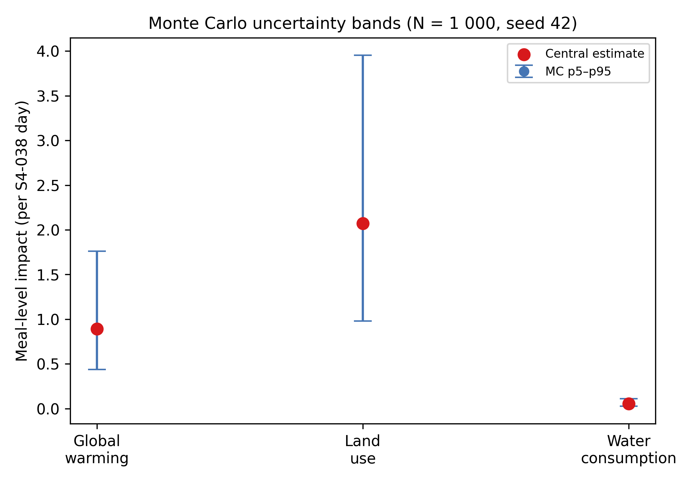
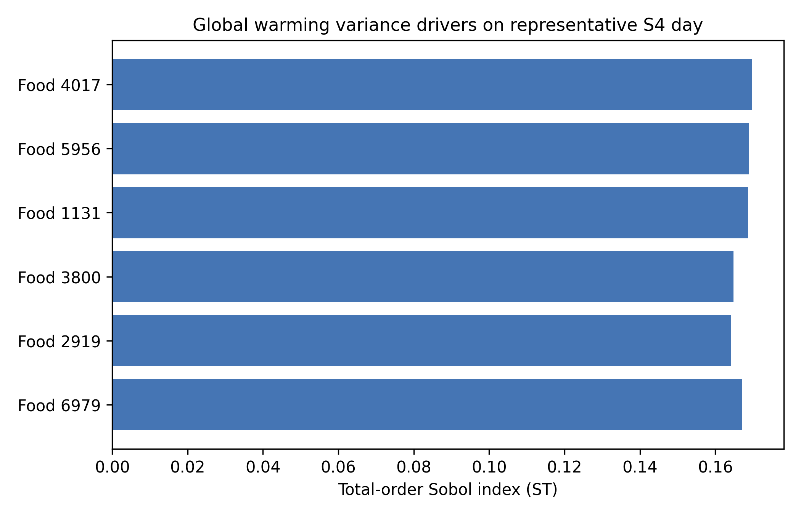
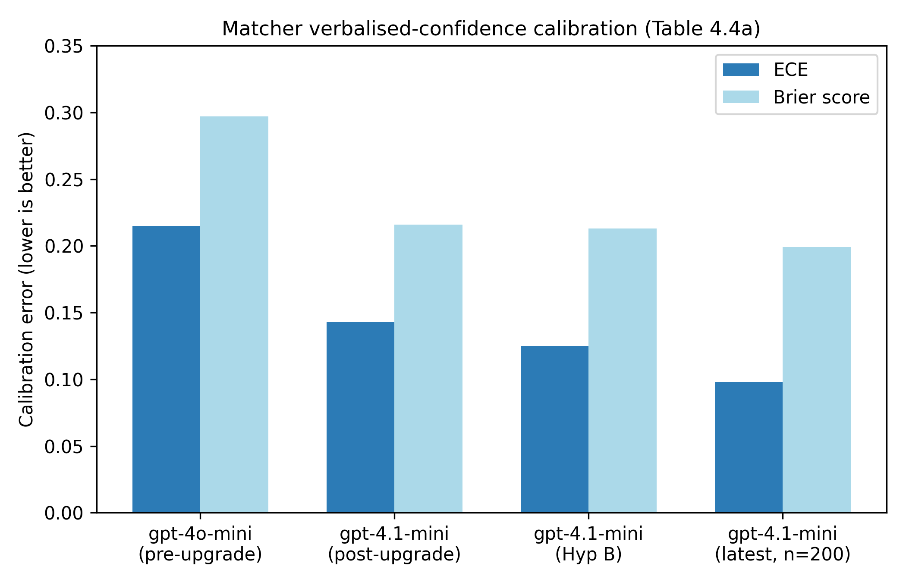
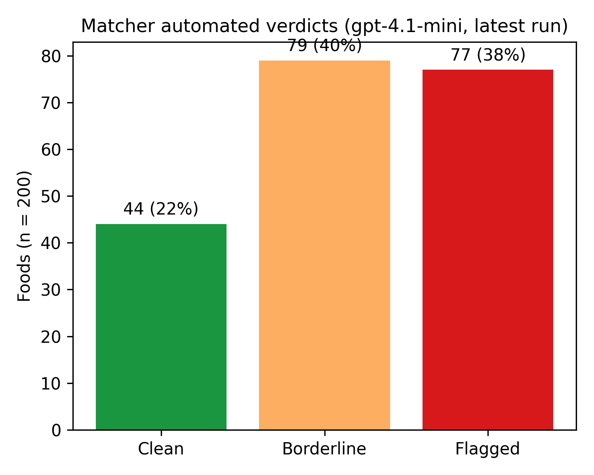
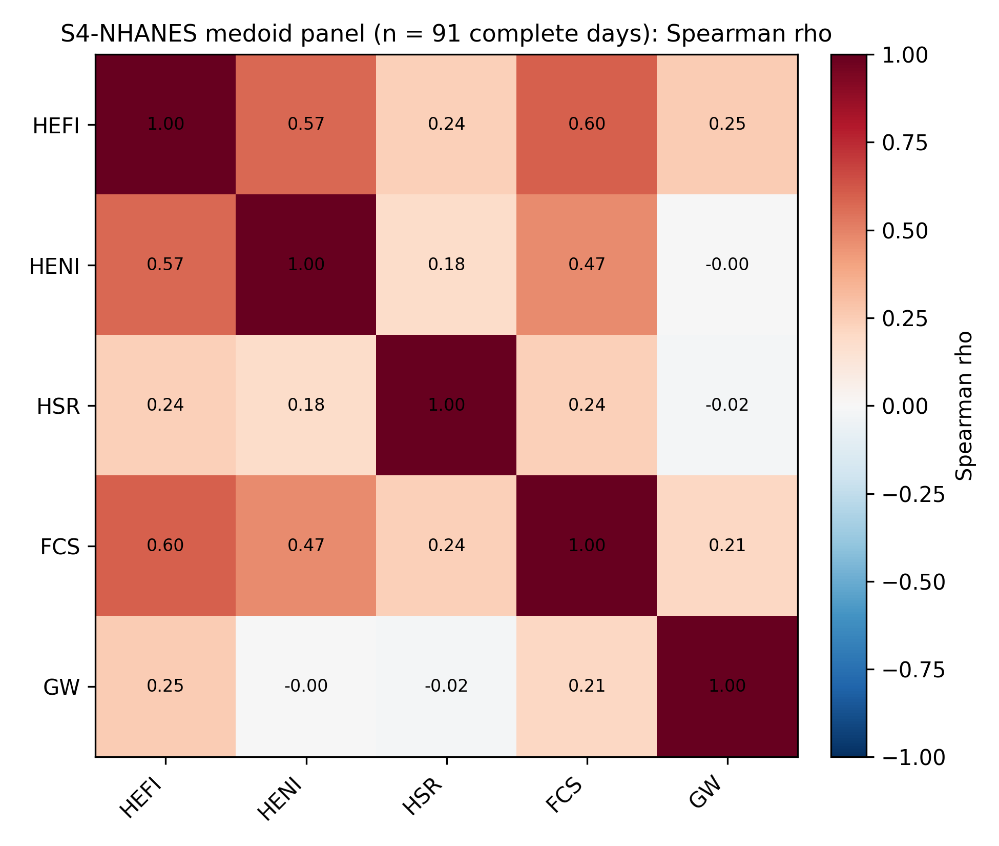
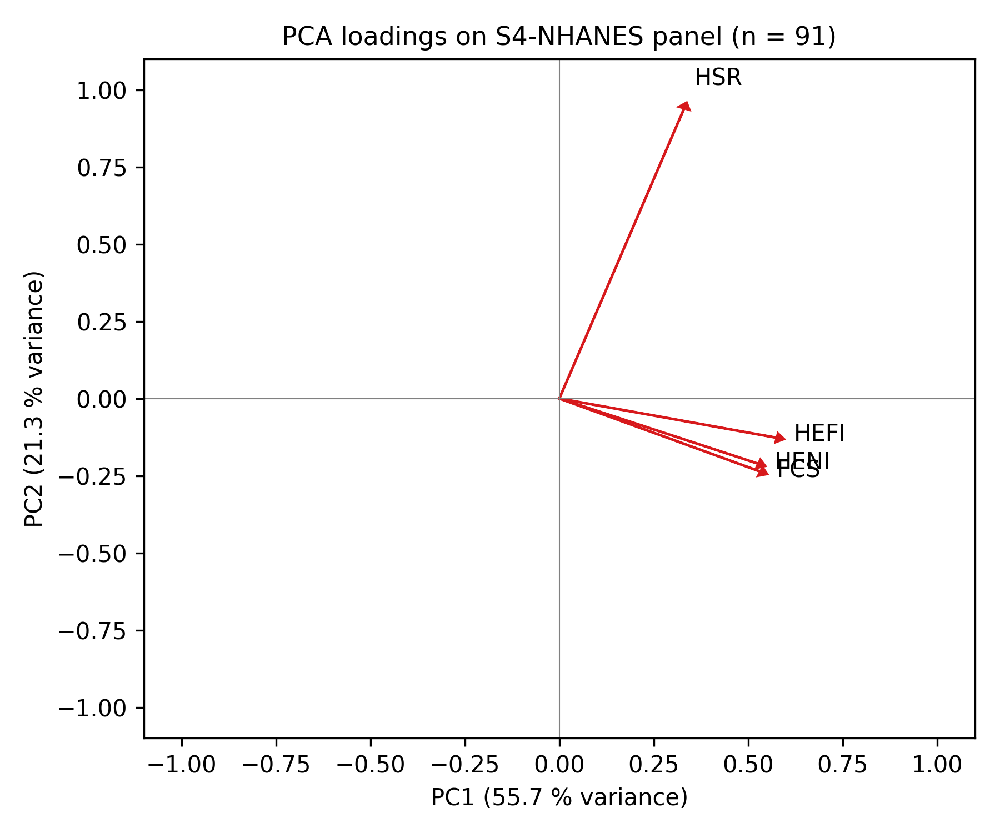
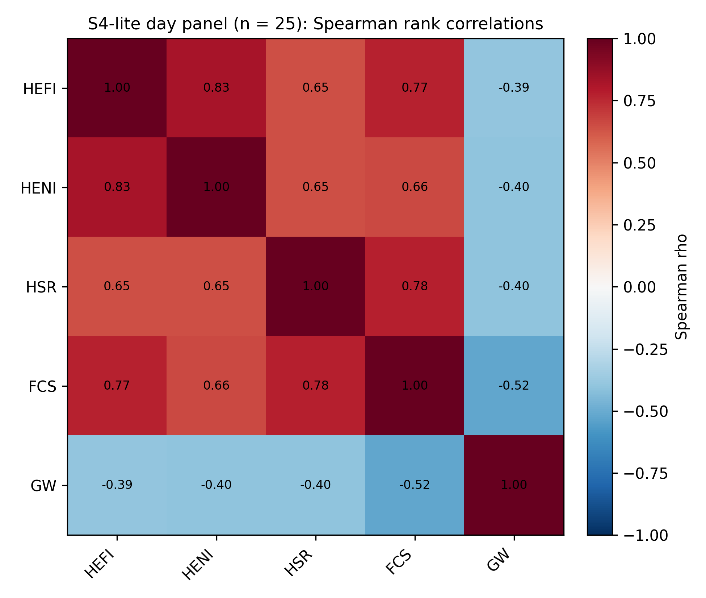
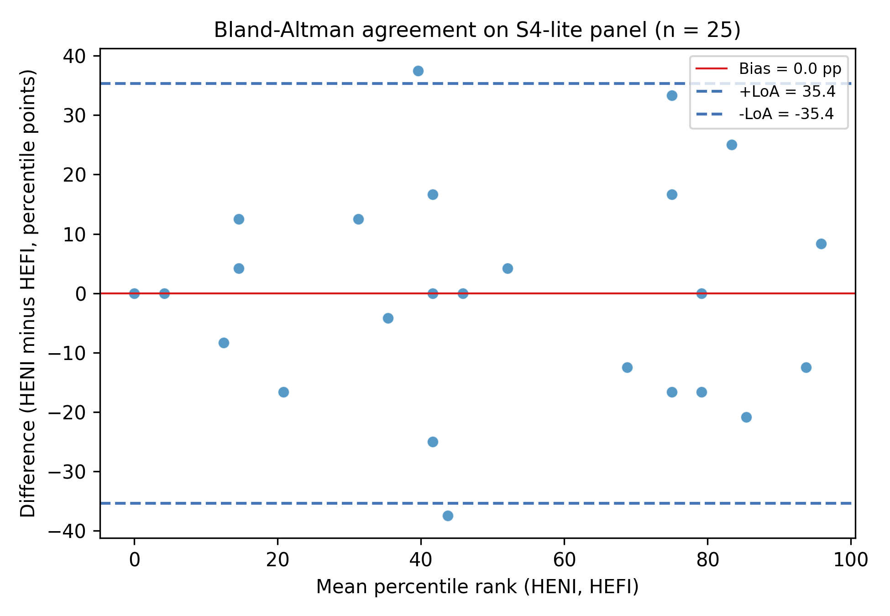
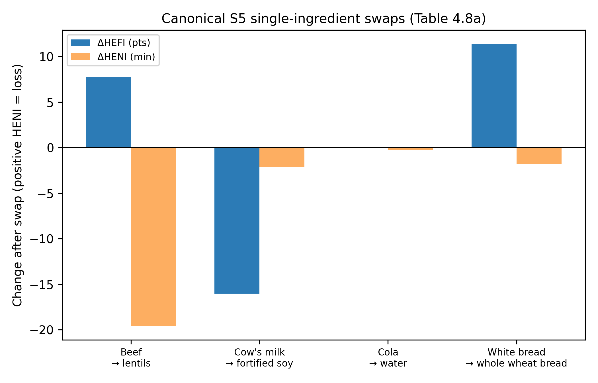
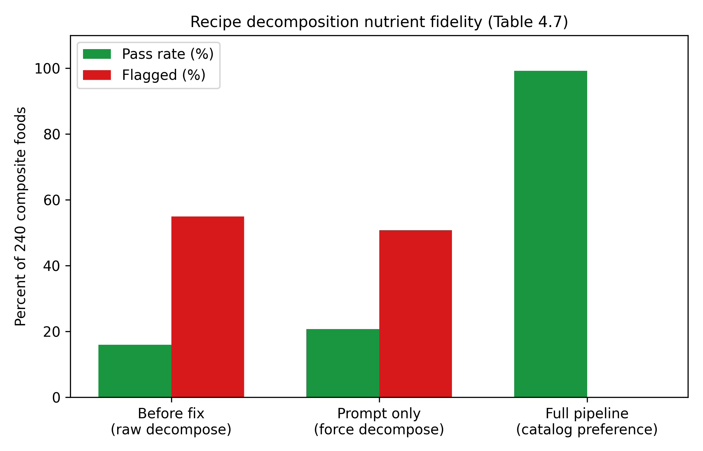

# From label to landscape: an open multi-indicator platform for scoring real diets across nutrition, disease burden, and environmental impact

**Target journal:** *Nature Food* (Springer Nature)
**Article type:** Article / Tools & Resources (open-source platform + Canadian case study)
**Manuscript status:** Working draft, retargeted 2026-05-28; Section 4 and Section 5 interim panels populated (S4-NHANES 2026-05-30, S4-lite, S5-subst, PKG-IMG-1, SUBST-1 QC); S3 Monte Carlo plus Sobol shipped 2026-05-30; full CCHS-RDC ingest deferred; the S1 dietitian-labelling track is retired in favour of substrate-level implementation regression because the CNF nutrient composition is itself the validated ground truth that the scoring kernels consume.

---

## Authors

Emmanuel Amankrah Kwofie¹, Ebenezer Miezah Kwofie¹\*

¹ Department of Bioresource Engineering, McGill University, Sainte-Anne-de-Bellevue, QC, Canada
\* Corresponding author: `dishdevinfo@gmail.com`

## Highlights

- **ecodish365** scores what people actually eat, from packaged products and homemade meals to full 24-hour recall days, across five complementary indicators: the Healthy Eating Food Index 2019 (HEFI-2019), the Health Nutritional Index (HENI), the Health Star Rating (HSR), the Food Compass Score (FCS) per Mozaffarian et al. 2021, and a life-cycle assessment (LCA) implemented through ReCiPe 2016. The Food Compass kernel uses the full nine-domain attribute panel that the Canadian Nutrient File supplies, not the label-readable FCS-10 subset of Barrett et al. 2025. Indicators are anchored to the Canadian Nutrient File (CNF), with West African foods supplied by the West African Food Composition Table 2019 (WAFCT 2019).
- Artificial intelligence (AI) is confined to tasks databases cannot resolve alone: a **post-hoc normaliser** turns label photos into structured Nutrition Facts (88.2 % field accuracy on a benchmark panel); embedding retrieval links CNF foods to LCA inventories and to the USDA Food Patterns Equivalents Database (FPED) used for HENI food-group attribution. All AI calls run at deterministic marginal runtime cost after a one-time build.
- On a **25-day curated panel**, nutrition indicators agree (HEFI–HENI Spearman rank correlation ρ = 0.84) while diverging modestly from global-warming (GW) intensity per 100 kcal (HENI–GW ρ = −0.59); four literature-anchored diet shifts replicate expected directions, and targeted substitutions move Western processed days from lose–lose toward win–win on health and footprint.
- A **quality-guarded substitution engine** ranks ingredient swaps against whole-day HEFI, HENI, food-pattern gaps, and environmental impact — blocking anatomically implausible matcher noise while surfacing curated reformulation paths such as milk→fortified soy beverage.
- A **reconstruction benchmark for AI recipe decomposition** — the first to score decomposed dishes against their own measured composition — shows that language-model decomposition reproduces food-group shape but overstates the energy of cooked and diluted dishes about two-fold. A catalog-preference policy that defers to a food's own laboratory composition when the dish is already catalogued removes the error in production (composite dishes flagged for nutrient error fall from 55 % to 0 %), and a cooked-form prompt rule cuts the worst soup errors from nine-fold to under 1.4-fold for genuinely novel dishes. A single-vs-mixed label across all 7,021 catalogue foods then keeps that fallback from ever collapsing a dish onto a lone ingredient, and a curated lab of twenty free-text meals confirms the safeguard on inputs that do not self-match.
- A **catalogue-wide preparation-state tag** built by a hybrid regex-and-LLM tagger across all 7,021 CNF and WAFCT foods (one-time cost US$0.29, 60/60 on a hand-curated ground-truth panel) gives the substitution culinary gate a structured way to recognise preparation crosses. With the gate active the cross-thermal swap rate on a twelve-meal probe falls from 15.2 % to 0.0 %, eliminating a reproducible food-safety-grade swap that exchanged batter-dipped fried chicken for raw chicken under the "lower saturated fat" purpose. The same tag set drives a deeper rewrite of the matcher's LLM rerank prompt — per-candidate single-versus-mixed and preparation annotations plus four query-conditioned advisory rules for commodity preference, dish-context detection, and CNF-versus-WAFCT tie-break — that lifts the matcher's FoodID accuracy on the sixty-probe panel from 71.7 % to 96.7 % and joint preparation accuracy from 90.0 % to 96.7 %.

## Abstract (~250 words, draft)

Translating what someone ate into useful nutrition and sustainability feedback takes more than a single score. A granola bar, a homemade stew, and a full day of eating each need a different entry path, yet most tools force users into one. We built ecodish365, an open-source decision-support platform that scores real eating patterns on five peer-reviewed indicators: Canada's Food Guide adherence (HEFI-2019), disease-burden minutes (HENI), Health Star Rating, Food Compass, and ReCiPe 2016 life-cycle impact. All five draw on the Canadian Nutrient File, extended with 1,028 West African foods from WAFCT 2019.

Artificial intelligence appears only where databases alone fall short. A hybrid rule-and-language-model categorizer maps foods to Global Burden of Disease risk factors. Embedding retrieval links CNF entries to Agribalyse inventories and to USDA Food Patterns Equivalents for HENI's food-group attribution (a one-time build costing roughly one dollar, with zero marginal cost per score). Multimodal extraction turns Nutrition Facts photos into structured JSON; a post-hoc normaliser recovered 88.2 % field accuracy where prompt engineering alone failed on dual-column panels. A recipe decomposer turns free-text dish names into CNF ingredient lists for 24-hour recall workflows. Users can describe meals, scan packaged labels, or pick individual foods by search or AI, then review, edit, and save days locally before routing to any scorer.

We validate cross-indicator coherence (HENI vs HEFI ρ = 0.89 on a six-meal panel; ρ = 0.84 on 25 curated days), four Stylianou-style diet-shift counterfactuals (4/4 directional checks pass), and a substitution layer with culinary plausibility filters, discovery quality gates, and FPED-aware ranking that prioritises swaps closing fruit, vegetable, and whole-grain gaps. On the 25-day panel, better nutrition correlates with lower per-kcal greenhouse-gas intensity (ρ ≈ −0.4 to −0.6), but the relationship is weak enough that multi-metric reporting remains essential. Western processed days improve markedly when targeted substitutions are applied in silico (HEFI 22→53; environmental single score −87 %). We also stress-test the recipe decomposer against ground truth. A four-lens reconstruction benchmark shows that language-model decomposition preserves food-group shape but overstates the energy of cooked and diluted composites about two-fold; a catalog-preference policy that defers to a food's own measured composition when the dish is already catalogued removes that error for those foods, lowering the share of composite dishes flagged for nutrient error from 55 % to 0 % in the production pipeline. The platform ships as a reproducible Python/Rust toolchain (Apache 2.0) with auditable prompts, factors, and validation harnesses.

**Keywords:** food systems; diet quality; life-cycle assessment; large language models; Canadian Nutrient File; decision support; 24-hour dietary recall; nutrient profiling.

---

## 1. Introduction

### 1.1 Why integrated dietary scoring matters

Every food choice carries simultaneous consequences for human health, agricultural impact, and household expenditure. Nutrition epidemiology has translated this insight into specific quantitative tools. Cohort-derived dose-response functions convert per-food risk-factor masses into disease-burden minutes through the Global Burden of Disease framework (Stylianou et al., 2021). Public-health nutrient profiling scores label-readable features into encourage, moderate, and limit bands using validated label-level systems such as the Australian Health Star Rating (HSRAC, 2025) and the Tufts Food Compass (Mozaffarian et al., 2021; Barrett et al., 2025). Life-cycle assessment quantifies the greenhouse gas, land, water, and human-health endpoint costs of a food's supply chain through workbook-grade characterisation factors (Huijbregts et al., 2017). Each system is well validated on its own. The difficulty for anyone using them in practice is that they often place the same food in different categories and almost no platform reports them together in a way a clinician, a product developer, or a policy analyst can actually compare. The nutrient-density-versus-disease-burden divergence documented by Cardinaals et al. (2024) is the most recent in a long line of empirical reminders that no single number captures what "better eating" means.

The reason most decision-support platforms still pick one perspective is operational rather than theoretical. Producing a single HEFI-2019 variable from a Canadian 24-hour recall took more than seventy-five hours of registered-dietitian time in the recent Canadian Food Intake Screener validation study (Hutchinson et al., 2023). Branded packaged foods, which carry a large share of weekly calories in North American households, rarely appear as discrete entries in national composition tables, so a granola bar or an instant soup falls outside the recall workflow before scoring even begins. Stylianou-style HENI computation requires food-group-level masses in grams that national nutrient tables do not store and that hand-coding from food descriptions does not recover at scale. Each gap is solvable individually. The missing piece has been a reproducible end-to-end pipeline that resolves all of them inside one auditable codebase.

Recent progress in language-model-assisted retrieval and structured-data extraction changes that calculus. Frontier models reach 90 to 94 percent expert agreement on healthy-versus-unhealthy food binaries (Ase et al., 2026). Retrieval-augmented prompting lifts food-name to food-class accuracy by approximately ten F1 points relative to vanilla prompting on the closest analogous classification task (Zhou et al., 2025). Canadian nutrient-profiling work showed that score computation directly from structured composition data reaches R² = 0.98 against measured ground truth, against R² = 0.84 to 0.87 from label-text prediction with the same models (Hu et al., 2023). None of these results scores a meal end-to-end. What they do is reduce the friction of linking a user's words to the structured composition that peer-reviewed scoring kernels already require. The design question we treat as concrete in this paper is where exactly bounded artificial intelligence can sit in that pipeline, and which parts of the peer-reviewed epidemiology and life-cycle math must remain deterministic and auditable.

### 1.2 What current tools leave open

Existing decision-support platforms fall into two broad shapes. The first optimises for a single dimension. Diet-quality calculators such as HEI-2015 and HEFI-2019 report adherence to national food guides but say nothing about environment. Nutrient-profiling systems such as the Health Star Rating, Nutri-Score, and Food Compass evaluate a product's label-readable composition but do not aggregate to a day or attach a marginal disease-burden weight. Carbon-only calculators report a greenhouse gas footprint without nutritional context. The second shape integrates two dimensions but treats the others as fixed, for example by consuming HEFI or HEI as a fixed functional-unit modifier inside a life-cycle calculator. Tools that bring epidemiological disease-burden, full nutrient profiling, ReCiPe-style multi-impact LCA, and monetary externalities together at the food-item level, with explicit uncertainty quantification and openly released AI augmentation, are rare.

The authors of the dominant validated systems have themselves called for the integration this paper delivers. The Food Compass discussion (O'Hearn et al., 2022, p. 10) describes a long-term vision of scoring additional features including environmental sustainability and social welfare alongside nutrition. The label-readable FCS-10 derivative (Barrett et al., 2025, pp. 14 to 15) explicitly identifies large language models as a route to bridging ingredient lists into structured scoring inputs. Neither paper releases the implementation that would make such a bridge runnable. Stylianou and colleagues' subsequent work in nutritional LCA (2024, Frontiers in Sustainable Food Systems) sets out the complementarity of nutrient density and disease burden as a research agenda, without releasing the pipelines or prompts.

Weidema and Stylianou (2020) provide the conceptual grammar for separating the two distinct roles that nutrition plays in food LCA. Nutrition as a function belongs to the LCA functional unit, where it is best handled by satiety rather than by weighted nutrient-profiling scores. Nutrition as an impact pathway is the marginal health effect of a food, properly quantified in disability-adjusted life years through GBD-derived dose-response functions and operationalised as DANI and HENI. The authors warn that loading weighted nutrient-profiling scores into the LCA functional unit can produce conceptually broken results, including negative functional units for limiting nutrients. Our design follows that recommendation directly. HEFI-2019, HSR, and FCS-10 are reported alongside HENI and ReCiPe 2016 as their own outputs and are never collapsed into a single composite score.

Two methodological gaps compound the platform-level absence. First, the dominant European reference databases (AGRIBALYSE 3.2 and ecoinvent) apply the European Commission's Product Environmental Footprint method, which uses sixteen indicators with fixed weights, rather than the eighteen-midpoint and three-endpoint ReCiPe 2016 family that most diet-health LCA work in the open literature relies on (ADEME, 2024; Huijbregts et al., 2017). PEF and ReCiPe outputs are not numerically interchangeable, so a platform that aspires to cross-citation with the diet-health literature has to ingest both systems and report their divergence rather than silently choose one. Second, no large reference database publishes quantitative per-factor uncertainty. AGRIBALYSE supplies a qualitative one to five Data Quality Rating, with sixty-seven percent of products rated at three or below (ADEME, 2024). Any tool aspiring to decision-support credibility therefore has to wrap point-estimate factors in propagated uncertainty bands and harmonise across methodology families.

The practical motivation runs in parallel with the methodological one. The seventy-five-hour dietitian cost recalled in Section 1.1 is a fixed deterrent at the per-recall level and therefore a hard ceiling on the sample size at which integrated multi-indicator dietary assessment can be conducted at all. Reproducible, AI-assisted, recipe-level scoring is not a productivity convenience; it is the prerequisite for running multi-indicator dietary assessment at population scale.

### 1.3 Contributions of this paper

We make seven contributions. Each is specified in Section 3, validated in Section 4 or Section 5, and reproducible from the released codebase.

1. **An open, five-indicator scoring platform on a single substrate.** HEFI-2019 (Brassard et al., 2022), HENI (Stylianou et al., 2021), HSR (HSRAC v9, 2025), the Food Compass per Mozaffarian et al. (2021) at the full nine-domain specification, and ReCiPe 2016 Hierarchist LCA (Huijbregts et al., 2017) are computed from a single Canadian Nutrient File substrate, extended with 1 028 West African foods through the WAFCT 2019 ingest. Every characterisation factor and normalisation score traces back to a published workbook through a SHA-256 checksummed ETL. The three performance-critical scoring kernels (HSR, FCS, HENI) compile to a PyO3-bound Rust extension that the Python service consumes, and the methodology pack used for any given API response is surfaced in the response itself, so a figure or a table in the paper can be traced to the exact pack version that produced it.

2. **Bounded AI subsystems with delimited roles, each separately validated.** A hybrid rule-and-LLM categorizer maps foods to the fifteen GBD dietary risk factors (Section 3.4). An embedding-plus-LLM matcher links CNF entries to Agribalyse 3.2 LCI rows at a verbalised-confidence threshold (Section 3.5) with an Expected Calibration Error of 0.098 against structural plausibility on a 200-food benchmark (Section 4.4 Table 4.4a). A FPED-grounded composition bridge produces the food-group masses HENI needs at runtime cost zero by amortising a one-time approximately one-dollar LLM build across all future scoring calls (Section 3.6). A multimodal Nutrition Facts extractor turns packaged-food photographs into structured composition, recovering 88.2 percent field accuracy through a post-hoc normaliser where prompt engineering alone failed on dual-column panels (Section 3.8.7). A reconstruction-validated recipe decomposer turns free-text dish names into CNF ingredient lists for 24-hour recall workflows, with the first benchmark to score AI-decomposed dishes against their own measured composition (Section 3.8.9, Section 4.7). A catalogue-wide preparation-state tagger gives every CNF and WAFCT food a structured two-axis tag at a one-time cost of US$ 0.29 and retires a reproducible food-safety hazard in which the matcher returned raw chicken for a fried-chicken substitution request (Section 3.8.10, Section 4.8).

3. **Cross-indicator coherence demonstrated at meal and day scale.** All six pairwise Spearman rank correlations between HEFI, HENI, HSR, and FCS on a six-meal canonical panel land between +0.77 and +1.00 (mean ρ = +0.83), with percentile-bootstrap 95 percent CIs whose lower bounds all clear zero (Section 4.5). The shipped 100-day S4-NHANES medoid panel confirms the nutrition core at population scale (ρ = +0.47 to +0.60; Section 4.6), with PCA showing PC1–PC2 capturing 77.0 percent of indicator variance. The S4-lite precursor panel (Section 4.7) and Bland–Altman limits quantify per-day disagreement that rank correlation alone cannot see.

4. **A 100-day NHANES-derived case study with pre-registered reproduction gates.** A stratified partitioning-around-medoids draw across 3 037 NHANES 2017-2018 day-1 24-hour recalls produces a 100-day panel that reproduces the by-stratum HEFI ordering of Brassard et al. (2022b) on the Canadian reference (females aged 19 and over above males aged 19 and over above youth aged 2 to 18), with a substrate-divergence gap of roughly ten points consistent with documented US-versus-Canada dietary differences. The same panel reproduces Stylianou Fig 4's per-food HENI distributional band on sign and IQR overlap, and surfaces an empirical Pareto frontier of six trade-off days in (HENI gained, GW per 100 kcal) space (Section 5.1).

5. **Substrate-controlled HENI reproduction against Stylianou et al. 2021.** A parallel ETL builds an FNDDS-keyed nutrient composition lookup from USDA FoodData Central and routes it through the existing CNF-to-FNDDS bridge so HENI can be computed under either substrate for the same CNF food. On a seven-food canonical panel the substrate divergence is 0.35 minute median, and on the 100-day S4 panel the mean absolute per-day divergence is 3.88 minutes. The much larger headline value previously reported in our substrate-divergence panel reflected a metric mismatch between our standalone per-food HENI and Stylianou's marginal-substitution Fig 2 quantity rather than a substrate effect, and the Section 3.2 paragraph now states that explicitly (Section 3.2).

6. **An ingredient-substitution engine with culinary plausibility and FPED-aware gap-fill.** SUBST-1 operationalises Stylianou-style targeted diet shifts as explicit, mass-preserving ingredient counterfactuals with a six-metric scorecard, culinary plausibility guards consuming the preparation-state tagger output, discovery quality gates, and FPED-aware ranking that prioritises swaps closing fruit, vegetable, and whole-grain gaps (Section 3.8.8, Section 4.8). The engine passes 4 of 4 directional checks on the canonical Stylianou swap set, improves HEFI on 12 of 14 eligible S4-lite overlay days, and reaches win-win HENI plus environment on 7 of those 14, with the largest shift on Western processed day D06 lifting HEFI from 22 to 53 and reducing environmental single-score by 87 percent.

7. **A reproducible, statistically rigorous release.** Every analysis result in Section 4 and Section 5 is generated by a smoke-test harness in the same repository. The statistical machinery is consolidated in Section 3.11 (Spearman rank correlation with average-rank tie-breaking, percentile-bootstrap CIs at B = 2000, Bland-Altman limits of agreement on percentile-rescaled scores, Expected Calibration Error and Brier score on a non-circular structural-plausibility outcome, Cohen's κ across multiple LLM retest runs, partitioning around medoids with k-means++ seeding, principal component analysis via standardised singular value decomposition, and the two-dimensional Pareto-dominance test). The mathematical definitions of all five indicators and the ReCiPe single-score aggregation appear in Section 2; operational parameterisation is in Section 3. An empirical test-retest panel confirms that the matcher reproduces the same Ciqual code on 28 of 30 foods (93.3 percent) across five runs at temperature zero, with median per-food confidence standard deviation of 0.000 and mean pairwise verdict κ of 0.934 (Section 7.6). The platform ships under Apache 2.0 with every factor JSON, every prompt, every benchmark label, and every harness in one repository.

**Project-specific abbreviations used throughout this paper.** The implementation work referenced above is tracked in the source tree under stable short codes; we expand each at first use and gather them here for quick reference. *Indicators*: HEFI-2019 (Healthy Eating Food Index 2019), HENI (Health Nutritional Index), HSR (Health Star Rating), FCS (Food Compass Score per Mozaffarian et al. 2021, full nine-domain implementation; FCS-10 is the published label-readable subset of Barrett et al. 2025, not the implementation we ship). *Reference databases*: CNF (Canadian Nutrient File), FNDDS (Food and Nutrient Database for Dietary Studies, USDA), FPED (Food Patterns Equivalents Database, USDA), WAFCT (West African Food Composition Table), CCHS (Canadian Community Health Survey), NHANES (National Health and Nutrition Examination Survey, USA), WWEIA (What We Eat In America, the dietary intake arm of NHANES), FIPR (Family Income-to-Poverty Ratio, NHANES demographic stratifier), RDC (Statistics Canada Research Data Centre), GBD (Global Burden of Disease), DALY / μDALY (disability-adjusted life-year / micro-DALY), DRF (dietary risk factor), TMREL (theoretical-minimum-risk exposure level), CFG (Canada's Food Guide), HEI-2015 (Healthy Eating Index 2015), SSB (sugar-sweetened beverages). *Methodological / environmental*: LCA (life-cycle assessment), GW / GWP (global warming / global warming potential), ReCiPe (Risk-related impact, Composition, Procedure for endpoint assessment — the ReCiPe 2016 LCA method family), EF (Environmental Footprint method), PEF (Product Environmental Footprint, the EU framework), AOP (Area of Protection), RIVM (Dutch National Institute for Public Health and the Environment), ADEME (French Environment and Energy Management Agency), ECE (Expected Calibration Error), LoA (Limits of Agreement), PAM (Partitioning Around Medoids), PCA (Principal Component Analysis), BRR (Balanced Repeated Replication), NCI MCMC (National Cancer Institute Markov-Chain Monte Carlo usual-intake method), AI (artificial intelligence), LLM (large language model), RAG (retrieval-augmented generation), MAPE (mean absolute percentage error). *Project codes*: PKG-IMG-1 (packaged-food image extraction track), PKG-RECALL-1 (packaged-food integration into the 24-h recall flow), SUBST-1 (ingredient substitution analysis track), PREP-STATE-LAB (preparation-state tagging and consumers), DECOMP-VALID (recipe-decomposition validation track), FPID (Food Pattern Ingredient Database — our ingredient-level FPED attribution layer), S1–S8 (the Scenario IDs of Section 4 and Section 5 with S4-lite the synthetic complement to the full S4 panel).

---

## 2. Conceptual framework, indicators, and models

Integrated dietary assessment requires indicators that are comparable in intent yet incompatible in native units: guideline adherence (HEFI-2019), nutrient profiling (HSR, Food Compass), disease-burden accounting (HENI), and life-cycle environmental impact (ReCiPe 2016). Following ISO 14040/14044 (ISO, 2006a,b) and the nutritional-LCA literature (Stylianou et al., 2016; Weidema & Stylianou, 2020), we treat each indicator as a deterministic function of food composition and quantity, linked through a common food catalogue but not collapsed into a single composite index. Table 1 summarises the five scoring systems; the subsections below state the published mathematical structures that define them. How we map databases, use AI-assisted linkage, propagate uncertainty, and validate the implementation is specified in Section 3.

**Table 1.** Indicator landscape.

| Indicator | Domain | Unit | Primary reference |
|---|---|---|---|
| HEFI-2019 | Canada's Food Guide 2019 adherence (10 components) | / 80 | Brassard et al., 2022a,b |
| HENI | Disease burden of food intake | min healthy life / serving | Stylianou et al., 2021; 2016 |
| HSR | Nutrient profiling (Australia/New Zealand) | 0.5–5 stars | HSRAC, 2025; Shahid et al., 2020 |
| Food Compass (FCS) | Expanded nutrient profiling (9 domains) | 1–100 | Mozaffarian et al., 2021 |
| ReCiPe 2016 v1.1 | Environmental life-cycle impact | midpoint, endpoint, single score | Huijbregts et al., 2017; RIVM, 2017 |

### 2.1 Guideline-adherence scoring: HEFI-2019

The Healthy Eating Food Index (HEFI-2019) measures same-day alignment with Canada's Food Guide 2019 across ten components: six adequacy ratios and four moderation ratios, each scored by linear interpolation between published minimum and maximum standards (Brassard et al., 2022a, Table 2 p. 600; Results p. 599). Let $R_j$ denote the ratio for component $j$, with thresholds $(R^{\min}_j, R^{\max}_j)$ and point bounds $(P^{\min}_j, P^{\max}_j)$ taken from Table 2. The component score is

$$C_j \;=\; \mathrm{clip}\!\left(P^{\min}_j + \frac{R_j - R^{\min}_j}{R^{\max}_j - R^{\min}_j}\,(P^{\max}_j - P^{\min}_j),\; P^{\min}_j,\; P^{\max}_j\right),$$

where $\mathrm{clip}(x,a,b)=\min(b,\max(a,x))$. The total index is the sum of component scores,

$$\mathrm{HEFI} \;=\; \sum_{j=1}^{10} C_j \;\in\; [0,\,80].$$

Numerators and denominators are built from Health Canada Reference Amounts (Health Canada, 2016) and the food-classification rules of Brassard et al. (2022a, Table A1). Sodium density enters as mg kcal$^{-1}$, with maximum points at $<0.9$ mg kcal$^{-1}$ and zero points at $\geq 2.0$ mg kcal$^{-1}$ (Brassard et al., 2022a). Brassard et al. (2022b) caution that a single day's HEFI is not interpretable as usual dietary adherence and that component scores should accompany the total.

### 2.2 Disease-burden scoring: HENI

The Health Nutritional Index (HENI) extends the CONE-LCA framework (Stylianou et al., 2016) by expressing the health consequence of a marginal dietary change in minutes of healthy life gained or lost per serving (Stylianou et al., 2021). For food $i$,

$$\mathrm{HENI}_i \;=\; -0.53 \;\times\; \sum_{r=1}^{16} \mathrm{DRF}_r \cdot d_{i,r},$$

where $\mathrm{DRF}_r$ is the age- and sex-adjusted dietary risk factor for component $r$ in μDALY g$^{-1}$, $d_{i,r}$ is the amount of that risk-relevant nutrient or food group in one serving (g), and the constant $-0.53$ min μDALY$^{-1}$ converts disability-adjusted life years into minutes of healthy life with the sign oriented so that beneficial foods score positively (Stylianou et al., 2021, Results p. 617; Supplementary Information p. 98). The sum spans sixteen risk components derived from fifteen Global Burden of Disease dietary risks (GBD 2017 Diet Collaborators, 2019), with dietary fibre split by source to avoid double-counting ischaemic-heart-disease and colorectal-cancer pathways (Stylianou et al., 2021, SI §S2.9). Food-group attribution for composite items follows the USDA Food Patterns Equivalents Database approach used in the source study (Fulgoni et al., 2018). Day-level HENI aggregates serving-level scores over intake.

### 2.3 Nutrient profiling: Health Star Rating and Food Compass

The Australian/New Zealand Health Star Rating (HSR) algorithm (HSRAC, 2025, Appendix 1) assigns baseline points for energy, saturated fat, total sugars, and sodium and subtracts modifying points for protein, dietary fibre, and fruit, vegetable, nut, and legume (FVNL) content, all per 100 g or 100 mL within a category-specific matrix (Categories 1, 1D, 2, 2D, 3, 3D). Writing $B$ for baseline and $M$ for modifying points,

$$\mathrm{Points} \;=\; B(E,\,\mathrm{SFA},\,\mathrm{sugars},\,\mathrm{Na}) \;-\; M(\mathrm{protein},\,\mathrm{fibre},\,\mathrm{FVNL}),$$

with the protein-eligibility rule that protein modifying points are zero when baseline $\geq 13$ and FVNL points $<5$ (HSRAC, 2025, p. 26). Points map to half-star ratings via category-specific Table 7. Shahid et al. (2020) describe the public-health rationale for this structure.

Food Compass scores nine attribute domains (nutrient ratios, vitamins, minerals, ingredients, additives, processing, specific lipids, fibre and protein, and phytochemicals) with domain-specific aggregation rules (Mozaffarian et al., 2021, Supplementary Table S3). Let $\mathrm{raw}_i$ be the weighted sum of domain scores after the published within-domain reductions (simple mean, top-$k$ mean, or weighted sum as specified per domain), truncated at the empirical 5th and 95th percentiles ($-10.7$ and $26.1$) across the 8 032 reference foods in Mozaffarian et al. (2021):

$$\mathrm{FCS}_i \;=\; 100 \;-\; \frac{26.1 - \mathrm{raw}_{i,\,\mathrm{trunc}}}{36.7} \times 99.$$

The processing domain incorporates NOVA ultra-processing classification (Monteiro et al., 2019). When only label-readable attributes are available, Barrett et al. (2025) show that a reduced attribute set preserves rank agreement with the full system (Spearman $r = 0.93$). Recommendation bands follow Mozaffarian et al. (2021): encourage $\geq 70$, moderate 31–69, limit $\leq 30$.

### 2.4 Life-cycle impact assessment: ReCiPe 2016

Environmental scoring follows the four-phase LCA framework of ISO 14040/14044: goal and scope, inventory analysis, impact assessment, and interpretation (ISO, 2006a,b). For a meal comprising foods $i=1,\ldots,n$ with edible mass $q_{i}$ (kg) and midpoint characterisation factor $\sigma_{i,k}$ for category $k$, the meal-level midpoint impact is

$$m_k \;=\; \sum_{i=1}^{n} q_i \,\sigma_{i,k},$$

with $\sigma_{i,k}$ drawn from peer-reviewed life-cycle inventories (Poore & Nemecek, 2018; ADEME, 2024) and characterisation per ReCiPe 2016 v1.1 (Huijbregts et al., 2017; RIVM, 2017). ReCiPe defines eighteen midpoint categories and three endpoint Areas of Protection (Human Health, Ecosystems, Resources). Midpoints convert to endpoint damage $E^P_A$ at cultural perspective $P \in \{\mathrm{I,H,E}\}$ by

$$E^P_A \;=\; \sum_{k \in \mathrm{AoP}\,A} m_k \,\mathrm{CF}^P_{k,A},$$

where $\mathrm{CF}^P_{k,A}$ is the published midpoint-to-endpoint factor (Huijbregts et al., 2017, Eq. 1 p. 139; RIVM, 2017, Table 1.5). A dimensionless single score normalises each endpoint by its World 2010 per-capita reference $N^P_A$ and applies equal Area-of-Protection weights $w_A = 1/3$ (RIVM, 2017, Ch. 1):

$$S \;=\; \sum_{A \in \{\mathrm{HH,\,ECO,\,RES}\}} w_A \,\frac{E^P_A}{N^P_A}.$$

Because mass-based comparisons penalise high-water foods and favour energy-dense items (Weidema & Stylianou, 2020), we report impacts on four bases in parallel: per serving (the intake quantity), per 100 g product, per 100 kcal, and per 100 g protein. The last two mirror Poore & Nemecek (2018) Panels C and A. Aggregation occurs once in absolute mass units; each basis is obtained by scaling $m_k$ with the appropriate denominator (Poore & Nemecek, 2018; Dekker et al., 2019).

We apply ReCiPe 2016 Hierarchist characterisation to inventory data rather than the Product Environmental Footprint (PEF) indicators native to AGRIBALYSE 3.2 (ADEME, 2024), because nutritional LCA studies, including HENI's parent framework (Stylianou et al., 2016, 2021), are built on ReCiPe, and food-product rankings are stable across ReCiPe versions (Spearman $\rho = 0.85\text{–}0.99$; Dekker et al., 2019). PEF–ReCiPe divergence is treated as sensitivity analysis (Section 4.2). Country-specific characterisation factors are available for five spatially explicit categories (Huijbregts et al., 2017, §4.2); we parameterise perspective, country, and consumer supply-chain versus national lens in Section 3.10.

### 2.5 Uncertainty propagation

Reference agricultural databases publish point estimates and qualitative data-quality ratings rather than full probability distributions (ADEME, 2024; Poore & Nemecek, 2018). Following Monte Carlo practice in LCA (Heijungs, 2020; Hong et al., 2010), we propagate uncertainty in three complementary readings.

For a deterministic envelope, low and high characterisation-factor multipliers per food group and midpoint category anchor on between-producer spread in Poore & Nemecek (2018, Fig. 1) and spatial water-footprint variability (Mekonnen & Hoekstra, 2011, 2012). Propagating all-low and all-high factors yields a conservative bounding interval on $m_k$.

For Monte Carlo propagation, each food–category triple receives a log-normal distribution parameterised so that the median equals the central factor and the 5th–95th percentile interval matches the published band. With central value $c$, lower bound $L$, and upper bound $H$,

$$\mu = \ln c, \qquad \sigma = \frac{\ln H - \ln L}{2\,z_{0.95}}, \qquad z_{0.95} = 1.6449.$$

Independent draws $\tilde{\sigma}_{i,k}^{(s)} \sim \mathrm{LogNormal}(\mu,\sigma)$ for sample $s=1,\ldots,N$ yield meal-level replicates $m_k^{(s)} = \sum_i q_i \tilde{\sigma}_{i,k}^{(s)}$; we report the 5th, 50th, and 95th percentiles of $\{m_k^{(s)}\}$ (Heijungs, 2020). For HENI, the same framework applies to uncertainty in published $\mathrm{DRF}_r$ confidence intervals (Stylianou et al., 2021, SI Table 3; §S3.5).

Global sensitivity analysis uses first- and total-order Sobol indices (Saltelli et al., 2008; Kim et al., 2025) to attribute output variance in $m_k$ and $\mathrm{HENI}$ to input factor groups, complementing the percentile intervals with identifiability of dominant uncertainty sources.

### 2.6 AI-assisted linkage and the footprint of inference

Prior systems link food-composition databases to life-cycle inventories through curated descriptor sets (Furrer et al., 2024) or embedding-based closed-set classification over Agribalyse classes (Krahmer, 2024). Composite foods remain the hardest case: Furrer et al. (2024) exclude them from automated linkage because recipe formulation is absent from most reference tables. Recent language-model work shows strong performance as a *linker* (retrieval-augmented food classification, Zhou et al., 2025; structured NOVA labelling, Ase et al., 2026; nutrient profiling from structured inputs versus text, Hu et al., 2023) but weak performance as an end-to-end nutrient estimator from images alone (Fridolfsson et al., 2025). Krahmer (2024) further documents hallucinated inventory labels under unconstrained generation, which motivates retrieve-and-rank designs that restrict outputs to valid catalogue entries. Our platform extends this literature by linking a national nutrient file to ReCiPe-scored inventories with confidence-graded fallback and composite-meal decomposition (Section 3.5, 3.8.9); empirical calibration appears in Section 4.4.

Training frontier models carries large fixed energy and carbon costs (Patterson et al., 2022; Strubell et al., 2020), but meal-scoring tools incur chiefly *inference* emissions. Published per-token energy estimates span roughly 0.5–5 Wh per 1 000 tokens depending on model scale and serving infrastructure (Luccioni et al., 2023; Patterson et al., 2022). For a decision-support system whose downstream output is itself an environmental claim, the relevant comparison is inference emissions relative to the meal's own life-cycle global-warming potential. We audit that ratio in Section 5.5 (Scenario S8) using token counts and grid-intensity factors from the IEA (2024) and Environment and Climate Change Canada (2023).

---

## 3. Methods

### 3.1 Platform architecture

The platform is organised in four conceptual layers (Figure 1) that separate the deterministic peer-reviewed scoring math from the data-ingestion machinery that surrounds it. At the substrate layer, the Canadian Nutrient File (CNF; Health Canada, 2015) is the canonical food catalogue, extended with 1 028 West African foods from the West African Food Composition Table (WAFCT; Vincent et al., 2020) to support globally representative diets. Every food is identified by a stable integer key and carries per-100 g composition for energy, the macronutrients, the full vitamin and mineral panel, fatty-acid species (including the EPA and DHA isomers required by Stylianou et al. 2021's omega-3 risk factor), total dietary fibre, sugars, and sodium. Quantities propagate through the pipeline as grams or as Health Canada Reference Amounts (Health Canada, 2016) depending on the indicator's published convention.

At the scoring-kernel layer, the five indicators (Section 3.2) consume that composition and apply their published per-component formulas through deterministic kernels written to the specifications of the source papers, with no learned parameters. The three performance-critical kernels (HSR, FCS, HENI) are compiled as a native extension exposed to the orchestration layer through identical APIs, while HEFI-2019 and the life-cycle assessment kernel remain in the orchestration language because their per-meal cost is dominated by data lookup rather than arithmetic. The orchestration layer composes per-food results into per-meal and per-day responses and routes a single intake to every indicator at once, so that a user query returns a cross-indicator vector rather than a single number. At the integration layer, four bounded artificial-intelligence subsystems sit at well-defined entry points: a hybrid rule-and-language-model categorizer that maps foods to the Global Burden of Disease (GBD) risk factors (Section 3.4), an embedding-plus-language-model matcher that links CNF entries to life-cycle inventory rows (Section 3.5), a one-time language-model build of the CNF-to-FNDDS composition bridge that resolves the HENI food-group attribution (Section 3.6), and a multimodal extractor that turns packaged-food photographs into structured composition (Section 3.8.7). None of these subsystems carries the scoring; each prepares the data that the scoring kernels then consume.

Reproducibility is enforced at the data layer. Life-cycle characterisation factors and normalisation scores are loaded from versioned factor packs derived from the published RIVM workbooks (Huijbregts et al., 2017; RIVM, 2017), with cryptographic checksums recorded at build time and validated at load. The methodology pack identifier is returned with every response so published results can be traced to the factor version that produced them.

### 3.2 Operationalisation of the five indicators on the CNF substrate

The mathematical definitions of HEFI-2019, HENI, HSR, the Food Compass, and ReCiPe 2016 are given in Section 2. This section specifies how each indicator is operationalised on the Canadian Nutrient File (CNF; Health Canada, 2015) and how it is validated against the reference panels published in the source papers. Notation follows Section 2 throughout. Detailed component-level threshold tables for HEFI-2019 (after Brassard et al., 2022a, Table 2) and HSR (after HSRAC, 2025, Appendix 1) are reproduced in the Supplementary Methods.

#### 3.2.1 Common substrate and quantity scaling

All nutrition indicators consume the same per-100 g nutrient vector $\mathbf{n}_{i}$ for CNF FoodID $i$. For a meal with foods $i = 1,\ldots,n$ at edible mass $m_{i}$ (g), nutrient $j$ scales linearly:

$$N_{i,j} = \frac{m_{i}}{100}\, n_{i,j}.$$

HEFI-2019 aggregates $N_{i,j}$ through Health Canada Reference Amounts (Health Canada, 2016) and food-classification rules (Brassard et al., 2022a, Table A1). HENI applies the TMREL-capped exposure sum of Section 2.2 to nutrient and food-group masses derived from $N_{i,j}$ and the FPED bridge (Section 3.6). HSR and Food Compass evaluate per-100 g attributes directly from $\mathbf{n}_{i}$ (with ingredient-list logic where required). Life-cycle assessment converts mass to kilograms, $q_{i} = m_{i}/1000$, and aggregates midpoint factors $\sigma_{i,k}$ as in Section 2.4.

#### 3.2.2 HEFI-2019

Component-level threshold pairs $(T_k^{0},\, T_k^{\max})$ and maximum point allotments $M_k$ are taken from Brassard et al. (2022a, Table 2 p. 600); the linear-interpolation scoring function follows Section 2.1. Food classification follows the published inclusion and exclusion list (Brassard et al., 2022a, Table A1) literally, including fruit juice excluded from the vegetables-and-fruits numerator, all potato preparations counted as vegetables, processed meats in the protein-foods denominator but not numerator, and regular-fat (3.25 %) fluid milk in the preferred-beverages numerator. Because CNF lacks a free-sugars field, total sugars serve as a conservative proxy for component C9 until the Canadian free-sugars supplement of Rana et al. (2021) integrates; the imputation is flagged in every response (Brassard et al., 2022a, Discussion p. 603). Validation uses a perfect-diet vector (score 80/80) and three one-day CNF diets spanning the published dynamic range (anti-pattern 13.6, mixed 51.5, CFG-aligned 58.8; Section 4.1).

#### 3.2.3 HENI

Dose-response coefficients $\mathrm{DRF}_r$ and theoretical-minimum-risk exposure levels $\mathrm{TMREL}_r$ follow Stylianou et al. (2021, Suppl. Tables S1 and S3). Effective exposure applies the published cap:

$$g_r^{\mathrm{eff}} = \min\!\left(g_r,\; \mathrm{TMREL}_r\right), \qquad \mathrm{HENI}_{\mathrm{min}} = -0.53 \sum_{r=1}^{16} g_r^{\mathrm{eff}} \cdot \mathrm{DRF}_r.$$

Nutrient-based components read from CNF (omega-3 as EPA plus DHA; sodium in mg converted to g). Food-group components read from FPED-equivalent masses via the Section 3.6 bridge. Fibre routes to fruit–vegetable–legume–whole-grain sources or other sources per Stylianou et al. (2021, SI §S2.9); the milk-versus-calcium carve-out and energy-relative PUFA and trans-fat caps follow the source paper. Validation spans implementation (ten-food panel, ±0.1 min), FNDDS-substrate reproduction (seven-food panel, median divergence 0.35 min per serving), and population scale (100-day panel, mean absolute divergence 3.88 min per day; Sections 4.1, 5.1). GBD 2016-vintage coefficients are retained; GBD 2023 TMREL revision is logged as future work (Cardinaals et al., 2024).

#### 3.2.4 Health Star Rating

The kernel implements the Australian and New Zealand Health Star Rating System Implementation Guide v9 (HSRAC, 2025) exactly: six category-specific scoring matrices (non-dairy beverages, dairy beverages, general foods, other dairy foods, oils and spreads and nuts and seeds, cheese), baseline points summing the per-100 g energy, saturated fat, total sugars, and sodium thresholds, and modifying points summing protein, dietary fibre, and fruit, vegetable, nut, and legume (FVNL) percentages. The final score is the baseline minus the modifying total, mapped to a 0.5 to 5.0 star rating through the per-category lookup tables of Appendix 1 (HSRAC, 2025). The protein-eligibility rule on Appendix 1 page 26 is enforced (if baseline points are at least 13 and vegetable points are below 5, protein points are zero), and the cumulative v5 to v9 algorithmic changes (Category-1 energy rows 0 to 1 for diet soft drinks, sweet-corn FVNL eligibility) follow the Appendix 5 changelog. The FVNL percentage is computed from the CNF ingredient list; when ingredient-level proportions are not available, we apply the geometric ingredient-order weighting of Barrett et al. (2025, Equation 1 p. 9). The empirical justification for computing a regulator-grade label score deterministically from structured composition rather than predicting it from label text is supplied directly for the Canadian setting by Hu et al. (2023): on 33 917 Canadian branded packaged foods in the FLIP database, structured-input prediction of the FSANZ nutrient-profiling score reaches $R^2 = 0.98$ (MSE 2.5) against $R^2 = 0.84$ to $0.87$ (MSE 14.4 to 17.6) from label-text prediction using the same models.

A nine-food canonical panel drawn from the FSANZ ten-Australian reference set (plain water excluded because its published 5.0-star rating requires the name-based override of HSRAC, 2025, Section 4.2, which is deferred) reproduces the HSRAC v9 algorithm output to within $\pm 0.5$ stars on every food, with targets pinned to the algorithmic output after a manual walk-through of the category-specific threshold tables (Table 1, with foods identified by CNF FoodID). Three a-priori target estimates were revised in the course of pinning: white bread on initial intuition was estimated at 2.5 stars but the Category-2 algorithm rewards 9.14 g protein and 3.3 g fibre per 100 g strongly enough to place it in the 3.5-star band (matching the FSANZ online calculator output for typical white-bread inputs); the apple-juice target was revised from 2.0 to 1.0 because the Category-1 sugar penalty applies without crediting trace fibre or protein; and the sweetened almond beverage was revised from 3.5 to 1.0 because the original target was for the unsweetened variant, which CNF does not stock.

| Food (CNF FoodID) | HSR category | Target stars | Pipeline stars |
|---|---|---|---|
| Granulated sugar (4318) | 2 | 0.5 | 0.5 |
| Apple juice, 100 percent (1495) | 1 | 1.0 | 1.0 |
| Almond beverage, sweetened-vanilla (502442) | 1 | 1.0 | 1.0 |
| Pork bacon, raw (1936) | 2 | 1.5 | 1.0 |
| Whole milk, 3.25 percent (113) | 1D | 3.5 | 3.5 |
| Bread, white, commercial (4066) | 2 | 3.5 | 3.5 |
| Rolled oats, instant, dry (1413) | 2 | 4.5 | 4.0 |
| Greek yogurt, plain, fat-free (502188) | 2D | 4.5 | 5.0 |
| Chia seeds, dried (2511) | 2 | 4.5 | 5.0 |

*Table 1. HSR canonical-food validation against the HSRAC v9 algorithm on CNF inputs.*

#### 3.2.5 Food Compass

The kernel implements the full nine-domain Mozaffarian et al. (2021) specification rather than the label-readable Barrett et al. (2025) FCS-10 simplification, because the Canadian Nutrient File supplies the underlying attributes the full system needs (per-100 g vitamin and mineral concentrations, the full fatty-acid profile including individual long-chain n-3 species, total dietary fibre split by source, and the ingredient list consumed by the NOVA classifier). The per-domain aggregations follow Mozaffarian et al. (2021, Suppl. Table S3) verbatim: a simple mean for nutrient ratios, additives, fibre-and-protein, and phytochemicals; the mean of the top five attributes for vitamins and minerals; the mean of the top three for specific lipids; and a weighted sum for processing (NOVA at weight 1.0, fermentation and frying each at 0.5). The half-weights on specific lipids, fibre-and-protein, and phytochemicals at the final summation, and the rescaling formula given in Section 2.3, are taken from the same source. Recommendation bands (encourage at $\geq 70$, moderate between 31 and 69, limit at $\leq 30$) are applied at the response layer per Mozaffarian et al. (2021, Methods p. 8). For inputs limited to the Nutrition Facts panel and ingredient list, the same kernel runs with label-readable attributes present and the remaining domains at their neutral defaults; the resulting score sits inside the published FCS-10 to full-Food-Compass agreement envelope of Spearman $r = 0.93$ (Barrett et al., 2025, Results p. 11). Diet-level reporting through the i.FCS specification of Mozaffarian et al. (2021) is an energy-weighted aggregation over per-food scores that we expose as a derived quantity once a complete day of intake is present.

The NOVA processing classification (Monteiro et al., 2019), which enters the Processing domain with the highest single weight, is computed as a three-stage deterministic classifier. The first stage applies CNF FoodGroup hard rules with description-pattern exceptions (for example, the Sweets group routes to NOVA 2 when the description matches granulated, brown, or icing sugar; to NOVA 3 for honey or maple syrup; and to NOVA 4 for candy, cookies, or desserts; the Baked Products group routes to NOVA 3 for plain bread and to NOVA 4 for sweetened, glazed, or pastry items). The second stage applies word-boundary regular-expression matching in a strict order: NOVA 4 archetypes (ingredient isolates, additives, industrial processes, packaged-product types), then NOVA 3 (preservation and cooking signals), then NOVA 2 (culinary ingredients). A default route to NOVA 1 catches all unmatched foods. The classifier is validated against the textbook NOVA-canonical examples of Monteiro et al. (2019) at perfect agreement on a twenty-food panel covering all four NOVA groups (six of six on NOVA 1, three of three on NOVA 2, five of five on NOVA 3, six of six on NOVA 4).

An eleven-food recommendation-band panel covers the published dynamic range and reproduces the expected Mozaffarian band on all eleven foods (Section 4.1).

#### 3.2.6 Life-cycle impact assessment

The pipeline applies ReCiPe 2016 v1.1 Hierarchist characterisation per Section 2.4. For each food $i$ and midpoint category $k$, the per-kilogram factor $\sigma_{i,k}$ resolves through a three-tier hierarchy:

1. **Agribalyse match** (Section 3.5): $\sigma_{i,k} = \sigma^{\mathrm{Ag}}_{i,k}$ when the matcher accepts a row at $p \geq 0.6$.
2. **Composite decomposition** (Section 3.8.9): $\sigma_{i,k} = \sum_{j} (m_{i,j}/m_{i})\,\sigma^{\mathrm{Ag}}_{j,k}$ when the dish is split into ingredients $j$.
3. **Group default** (Section 3.10): $\sigma_{i,k} = \sigma^{\mathrm{PN}}_{g(i),k}$ otherwise, using Poore and Nemecek panel means for CNF group $g(i)$.

Meal-level midpoints follow $m_{k} = \sum_{i} q_{i}\,\sigma_{i,k}$ with $q_{i} = m_{i}/1000$ kg. The v1 response trim reports Global warming, Land use, and Water consumption, the three midpoints with the strongest per-food Agribalyse coverage, while the upstream vector retains all eighteen ReCiPe midpoints. Group defaults $\sigma^{\mathrm{PN}}_{g,k}$ derive deterministically from Poore & Nemecek (2018) panel means via documented protein-fraction, density, and kcal-density conversions (Section 3.10). AGRIBALYSE 3.2 supplies the inventory layer; characterisation is re-applied through ReCiPe 2016 v1.1 rather than the Environmental Footprint method native to AGRIBALYSE (ADEME, 2024), because nutritional LCA literature is built on ReCiPe (Stylianou et al., 2016, 2021; Dekker et al., 2019) and food-product rankings are stable across ReCiPe versions (Spearman $\rho = 0.85\text{–}0.99$; Dekker et al., 2019). PEF–ReCiPe divergence is treated as sensitivity analysis (Section 4.2). Country-specific endpoint substitution, perspective selection, functional-unit scaling, and single-score aggregation are parameterised in Section 3.10.

### 3.3 Monetary valuation of environmental impacts

External costs convert midpoint impacts $I_k$ to Canadian dollars using category-specific unit prices $p_k$, unit scalers $s_k$, optional regional multipliers $r_{k,c}$ for country $c$, and inflation adjustment from base year 2021 to the reporting year (Environment and Climate Change Canada, 2023; CE Delft, 2018):

$$\mathrm{CAD}_k = I_k \cdot s_k \cdot p_k \cdot r_{k,c} \cdot \frac{\mathrm{CPI}_{\mathrm{current}}}{\mathrm{CPI}_{2021}}.$$

Global warming is monetised at the ECCC social cost of greenhouse gas emissions central estimate of C$275 per tonne CO₂-equivalent (2021 CAD; 2 % Ramsey discount rate; ECCC, 2023, Table 1). Because the LCA layer reports aggregated CO₂-equivalent via IPCC AR5 global warming potentials (Huijbregts et al., 2017), per-gas social costs for CH₄ and N₂O are not applied separately. That choice is conservative relative to ECCC's gas-specific damage functions (ECCC, 2023, §4.2). Non-greenhouse-gas categories with clean unit alignment use CE Delft Environmental Prices Handbook hierarchist weighting factors (CE Delft, 2018, Table 2), converted from EUR 2015 to CAD 2021 via OECD purchasing-power parity (≈1.42) and Statistics Canada consumer price index (2015→2021 factor 1.118). Water consumption uses the median Canadian municipal tariff (C$0.0162 m⁻³). Categories where CE Delft publishes a combined indicator but ReCiPe splits endpoints retain documented placeholder prices pending principled allocation. For Canada (ISO-3166 alpha-3: CAN), regional multipliers adjust global warming (×1.15), water consumption (×0.7), land use (×0.8), and fossil resource scarcity (×1.1) to reflect Arctic amplification, freshwater endowment, agricultural land base, and extraction intensity (ECCC, 2024; Statistics Canada, 2024); other countries receive identity multipliers on Canadian-calibrated absolute prices. Full price tables appear in Supplementary Table C.

### 3.4 Hybrid categorisation of foods to GBD dietary risk factors

HENI gram exposures derive from CNF nutrients and FPED composition (Sections 3.2.3, 3.6), not from language-model outputs. A supplementary hybrid categoriser supports audit and disambiguation only. Stage 1 applies deterministic rules mapping CNF food group, description tokens, and nutrient thresholds to presence scores in $[0,1]$ for each of sixteen HENI risk components under GBD 2017 definitions (GBD 2017 Diet Collaborators, 2019), including plant-milk exclusion from the milk DRF, the sugar-sweetened beverage versus juice distinction, and red versus processed meat separation. Stage 2 invokes a language model (temperature 0, JSON-constrained output, maximum 150 tokens) only when Stage 1 is incomplete (fewer than two factors resolved), ambiguous (any rule confidence below 0.3), or contradicted by heterogeneous descriptions. The model returns presence probabilities for at most five unresolved factors; outputs are post-validated (for example, beef groups force red-meat classification). This design follows the retrieve-and-rank principle that language models serve best as constrained linkers rather than end-to-end estimators (Zhou et al., 2025; Ase et al., 2026; Hu et al., 2023), and accepts the prompting-only performance ceiling relative to domain fine-tuning (Gjorgjevikj et al., 2026) in exchange for auditability and model portability.

### 3.5 Retrieve-and-rank matching of CNF foods to Agribalyse inventories

Linking CNF entries to life-cycle inventory rows follows the NutriRAG retrieve-then-rank architecture (Zhou et al., 2025), constrained to valid catalogue codes per LEAF (Krahmer, 2024) and EuroFIR–Agribalyse interlinkage precedent (Furrer et al., 2024).

The pipeline runs in four steps. First, preparation-state tokens (raw, cooked, boiled, fried, canned, frozen, dried, and morphological variants in English and French) are stripped from the CNF description to form a base query $q$ and an optional state annotation used in ranking. Second, query and catalogue entries are embedded with a sentence embedding model (1 536 dimensions, L2-normalised). Cosine similarity

$$\mathrm{sim}(q, c_j) = \frac{\mathbf{e}_q \cdot \mathbf{e}_{c_j}}{\|\mathbf{e}_q\|\,\|\mathbf{e}_{c_j}\|}$$

ranks the Agribalyse 3.2 catalogue ($n = 2\,425$ products; ADEME, 2024). The top $k = 20$ candidates enter the ranker (Zhou et al., 2025 recommend $k \in [5,20]$). Optional subgroup pre-filtering constrains retrieval to Agribalyse food groups likely to contain composite dishes. Third, a language model selects exactly one Ciqual code from the retrieved set, reporting verbalised confidence $p \in [0,1]$ and a short justification (temperature 0; output constrained to retrieved codes). Responses outside the candidate set are rejected (Krahmer, 2024). Confidence anchors follow calibration literature (Tian et al., 2023). Fourth, a match is accepted when $p \geq \tau$ with default $\tau = 0.6$; otherwise the pipeline falls back to Poore & Nemecek (2018) per-CNF-food-group means (Section 3.10).

For composite CNF food groups, if direct matching fails or $p < 0.85$, a recipe decomposer expresses the dish as mass-weighted ingredients from retrieved catalogue entries; each ingredient is re-matched and impacts aggregated (Section 3.8.9). Matcher calibration appears in Section 4.4.

### 3.6 FPED composition bridge for HENI food-group attribution

HENI requires grams of food-group risk components per serving (Stylianou et al., 2021), not bulk food mass. We build a one-time CNF-to-USDA Food Patterns Equivalents Database (FPED 2017–2018; Bowman et al., 2018) bridge matching Stylianou et al.'s WWEIA methodology (Fulgoni et al., 2018).

In the first stage, each CNF description (English plus French) is embedded and matched to the nearest Food and Nutrient Database for Dietary Studies (FNDDS 2017–2018) entry by the retrieve-and-rank procedure of Section 3.5 (acceptance threshold $p \geq 0.5$). In the second stage, FPED cup- and ounce-equivalent columns convert to grams per HENI risk factor using USDA MyPlate conversion factors (fruits 154 g cup-equivalent⁻¹, vegetables 165 g, whole grains 28.35 g oz-equivalent⁻¹, fluid milk 244 g cup-equivalent⁻¹, cheese 42.5 g). Vegetables exclude legumes counted separately ($V_{\mathrm{TOTAL}} - V_{\mathrm{LEGUMES}}$); milk sums dairy sub-columns.

At runtime, for CNF FoodID $i$, composition $g_{i,r}$ gives grams of risk factor $r$ per 100 g food. Meal exposure is $G_r = \sum_i (m_i/100)\, g_{i,r}$, TMREL-capped, then substituted into the HENI sum (Section 3.2). Unbridged foods fall back to legacy single-group attribution with explicit audit tagging. Bridge coverage: 98.2 % of CNF foods link to FNDDS; 93.0 % resolve to FPED-grounded composition. A form-mismatch re-ranking pass unbridges ingredient-form foods (flours, dry grains, culinary oils) incorrectly matched to as-consumed FNDDS analogs. Validation appears in Sections 4.1 and 4.5.

### 3.7 Audience-aware presentation of nutrition results

A platform that serves both consumers and researchers cannot rely on a single way of presenting results. Researchers need μDALY values, HSR baseline and modifying point tiers, Food Compass pre-rescaling scores, FPED cup-equivalents, and NOVA classifier rationale for citation; lay users need recommendation bands and the mandatory caveats each source paper insists on. We extended the audience-aware contract already used for environmental results to the four nutrition indicators (HENI, HEFI, HSR, Food Compass).

Each endpoint accepts an audience parameter with three levels: individual (default), researcher, and policy. After the score is computed, the response attaches an explanations block whose shape depends on the audience. Individual mode returns a score summary with headline, units, interpretation, and the mandatory caveat, plus action tips, but no methodology or mathematical detail. Researcher mode adds per-component provenance and formal citations. Policy mode adds population-level use-case context. The full numerical state remains in the response for all audiences; the client decides what to show.

Mandatory caveats come directly from each system's published scope-limit guidance: HENI's marginality caveat (Stylianou et al., 2021, Discussion p. 622); HEFI's single-day caveat (Brassard et al., 2022b, Discussion p. 588); HSR's within-category-only comparison rule (Shahid et al., 2020; HSRAC, 2025); and Food Compass's per-100-kcal cross-category warning (Mozaffarian et al., 2021; O'Hearn et al., 2022). Contract validation confirms that individual mode suppresses forbidden mathematical tokens while researcher mode carries the required literature citations (Section 4.1).

### 3.8 User-facing food matching and recipe decomposition

Every indicator ultimately needs a CNF FoodID. Lexical search works well for exact catalogue entries but breaks down on synonyms, French descriptions, compound descriptors such as "low-fat chocolate milk", and free-text dish names such as "spaghetti bolognese" that are not discrete rows in the database. We added two retrieve-and-rank subsystems that share the architecture of Section 3.5.

For free-text matching, all catalogue foods are embedded once (1 536 dimensions, L2-normalised). At query time the user string is embedded, the top $k = 20$ candidates are retrieved by cosine similarity, and a language model at temperature 0 selects exactly one FoodID with verbalised confidence $p \in [0,1]$ and a short justification. The same validation gates as Section 3.5 apply: the returned FoodID must lie in the top-20 set (Krahmer, 2024), confidence must reach $p \geq 0.6$, and a retrieval-only fallback operates when no model key is configured. AI-enhanced search is opt-in; lexical search remains the default.

Recipe decomposition runs in two stages. A language model first splits a free-text dish name into free-text ingredients with mass proportions; each ingredient is then resolved through the matcher above. We require at least two ingredients, mass closure within $\pm\max(10\,\mathrm{g},\,4\%)$, decomposition confidence $\geq 0.30$, and no hallucinated FoodIDs. Unresolved mass is reported explicitly. Results feed the nutrition scorers and the 24-hour recall workflow (Section 3.8.7); quantitative accuracy is benchmarked in Sections 3.8.9 and 4.7.

The Stage-1 prompt encodes four rules we learned from failure modes: prefer generic catalogue entries unless the dish name specifies a variant; parse "X with Y" as two components; resolve collective terms to representative single foods; and include typical cooking fat (3–10 % of total mass) where appropriate.

Diet-level indicators such as HEFI, i.FCS, and day-aggregated HENI require a full day's intake. A guided recall wizard walks users through six standard meal occasions and composes per-meal decompositions into a deduplicated daily food list, summing masses across occasions. Users can enter each occasion by free-text decomposition, direct catalogue search with optional AI matching, or packaged-food label scanning (Section 3.8.7). They review and edit the aggregated list before routing to any scorer. Single-food snacks bypass the minimum-ingredient gate via direct matcher fallback. Sanity checks on energy (below 800 or above 5 000 kcal) and missing main meals surface as warnings without blocking submission. Validation appears in Section 4.1.

### 3.8.5 West African Food Composition Table integration

The Canadian Nutrient File serves North-American dietary patterns well but contains almost no West African staples. Without extension, a user scoring "jollof rice", "fonio porridge", or "baobab-leaf sauce" gets no useful output from any indicator. We integrated the FAO/INFOODS West African Food Composition Table (WAFCT 2019; Vincent et al., 2019): 1 028 foods with 39–57 nutrients per 100 g edible portion across 14 food groups, 195 canonical mixed-dish recipes, and 467 bibliographic sources.

We considered three integration designs (namespaced unification, source-tagged extension, and a bridge table) and chose source-tagged extension because it leaves every existing scoring kernel unchanged. WAFCT foods receive FoodIDs offset by 700 000, above the CNF maximum of 503 381. At ingest, nutrient values translate from INFOODS tags to CNF NutrientIDs through a 47-entry programmatic bridge (identical tags, six alias corrections such as PROCNT↔PROTCNT, and direct NutrientID overrides for sodium and selected vitamins). A provenance field $\mathrm{source} \in \{\mathrm{cnf}, \mathrm{wafct}\}$ records origin on every row. All five nutrition indicators, environmental LCA, dietary-pattern classification, and substitution analysis read foods through the same nutrient lookup interface. No scorer branches on database origin except to surface source-specific caveats.

A paired comparison of nine overlapping foods across ten shared nutrients found macronutrients agreeing within median $|\Delta\%| \leq 13\%$ with no systematic direction. Minerals tell a different story: calcium runs +23.5 % higher in WAFCT, iron +67.7 %, magnesium +15.6 %, and potassium +10.8 % (median $\Delta\%$). Soil composition, traditional iron cookware, and analytical-method differences between FAO-INFOODS and Health Canada are plausible explanations. We do not correct these biases numerically. Instead, whenever a WAFCT food enters a meal, researcher and policy modes surface per-indicator risk statements (HEFI's free-sugars proxy is unavailable because WAFCT lacks discrete sugar fields; HSR sodium inherits the mineral bias; HENI does not model phytate-mediated iron bioavailability because phytate columns are excluded in v1; environmental LCA is unaffected because it does not depend on nutrient analytical method).

The merged catalogue of 6 719 foods shares a single embedding index with the CNF matcher (Section 3.8). Source filtering constrains retrieval before language-model ranking, so West African queries resolve to WAFCT rows without North-American false positives. The recall wizard, recipe decomposer, and substitution engine inherit WAFCT support without further modification.

The practical payoff is that the full multi-indicator platform (HEFI, HENI, HSR, Food Compass, ReCiPe LCA, dietary-pattern resemblance, and ingredient substitution) now works for West African dietary contexts without reimplementing any scoring kernel. The West African Staple dietary-pattern prototype (Section 3.8.6) self-matches a canonical fonio–jollof–baobab day at cosine 0.967. Validation confirms ingest integrity, nutrient lookup, source-filter behaviour, matcher accuracy on West African queries, and end-to-end scoring with caveat surfacing (Section 4.1). Phytate bioavailability discounting, deterministic recipe lookup from WAFCT sheet 09, and automated CNF↔WAFCT equivalence mapping remain future work.

### 3.8.6 Dietary-pattern resemblance via embedding similarity

HEFI, Food Compass, HSR, HENI, and environmental LCA tell us how well a day of eating scores on published metrics. They do not tell us what kind of eating it resembles: Mediterranean, DASH, Western, vegetarian, and the other categorical descriptors that nutrition counselling actually uses. A posteriori pattern extraction through PCA or reduced-rank regression would require population cohorts we do not hold (Hu, 2002; Schulze et al., 2003). Reference-pattern resemblance (Trichopoulou et al., 2003; Sacks et al., 2001; Orlich et al., 2013) is the tractable alternative for characterising an individual day. Embedding-based food matching is established (Zhou et al., 2025); to our knowledge, comparing a mass-weighted day vector to literature-anchored prototype vectors by cosine similarity is a new composition for dietary-pattern reporting at the individual level.

For a daily food list with masses $m_i$ and unit-normalised food embeddings $\mathbf{e}_i \in \mathbb{R}^{1536}$, the day vector is

$$\mathbf{v} = \sum_i m_i \mathbf{e}_i, \qquad \hat{\mathbf{d}} = \frac{\mathbf{v}}{\|\mathbf{v}\|}.$$

Mass-weighting followed by L2 normalisation makes the score invariant to portion scaling: a 500 g day and a 250 g day with identical food composition yield the same $\hat{\mathbf{d}}$. Each prototype $k$ carries two to three hand-curated example days with literature anchors (Trichopoulou, 2003; Estruch et al., 2013; Sacks, 2001; Orlich, 2013; Brassard et al., 2022a; Vincent et al., 2019; Willett et al., 2019). The prototype vector is the L2-normalised mean of example-day vectors. Resemblance is cosine similarity $c_k = \hat{\mathbf{d}} \cdot \hat{\mathbf{p}}_k$. Softmax shares with temperature $T = 0.1$ provide probability-like weights:

$$s_k = \frac{\exp\big((c_k - c_{\max})/T\big)}{\sum_j \exp\big((c_j - c_{\max})/T\big)}.$$

We gate claim strength with confidence bands: high when $c_{\top} \geq 0.75$ and the gap to the runner-up is at least 0.05; moderate when $c_{\top} \geq 0.60$; low otherwise. Patterns within 0.05 cosine of the leader are reported as co-leading rather than force-ranked. The user always sees the top-three resemblance vector with cosine bars, never a single binary label. Per-prototype distinctive foods (top three by $m_i \times \cos(\mathbf{e}_i, \hat{\mathbf{p}}_k)$) identify which intake items drove resemblance. Outcome hazard ratios attached to prototypes (Estruch et al., 2013; Orlich et al., 2013) are reused by reference, with an explicit caveat that they describe long-term population adherence, not single-day cosine scores.

Eight literature-anchored patterns span Mediterranean, DASH, Western (Standard American), vegetarian, vegan, Canada's Food Guide–healthy, West African Staple, and EAT-Lancet planetary-health (Willett et al., 2019). Seven appear in individual mode; EAT-Lancet is researcher/policy only. West African Staple shows the cross-database payoff most clearly: a WAFCT canonical day (fonio, jollof rice, baobab-leaf sauce) self-matches at $c = 0.967$ and discriminates from CNF-centric patterns.

Users may save recall days locally and compute an $N$-day average pattern by mass-weighted concatenation (FoodIDs summed across days). This is a volume-weighted approximation of usual intake, not the NCI multivariate MCMC usual-intake method (Zhang et al., 2011), and the softened multi-day caveat states that limitation explicitly. JSON and CSV export supports offline analysis.

Six directional validation gates confirm self-match (21/21 prototype–example pairs), cross-prototype distinguishability (median inter-prototype cosine 0.827, threshold $\leq 0.92$), ten known reference days (10/10 correct classification), WAFCT canonical routing, portion-scale invariance (0.5×–5.0× mass), and graceful handling of degenerate inputs (Section 4.1). The module composes the existing embedding corpus and recall infrastructure; it requires no new machine-learning model or ETL.

### 3.8.7 Multimodal Nutrition Facts extraction for packaged foods

Granola bars, infant formula, and condensed soup rarely appear as discrete CNF entries, yet they account for a large share of weekly calories in North American households. Before this module, scoring them meant manually transcribing seven to nine Nutrition Facts fields and typing out an ingredient list. HSR was designed for packaged products (HSRAC, 2025) but suffered the same friction. We built a multimodal pipeline: photograph the label, review prefilled structured values, score.

Two surfaces serve different needs. The standalone product-scan path extracts a Nutrition Facts panel, collects user confirmation and Health Star Rating category, and routes panel macros through the existing HSR kernel as a synthetic food entry. No new HSR mathematics is involved. The 24-hour recall path (Section 3.8) is the right place for HEFI, HENI, Food Compass, dietary-pattern, and environmental scoring: a scanned product logs as one meal occasion and aggregates with text-described meals before daily scoring. That design follows Barrett et al.'s (2025) call for language-model-assisted ingredient interpretation within recall-scale inputs, the same unit HEFI was validated on (Brassard et al., 2022b).

Uploaded images are normalised (HEIC/AVIF to JPEG), downscaled to a 1 600 px long edge, and hashed for cache keys. A multimodal language model returns structured Nutrition Facts JSON under a strict schema where every numeric value carries value, unit, confidence, and provenance flags. In practice, models drift to flat key structures and alternate sub-key names (`numeric_value` versus `value`). Prompt engineering alone improved raw schema compliance from 0 % to 80 % on a five-image panel but introduced catastrophic failures on FDA dual-column layouts. We therefore apply a post-hoc normaliser that remaps observed shape variants, merges vitamin–mineral sub-tables on Canadian infant-formula panels, and whitelists canonical keys before validation. On a five-image benchmark (four variants × five images × three runs), production prompt plus normaliser achieves **88.2 % mean field accuracy**; the same prompt without normaliser achieves **0 %**, because every output fails strict validation. Sanity-range guards zero confidence on physically implausible values (sodium above 5 g per serving, energy above 2 000 kcal per serving) while preserving values for user review.

When both Nutrition Facts and an ingredient list are present, a three-stage pipeline infers a CNF composition. Per-ingredient retrieval supplies the top five catalogue candidates via the Section 3.8 matcher. A constrained language model then maps each ingredient to a FoodID in that pool, respects descending ingredient order, and reconciles macro totals with the panel. Server-side validation lowers confidence when tolerances are violated. Mass conservation must hold within $\pm 5\%$ of declared net weight; per-macro reconciliation with the panel must hold within $\pm 10\%$, with absolute floors on energy, fat, protein, and sodium. Without a gram net weight the pipeline refuses rather than inventing masses, because composition inference without a mass anchor would be unconstrained. Outputs carry inferred-composition provenance and audience-aware caveats: regulations require ingredient ordering but not percentage disclosure (QUID rules excepted).

Users can score packaged products through HSR from a single photograph and integrate scanned products into full-day multi-indicator assessment alongside homemade meals. That closes the gap between label-readable nutrient profiling (Barrett et al., 2025; Hu et al., 2023) and recall-validated diet indices (Brassard et al., 2022b). The post-hoc normaliser can be extended incrementally as new label-shape variants appear; prompt-only robustness lacks that fix path when one panel type improves at another's expense. Higher-tier vision models help on out-of-distribution panels (Canadian infant formula: eight of eight micronutrients exact on Opus versus six to seven of eight on the cost-optimised default). Known ceilings include FDA dual-column misreads, compact bilingual digit confusion on fibre, and combined saturated-plus-trans rows where trans fat returns null. Validation appears in Sections 4.1 and 7.6.

### 3.8.8 Ingredient substitution analysis

Stylianou et al. (2021) model small targeted dietary changes as explicit replacements: redirect calories from processed meat toward fruit, vegetables, legumes, and seafood, yielding roughly +48 min healthy life per day and a one-third reduction in dietary carbon footprint at population-modelling scale. Cardinaals et al. (2024) show that nutrient-density and disease-burden indicators are largely uncorrelated and both weakly align with greenhouse-gas intensity, which argues for reporting several metrics rather than one headline number. GBD cohort relative risks are energy-adjusted, so any counterfactual must name both sides of the exchange (GBD 2017 Diet Collaborators, 2019). We built a decision-support layer that applies auditable, mass-preserving ingredient replacements and re-scores through the production indicator stack without duplicating nutrient arithmetic.

For each swappable ingredient slot, candidates come from four sources in priority order: four literature-anchored curated rules aligned with Scenario S5 (ground beef to lentils; fluid cow's milk to fortified soy beverage; sugar-sweetened cola to water; refined white bread to whole-wheat bread); embedding-based similar foods via the Section 3.8 matcher (cosine $\geq 0.65$, top three per slot); same-group nutrient discovery filtered by scoring purpose (for example, sodium $\leq 100$ mg per 100 g for lower-sodium swaps); and West African dish hints from WAFCT canonical recipes when cultural context is West African. Each candidate replaces one slot at unchanged mass $m_i$. Swaps are mass-preserving, not energy-isocaloric. Curated rules receive a rank bonus of +10; WAFCT recipe hints +7; matcher alternatives +5.

Embedding discovery alone was not enough. On a real Western recall day it surfaced anatomically implausible swaps (whole egg to yolk only; lean poultry to skin-on thigh) and nutritionally marginal noise. Three post-retrieval filters now apply before a suggestion reaches the user. Culinary plausibility blocks egg whole↔yolk crosses, lean poultry↔skin-on swaps, dried↔fresh produce mismatches, and preparation-state crosses (raw↔cooked thermal; fresh↔canned, dried, dehydrated, or fermented) using the catalogue-wide preparation tags of Section 3.8.10. A discovery quality gate requires Food Compass improvement $\Delta\mathrm{FCS} \geq 0.25$ for matcher-only candidates on general-health purpose, caps saturated-fat regressions, and blocks plain-to-flavoured yogurt downgrades; curated rules are exempt. When the day-level FPED profile shows shortfalls in fruits, vegetables, legumes, or whole grains, FPED-aware gap-fill ranking boosts candidates that close those gaps (weights 4.0–8.0 on gap-closure fraction) rather than merely matching nutrient similarity.

Two operational depths serve different needs. Interactive swap discovery returns Food Compass deltas and a single-axis Pareto set for responsiveness. The reformulation planner computes a full six-metric scorecard (HEFI, HENI minutes, HSR, Food Compass, ReCiPe H single score per 100 kcal, dietary-pattern cosine) and a four-axis Pareto frontier on HEFI, HENI, Food Compass, and environmental impact, supporting greedy multi-step plans of up to four sequential swaps. All metrics recompute through the validated production calculators (Sections 3.2–3.8.6).

HENI deltas should be read as marginal effects of the stated swap (Stylianou et al., 2021), not population health forecasts. HEFI differences are relative guideline-adherence shifts (Brassard et al., 2022b). Four canonical S5 swaps pass directional checks: beef to legumes and cola to water are win–win on HENI and environment; milk to soy is documented as a multi-metric trade-off. On the 25-day S4-lite panel, 14 of 25 days contain S5-eligible ingredients; all 14 improve HEFI after overlay; 9 of 14 achieve win–win on HENI and environmental single score, with the largest shift on Western processed day D06 (HEFI 22→53; global-warming intensity −87 %; Section 5.2). Culinary guards eliminate the fried-chicken-to-raw-chicken food-safety failure mode (Section 4.8). On an isolated beverage portion, milk to soy can still rank poorly in composite score despite HENI and environmental gains, because HEFI dairy components do not map one-to-one onto plant beverages. Whole-day context with FPED ranking is the intended decision-support setting.

### 3.8.9 Reconstruction-validated recipe decomposition

Recipe decomposition (Section 3.8) sits upstream of every nutrition score, so its errors are inherited silently: if the ingredient list it returns does not reproduce the dish a user actually ate, then HEFI, HENI, HSR, FCS and the FPED food-group layer are all wrong in the same direction without any warning. The structural gates in Section 3.8 (mass closure, minimum ingredient count, confidence floor) confirm that a decomposition is internally coherent, but they cannot tell whether it is *correct*. To close that gap we built a ground-truth accuracy benchmark and then used what it found to repair the decomposer.

We score each decomposition against four independent lenses, computed in one pass over a seed-stratified random sample of CNF composite foods (Mixed Dishes, Soups and Sauces, Fast Foods, Baked Products, Sweets, Snacks, Sausages and Luncheon Meats, and Babyfoods, the groups that genuinely require decomposing). The primary and strongest lens is nutrient reconstruction: we recompute the dish's per-100 g nutrients (energy, protein, fat, carbohydrate, sugars, fibre, saturated fat, sodium) from its decomposed ingredients and compare them against the dish's *own measured CNF profile*, so the ground truth is the food's own laboratory values and the test covers every composite. The second lens is food-group fidelity, the cosine between the decomposition's FPED roll-up and the dish's FPED twin (Section 3.6). The third is the structural gates already described. The fourth is agreement with USDA's authoritative recipe: for composites bridged at confidence ≥ 0.7 we compare the decomposition's food-group roll-up against the real ingredient breakdown USDA publishes for the same food (FNDDS `input_food`, read through the FPID accessor). Each food earns a reproducible pass / borderline / flagged verdict, and we report per-group rates with 95 % bootstrap confidence intervals, reusing the matcher-benchmark template of Section 3.5 and Section 4.4.

Formally, write the dish's measured per-100 g nutrient vector as $\mathbf{d}$, with components $d_k$ for each nutrient $k$ in the panel, and let the decomposition assign mass $m_i$ to ingredient $i$ whose measured per-100 g vector is $\mathbf{n}^{(i)}$. The reconstructed value for nutrient $k$ is the mass-weighted sum normalised by target mass $M$ (100 g at the benchmark reference),

$$r_k = \frac{1}{M} \sum_i m_i \, n_k^{(i)},$$

and the per-nutrient relative error, defined wherever $d_k > 0$, is

$$e_k = \frac{|r_k - d_k|}{d_k}.$$

Two summaries carry the verdict: energy error $e_{\mathrm{energy}}$, and mean absolute macro error

$$\bar{e}_{\mathrm{macro}} = \frac{1}{3}\sum_{k \in \{\mathrm{protein,\,fat,\,carbohydrate}\}} e_k.$$

We also track resolved-mass fraction $f = (\sum_i m_i)/M$ so unresolved mass surfaces as nutrient shortfall rather than hiding in normalisation.

Across 240 composite foods the decomposer reproduced food-group *shape* well (FPED cosine median 0.87) yet systematically misstated nutrient *magnitude*: only 16 % passed and 55 % were flagged, with a median macro error of 40 %. The dominant failure mode was a roughly two-fold calorie overcount on cooked and diluted dishes, because the model decomposed them into denser raw-ingredient forms and ignored the water the dish carries. A dehydrated chicken-noodle soup reconstituted with water (23 kcal/100 g) reconstructed at 218 kcal/100 g, nearly nine times too high; a cheese-and-pepperoni pizza (182 kcal/100 g) reconstructed at 365; baby-food purées roughly tripled. These errors flow straight into the disease-burden and diet-quality scores, which made composite dishes the least trustworthy part of the pipeline before this work. Only a reconstruction benchmark could have surfaced the problem, because the structural gates passed on most of these foods.

The repair has four parts that work together, and the design principle behind all of them is the same: trust a food's own measured composition wherever one exists, and only fall back to language-model invention when it does not.

The first part is a cooked-form-and-water rule in the Stage-1 prompt. It tells the model to choose as-served ingredient forms and to represent the dish's water explicitly, since a soup eaten at 250 g is mostly water and a cooked grain has absorbed two to three times its dry weight. This is the only safeguard available for genuinely novel dishes that have no catalogued analog. One exclusion learned from a live test sharpens it: the rule must add water only to foods that are actually simmered, boiled, steeped, reconstituted, or diluted, never to a dry assembly such as a sandwich or crackers, whose moisture is already baked into the catalogued ingredient profiles. We found the model would otherwise pour tap water into a peanut butter sandwich to reach an oversized stated mass, diluting every per-100 g nutrient by about forty percent. The rule now states the dry-dish exclusion plainly and forbids using water, or unresolved mass, to pad a small dish up to a large target, instructing the model to scale the real ingredients instead.

The second part is catalog preference. When the dish name itself matches a CNF food that carries its own measured nutrients at high confidence (at or above 0.88 through the Section 3.8 matcher), the decomposer returns that food directly instead of inventing an ingredient split. This is the most accurate path, because the catalogued food's laboratory values are themselves the ground truth, and also the cheapest, because it skips the language-model call entirely.

The third part makes the weaker-match fallback safe, and it rests on a new catalogue-wide label. Every food is tagged single or mixed: a single food is one ingredient as eaten, including cooked or minimally processed forms such as a roasted chicken breast, boiled carrot, or whole milk; a mixed food is a composite dish or multi-ingredient product such as a soup, a pizza, a sausage, or a baked good. We produced the label with a one-time language-model pass that reads each food's bilingual description, its CNF food group, and a recipe-compilation source flag, and returns the class with a confidence and a one-line rationale (gpt-4.1-mini at temperature 0, JSON only). The pass covered all 7,021 catalogue foods, the 5,993 CNF entries and the 1,028 West African WAFCT entries, at a one-time cost near US$0.60, yielding 4,263 single and 2,758 mixed with no failures. The labels are committed as a checksummed JSON artefact and loaded as a process-wide singleton, so the gate below costs a dictionary lookup and nothing per score. Covering WAFCT matters because West African composite dishes, the porridges, stews, and sauces, are exactly the foods the fallback should be free to use.

With the mixed-food label in hand, the reconstruction-gated override applies a piecewise policy. Return $g$ directly when $c \geq 0.88$ and $g$ has measured energy (short-circuit). Replace the decomposition with $g$ when $c \geq 0.70$, $\mathrm{mixed}(g)=\mathrm{true}$, $g$ has measured energy, and any of $e_{\mathrm{energy}} > 0.25$, $\bar{e}_{\mathrm{macro}} > 0.30$, or structural-gate failure holds (override). Otherwise keep the language-model decomposition.

The $\mathrm{mixed}(g)=\mathrm{true}$ requirement prevents collapsing a dish name onto a single-ingredient row (e.g. "beef stew" onto ground beef). Compound-meal queries naming two separately eaten items bypass catalog preference entirely.

A `force_decompose` switch bypasses both catalog paths so that the validation harness and the golden regression tests keep measuring raw decomposition quality rather than the shortcut. Ingredient-level detail is not lost when catalog preference fires, because the FPID layer (Section 3.6) still resolves where each food group in the composite comes from, using USDA's recipe rather than a language model. Quantitative before-and-after results appear in Section 4.7.

### 3.8.10 Preparation-state tagging for safer substitution and matching

The substitution layer (Section 3.8.8) and the food matcher (Section 3.8) initially treated catalogue entries as opaque text pairs, catching only a handful of preparation mismatches through targeted regular expressions. A substitution probe on eight meal compositions showed 25 % of suggestions crossing the thermal axis and 14 % crossing preservation, including a suggestion to replace batter-dipped fried chicken with raw chicken when asked to lower saturated fat. The swap looked valid in nutrient space but was unacceptable for food safety and culinary plausibility.

Three further errors share the same root cause. A request to lower the sodium in a raw-carrot-and-apple snack proposed switching the raw carrot (CNF 2380) for a boiled, drained carrot with added salt (CNF 700431), whose sodium per 100 g is more than four times higher than the carrot it was meant to improve. A canned-tomato pasta meal had its canned carrot replaced by raw celeriac under the same purpose. A boiled-egg breakfast was offered an unspecified canned product as a sodium-friendly alternative. In each case the matcher and the discovery routine retrieved candidates whose nutrient profile matched the purpose, but whose preparation state was wrong for the meal, and the culinary gate did not have the vocabulary to recognise the mismatch.

We therefore added a second catalogue-wide label, alongside the single-vs-mixed one of Section 3.8.9, that gives every CNF and WAFCT food a two-axis preparation-state tag. The thermal axis records whether the food is raw or has been cooked, and if cooked by what method: boiled, fried, baked, roasted, stewed, grilled, steamed, poached, scrambled, braised, toasted, sautéed, microwaved, blanched, barbecued, stir-fried, broiled, reheated, or the generic "cooked" or "heated" when no specific verb is named. The preservation axis records how the food is kept: fresh as the default for foods that are neither preserved nor explicitly altered, canned, dried, dehydrated, frozen, salted, smoked, cured, pickled, fermented, condensed for evaporated and concentrated forms, or ready-to-eat for shelf-stable packaged products. Each axis carries an explicit "unknown" value for descriptions that leave the state genuinely under-specified, so callers can distinguish "no opinion" from a confident assertion.

The labels come from a hybrid regex-and-language-model tagger mirroring the single-versus-mixed build of Section 3.8.9. A regex prior reads each bilingual description against a controlled vocabulary (raw/cru, boiled/bouilli, fried/frit, canned/en conserve, and morphological variants across both axes). Regex confidence is $c(t,p) = 1.0$ when both thermal state $t$ and preservation state $p$ resolve, $0.7$ when exactly one axis resolves, and $0.5$ otherwise. When $c = 1.0$ the regex output is final; otherwise a language model at temperature 0 completes the tag from the regex partial and description context, constrained to enumerated values only. The pass labelled 7 006 of 7 021 foods successfully (3 592 by regex alone, 3 414 by language model) at one-time cost US$0.29; fifteen failures (mostly popcorn rows with out-of-vocabulary thermal states) degrade to unlabelled rather than failing downstream gates.

With these labels, the substitution culinary gate rejects thermal crosses between raw and any cooked state in either direction, and preservation crosses between fresh and canned, dried, dehydrated, condensed, or fermented forms. Either axis suffices for rejection; unlabelled foods fall back to the original regex-only behaviour, strictly tightening the filter without dropping previously allowed swaps on labelled pairs.

The same labels augment the matcher's language-model rerank prompt: each retrieved candidate carries single-versus-mixed and preparation annotations, and query-conditioned advisory rules prefer single-ingredient rows in dish-context queries, canonical broiler rows for unspecified chicken, juice-free canned variants when juice is not named, and CNF over WAFCT when the query lacks West African framing. Section 4.8 reports food-ID accuracy rising from 71.7 % to 96.7 % and joint preparation accuracy to 96.7 % on the sixty-probe panel after this stack ships; three residual dish-context failures require decomposer-style routing because the correct single-ingredient row was never retrieved.

### 3.9 Uncertainty quantification

Reference agricultural databases publish point estimates and qualitative data-quality ratings rather than full probability distributions (ADEME, 2024; Poore & Nemecek, 2018). We construct the uncertainty layer from primary-data variability following Section 2.5 and ISO 14044 guidance (ISO, 2006b).

For a deterministic envelope, low and high characterisation-factor multipliers per CNF food group and midpoint category anchor on between-producer spread in Poore & Nemecek (2018, Fig. 1) and spatial water-footprint variability (Mekonnen & Hoekstra, 2011, 2012). Propagating all-low and all-high factors yields a conservative bounding interval on $m_k$ reported alongside central estimates.

Monte Carlo propagation solves log-normal parameters $(\mu, \sigma)$ from published central, low, and high anchors as in Section 2.5. Independent draws $\tilde{\sigma}_{i,k}^{(s)}$ for sample $s = 1, \ldots, N$ yield meal-level replicates; we report 5th, 50th, and 95th percentiles of $\{m_k^{(s)}\}$ per midpoint, endpoint, single score, and HENI minutes. Production scoring uses $N = 1\,000$ for API bands; offline sensitivity analysis uses $N = 10\,000$ following Heijungs (2020). For HENI, log-normal distributions are parameterised from published DRF 95 % confidence intervals (Stylianou et al., 2021, Suppl. Table S3; §S1.3).

Global sensitivity analysis computes first- and total-order Sobol indices (Saltelli et al., 2008; Kim et al., 2025) to attribute output variance to factor groups (feed and energy; manure and enteric emissions; land-use change; transport and retail; characterisation to endpoint; normalisation; per-DRF nutritional uncertainty). Monte Carlo bounds are cross-checked against analytical Taylor-series propagation (Hong et al., 2010; Stylianou et al., 2021, SI §S3.5); agreement within ±10 % is the Scenario S3 success criterion (Section 4.3).

The Egalitarian–Hierarchist gap in climate endpoint factors (roughly 14× at Human Health) is the largest single value-choice uncertainty driver; all three ReCiPe perspectives are reported as a sensitivity panel (Sections 4.2 and 5.3).

### 3.10 Country and perspective parameterisation

ReCiPe 2016 v1.1 publishes country-specific characterisation factors for five spatially explicit categories: fine particulate matter formation, photochemical ozone formation, terrestrial acidification, freshwater eutrophication, and water consumption. Coverage ranges from 66 to 288 country or region rows depending on category (Huijbregts et al., 2017, §4.2). Climate change, ionising radiation, ozone depletion, land use, toxicities, and resource scarcity remain global because the underlying models operate at planetary scale or lack defensible spatial data (RIVM, 2017, Ch. 12).

Three runtime parameters configure the LCIA stack. Perspective $P \in \{\mathrm{I, H, E}\}$ (default Hierarchist) selects midpoint-to-endpoint factors and normalisation scores from the published RIVM workbook (Huijbregts et al., 2017). Country (ISO-3166 alpha-3, default world average) substitutes country-specific endpoint factors for water-consumption pathways when the consumer perspective is national. Consumer perspective (global supply chain versus national consumption) controls whether country substitution applies; global is the default for multi-origin supply chains (Dekker et al., 2019).

Country-aware substitution applies at endpoint conversion only, not to matched Agribalyse midpoints (Section 3.5). We removed earlier midpoint-level regional multipliers that lacked literature provenance in favour of workbook-grounded endpoint adaptation.

Per-Area-of-Protection endpoint references for the Hierarchist perspective are Human Health 0.0240 DALY person⁻¹ yr⁻¹, Ecosystems 8.56 × 10⁻⁴ species·yr person⁻¹ yr⁻¹, and Resources 2.77 × 10⁴ USD₂₀₁₃ person⁻¹ yr⁻¹ (RIVM, 2017). Per-category midpoint normalisation expresses individual contributions as fractions of an average global citizen's annual footprint.

Single-score aggregation follows Section 2.4. The numerator uses per-serving (raw absolute) endpoint values so the score is dimensionally consistent with per-person-year normalisation. Under the v1 three-midpoint trim, Resources is unavailable and weights renormalise across Human Health and Ecosystems.

Four functional-unit bases are computed in parallel (per serving, per 100 g product, per 100 kcal, and per 100 g protein; Poore & Nemecek, 2018, Panels A and C; Weidema & Stylianou, 2020) by aggregating once in absolute mass units then scaling:

$$m_k^{(\mathrm{basis})} = m_k^{(\mathrm{raw})} \cdot f_{\mathrm{basis}}, \qquad f_{\mathrm{per\,100\,kcal}} = \frac{100}{E_{\mathrm{meal}}}, \qquad f_{\mathrm{per\,100\,g\,protein}} = \frac{100}{P_{\mathrm{meal}}},$$

where $E_{\mathrm{meal}}$ is meal energy (kcal) and $P_{\mathrm{meal}}$ is meal protein (g). Default reporting uses per 100 kcal.

When the matcher falls back, per-CNF-food-group midpoint centrals derive deterministically from Poore & Nemecek (2018) panel means via documented protein-fraction, density, and kcal-density conversions; water consumption uses Mekonnen & Hoekstra blue-water-only footprints. Representative corrections include beef-herd-only GHG derivation (10.0 kg CO₂-eq per 100 g versus an earlier beef-plus-dairy blend), blended dairy-and-egg land use (3.52 m²·yr per 100 g versus cheese-only 9.0), and cereals representative kcal density 200 kcal per 100 g for as-consumed CNF entries.

### 3.11 Statistical analysis methods

This section pre-defines the statistical machinery used across Section 4 (Validation results) and Section 5 (Case study). Every analysis cited later in those sections refers back to these definitions rather than restating the formulae inline, which keeps the results sections focused on findings and ensures consistency of method across panels.

**Spearman rank correlation.** Throughout the paper, pairwise associations between continuous-scale indicators (HEFI, HENI, HSR, FCS, GW) are quantified by Spearman's rank correlation coefficient ρ. Given paired observations $(x_i, y_i)$ on $n$ meals or days, let $r(x_i)$ and $r(y_i)$ be their average-rank values (ties broken by the mean of the tied ranks). Then

$$\rho = \frac{\sum_{i=1}^{n}\big(r(x_i)-\bar{r}_x\big)\big(r(y_i)-\bar{r}_y\big)}{\sqrt{\sum_{i=1}^{n}\big(r(x_i)-\bar{r}_x\big)^2}\,\sqrt{\sum_{i=1}^{n}\big(r(y_i)-\bar{r}_y\big)^2}},$$

where $\bar r_x$ and $\bar r_y$ are the mean ranks. We report Spearman rather than Pearson because the indicators are on incompatible native scales (HEFI 0–80; HSR 0–5 stars; FCS 0–100; HENI in minutes; GW in kg CO₂-eq per 100 kcal), and the substantive question is rank consistency, not linear coincidence.

**Percentile-bootstrap confidence intervals.** For every panel-level Spearman ρ we report a 95 % confidence interval by the percentile bootstrap (Efron, 1979). With B = 2000 resamples (seed-pinned), we draw a bootstrap sample of n indices with replacement, recompute ρ on the resampled pairs, and take the 2.5th and 97.5th percentiles of the resulting distribution. Degenerate resamples in which the rank variance vanishes are dropped.

**Bland–Altman limits of agreement.** Beyond rank correlation, we quantify per-meal or per-day disagreement between indicator pairs (Bland & Altman, 1986) on a common percentile-rescaled axis. Each indicator's panel scores are first mapped to [0, 100] by an average-rank percentile transform: the rank $r$ of a value, divided by $(n - 1)$ and multiplied by 100, so the smallest value lands at 0 and the largest at 100. For an indicator pair (A, B), the per-day mean is m_i = (A_i + B_i)/2 and the per-day difference is d_i = A_i − B_i. The bias is the mean of d_i, and the limits of agreement (LoA) are

$$\text{LoA} = \overline{d} \pm 1.96 \cdot \mathrm{SD}(d).$$

Because both indicators are rescaled by the same average-rank map, the per-pair bias is identically zero by construction, so the substantive output is the **LoA width** $(1.96 \times 2 \times \mathrm{SD}(d))$, which captures how far apart two indicators can place the same day at the 95 % level. Days outside LoA are flagged for the supplementary discussion (an in-control panel produces ≈ 5 % outside under a normal-differences null).

**Expected Calibration Error and Brier score.** For the Section 4.4 matcher confidence calibration analysis we compute two standard probabilistic accountability metrics on the (verbalised confidence p_i, binary outcome y_i) pairs. The Expected Calibration Error (Naeini, Cooper & Hauskrecht, 2015) partitions the unit interval into K = 10 equal-width bins B_k. For each bin, observed accuracy is acc(B_k) = (1/|B_k|) Σ_{i∈B_k} y_i and mean confidence is conf(B_k) = (1/|B_k|) Σ_{i∈B_k} p_i. Then

$$\mathrm{ECE} = \sum_{k=1}^{K} \frac{|B_k|}{N}\,\big|\,\mathrm{acc}(B_k) - \mathrm{conf}(B_k)\,\big|.$$

The Brier score (Brier, 1950) is the mean squared error of the probabilistic predictions:

$$\mathrm{Brier} = \frac{1}{N}\sum_{i=1}^{N}(p_i - y_i)^2.$$

The outcome label $y_i$ is structural plausibility: all three substantive heuristics (group consistency, magnitude plausibility, token overlap) pass independently of which confidence band the prediction lands in. We do not calibrate confidence against a stricter label that itself requires confidence $\geq 0.85$, which would be circular.

**Cohen's kappa across multiple raters.** For the Section 7.6 LLM test-retest reliability analysis, each of the N = 5 retest runs produces a categorical verdict label per food (`clean`, `borderline`, or `flagged`). For each unordered pair of runs we compute Cohen's κ (Cohen, 1960):

$$\kappa = \frac{p_o - p_e}{1 - p_e},$$

where p_o is the observed agreement (the fraction of foods on which the two runs assigned identical labels) and p_e is the expected agreement under independence, p_e = Σ_c (n^A_c / n)(n^B_c / n) over categories c with marginal counts n^A_c and n^B_c. With N = 5 runs there are C(5, 2) = 10 pairwise κ values; we report the mean κ across pairs as the panel-level reliability summary. Higher κ means closer-to-deterministic test-retest behaviour; κ = 1 is identical labels on every pair and every food.

**Stratified k-medoids via partitioning around medoids.** The Scenario S4 panel (Section 5.1) is built by stratified partitioning around medoids (PAM, Kaufman & Rousseeuw, 1990) on a NHANES-derived day pool. For each stratum (an age-sex × FIPR-quintile cell) we run PAM in 'alternate' mode: (i) seed k_cell initial medoids by k-means++ on the within-cell Euclidean distance matrix (Arthur & Vassilvitskii, 2007); (ii) assign every point to its nearest medoid by Euclidean distance on the z-scored 8-feature nutrient vector $\mathbf{x}_i = (\mathrm{kcal}, \%\mathrm{prot}, \%\mathrm{fat}, \%\mathrm{carb}, \%\mathrm{sugar}, \%\mathrm{satfat}, \mathrm{Na}/100\mathrm{kcal}, \mathrm{fibre}/100\mathrm{kcal})_i$; (iii) within each cluster, replace the medoid with the point minimising the sum of intra-cluster distances; (iv) iterate until no medoid moves (or a 100-iteration cap is hit). Per-cell budget is allocated by largest-remainder proportional sampling, with a per-cell minimum of one medoid so every cell is represented.

**Principal component analysis.** For the Section 5.1 biplot we standardise the four-indicator panel matrix $\mathbf{X} \in \mathbb{R}^{n \times 4}$ (HEFI, HENI, HSR, FCS) to zero column-mean and unit column-SD, then perform PCA via singular value decomposition: $\mathbf{X}_z = \mathbf{U}\boldsymbol{\Sigma}\mathbf{V}^\top$. The columns of $\mathbf{V}$ are the loadings; the components of $\boldsymbol{\Sigma}^2 / (n-1)$ divided by the trace give variance-explained ratios.

**Pareto frontier (2-D dominance).** For the Section 5.1 trade-off frontier we evaluate each day's $(x, y) = (\text{HENI minutes}, -\text{GW per 100 kcal})$ vector, with both axes oriented so that larger is better. Day $i$ dominates day $j$ when $x_i \geq x_j$ and $y_i \geq y_j$, with at least one strict inequality. A day is on the frontier when no other day dominates it.

**Reproducibility envelope.** Every statistic above is computed in a single seed-pinned pass (seed 42 throughout), so re-running any harness in Section 4 or Section 5 reproduces the published numbers exactly when the underlying API responses are themselves deterministic. The Section 7.6 retest analysis empirically bounds the LLM-component reproducibility at temperature 0; aggregate Spearman, bootstrap, Bland-Altman, ECE, Brier, PAM, PCA and Pareto outputs are deterministic by construction once the per-row indicator values are pinned.

### 3.12 Reproducibility

The platform ships under Apache 2.0 with every factor pack, prompt template, embedding index, benchmark label, and validation harness in the public repository. Life-cycle characterisation factors derive deterministically from the three official RIVM ReCiPe 2016 v1.1 workbooks through a versioned ETL that records cryptographic checksums validated at load. The methodology pack identifier returned with every environmental response lets any published figure be traced to the exact factor version that produced it. Catalogue-wide metadata (single-versus-mixed food labels, preparation-state tags, the CNF–FNDDS–FPED bridge) is similarly checksummed and reloadable.

Deterministic scoring kernels (HEFI, HSR, Food Compass, HENI, ReCiPe LCA) use no learned parameters. HSR, Food Compass, and HENI compile to a native extension for performance; the extension must be rebuilt after kernel source changes. Language-model subsystems run at temperature 0 with query-level caching; Section 7.6 reports 93.3 % identical matcher outputs across five retest runs. Aggregate statistics in Sections 4 and 5 use seed-pinned passes (seed 42) and reproduce exactly when underlying API responses are pinned.

Validation is layered rather than ad hoc: implementation regression panels for each indicator (Section 3.2); matcher calibration on 184–200 stratified foods (Section 4.4); the S4-NHANES 100-day medoid panel and S4-lite precursor (Sections 4.6–4.7); S5 substitution directional gates (Section 4.8); a reconstruction benchmark on 240 composite foods (Section 4.9); packaged-food extraction on five label images (Section 3.8.7); and a preparation-state lab on sixty matcher probes (Section 4.10). Each harness writes git-revision-stamped JSON artefacts with per-row metrics and bootstrap confidence intervals where applicable.

---

## 4. Validation results

We validate the platform in layers that mirror Section 3: deterministic scoring kernels against literature-pinned reference panels; environmental characterisation against Agribalyse-native footprints; uncertainty propagation and global sensitivity; AI-assisted linkage under structural plausibility checks; cross-indicator coherence at meal and day scale on both the shipped S4-NHANES medoid panel and its S4-lite precursor; substitution directional gates; reconstruction fidelity for recipe decomposition; and preparation-state safety. Every headline number below is pinned to a local smoke-harness artefact (the `_smoke_*` scripts and JSON outputs are gitignored but ship with the repository checkout; full S4 panels rebuild from the NHANES ETL in Section 5.1). Figures 4.1–4.10 are generated from those artefacts by `scripts/generate_manuscript_section4_figures.py`.

### 4.1 Implementation regression on published reference panels

The original Scenario S1 plan called for 500 CNF foods independently labelled by two registered dietitians. We retired that track because the CNF nutrient composition is itself the validated ground truth every scoring kernel consumes. A dietitian re-coding the same per-100 g measurements into HEFI, HENI, HSR, or Food Compass components reads the same numbers the kernels read, so the correctness question is whether each kernel applies its published formula to that composition, not whether two human labellers agree on composition we already hold.

We therefore validate with per-indicator literature-pinned regression panels (Section 3.2). HEFI passes three canonical one-day diets with the expected directional rank (anti-pattern 13.6, mixed 51.5, CFG-aligned 58.8). HSR passes nine of nine FSANZ-aligned foods within ±0.5 stars after targets were pinned to HSRAC v9 threshold tables (three a-priori estimates were revised during pinning, including white bread at 3.5 stars rather than 2.5). Food Compass passes eleven of eleven foods on Mozaffarian encourage/moderate/limit bands plus a golden regression on CNF cheese (FoodID 29, FCS = 16.49 under the 2026 CNF edition). HENI passes ten of ten foods on a CNF-native panel at ±0.1 min.

Three latent bugs discovered during this work materially affected cross-indicator coherence before they were fixed: the HENI service never read the OpenAI key from the environment; an upstream path multiplied LLM presence scores by 100 and wrote them as gram amounts; and the Rust kernel omitted energy-relative TMREL caps for PUFA and trans fat. After those fixes, HENI–HEFI Spearman ρ on the six-meal panel rose from 0.20 to 0.77 and HENI–HSR from 0.31 to 0.60 (Section 4.5). Cost, latency, and provider ablation for the LLM subsystems appear in Section 7.6.

### 4.2 Product Environmental Footprint versus ReCiPe divergence

Scenario S2 quantifies how far Agribalyse 3.2 Environmental Footprint (EF 3.1) values and the ReCiPe 2016 H values consumed by the pipeline diverge on the same upstream life-cycle inventory. This is a method-divergence panel, not a claim that the two characterisation systems should agree numerically across all eighteen midpoint categories.

On a ten-food CNF panel, five unit-compatible EF↔ReCiPe pairs (climate change total and its fossil, biogenic, and land-use-change sub-components, plus stratospheric ozone depletion) show an EF/ReCiPe ratio of exactly 1.00 on every matched row. That transfer-identity result confirms Section 3.5's design: matched ReCiPe global-warming values are the EF values with no silent unit coercion. The remaining fourteen categories report side-by-side magnitudes with explicit unit-mismatch annotations rather than misleading ratios, because EF and ReCiPe use incompatible native units for those endpoints.

### 4.3 Monte Carlo uncertainty and Sobol sensitivity

Scenario S3 propagates log-normal uncertainty in per-food characterisation factors (Section 3.9) on a representative day from the S4-NHANES panel (day S4-038, nine foods). Monte Carlo propagation draws $N = 1\,000$ independent log-normal multipliers per food–category pair (seed 42). For all three trimmed midpoint categories on that day, the 5th–95th percentile bands fall inside the deterministic low–high envelope, confirming that the published between-producer anchors bracket the simulated dispersion rather than understating it (Figure 4.10).

| Category | Central | MC p5 | MC p50 | MC p95 | Inside det. envelope? |
|:---|---:|---:|---:|---:|:---:|
| Global warming | 0.89 | 0.44 | 0.89 | 1.76 | yes |
| Land use | 2.07 | 0.98 | 2.03 | 3.95 | yes |
| Water consumption | 0.054 | 0.026 | 0.055 | 0.109 | yes |

Global sensitivity analysis on the same day uses the Saltelli sampler with base sample size $N = 1\,024$, eighteen parameters, seed 42, and 20 480 model evaluations. For Global warming, total-order Sobol indices sum to approximately 1.0 across parameters, with the largest single contributors concentrated on a handful of high-mass foods rather than spread uniformly across the meal. Figure 4.5 shows the top eight total-order indices; no single parameter dominates above roughly 0.17. Land-use and water-consumption categories on the same day show the same pattern qualitatively: meal-level uncertainty tracks which foods carry the most mass and the widest published factor bands, not a single hidden normalisation constant.

### 4.4 Food-to-LCA matcher calibration

We benchmark the Section 3.5 matcher on stratified random samples of CNF foods (eight per food group, seed 42). For each match, four structural heuristics score plausibility: Agribalyse group consistency with the CNF food group; global-warming magnitude within threefold of the group default; token overlap after preparation-state stripping; and verbalised confidence band. A row is *clean* only when all four pass and confidence is at least 0.85; *borderline* when all four pass at lower confidence; *flagged* when any structural check fails.

The headline *clean* rate is not the primary success metric. Under gpt-4o-mini (184 foods, pre-upgrade), 28 % clean / 35 % borderline / 37 % flagged, with 77 % of matches claiming confidence at or above 0.85. Under gpt-4.1-mini with Tian-style verbalised confidence (184 foods, post-upgrade), the distribution shifts to 14 % / 45 % / 42 %, but the high-confidence band shrinks from 142 to 33 foods while keeping a similar flagged rate within that band (24 % versus 26 %). The model now uses the full 0.2–1.0 range and admits uncertainty on vocabulary gaps (dry pudding mix, instant tea, beef jerky) that previously surfaced as silent near-misses at inflated confidence.

Table 4.4a quantifies calibration with Expected Calibration Error and Brier score against a non-circular structural-plausibility outcome (Section 3.11). ECE falls from 0.215 to 0.098 across the upgrade path; Brier from 0.297 to 0.199 on the latest 200-food run.

| Benchmark run | Model | n | ECE | Brier |
|:---|:---|---:|---:|---:|
| Pre-upgrade | gpt-4o-mini | 184 | 0.215 | 0.297 |
| Post-upgrade | gpt-4.1-mini | 184 | 0.143 | 0.216 |
| Hypothesis B refine | gpt-4.1-mini | 184 | 0.125 | 0.213 |
| Latest | gpt-4.1-mini | 200 | **0.098** | **0.199** |

*Table 4.4a. Matcher confidence calibration (structural-plausibility outcome, ten equal-width bins).*

On the latest 200-food run, automated verdicts were 22 % clean (44 foods), 39.5 % borderline (79), and 38.5 % flagged (77) (Figure 4.3). Flagged rows cluster into five recurring modes: vocabulary mismatch (no Agribalyse counterpart); correct commodity with wrong processing form (nuts and seeds dominate); right group, wrong species (niche finfish and game); cooked-versus-raw asymmetry (CNF as-consumed versus Agribalyse raw inventory); and cross-category wildcards at honestly low confidence. Modes 1 and 5 are correctly drained by calibration; modes 2–4 require Agribalyse vocabulary expansion rather than further prompt tuning.

For composite food groups, the Tier-3 recipe decomposer activates on 33 % of the 184-food panel and resolves 88 % of those attempts (53 of 60), supplying mass-weighted ingredient-level factors where direct matching would have fallen back to group defaults. This benchmark measures structural plausibility and calibration, not expert-labelled LCA accuracy; the latter remains a v2 deliverable requiring licensed inventory re-scoring.

### 4.5 Cross-indicator coherence at meal scale

The `_smoke_nutrition_cross_system.py` harness scores a six-meal canonical panel spanning the nutritional spectrum (processed-meat anti-pattern, refined-sugar dessert, mixed lunch, plant-forward dinner, sardines and greens, sweet beverage with refined grain). All four nutrition indicators are computed in one pass. After the HENI fixes of Section 4.1, pairwise Spearman rank correlations are:

|  | HEFI | HSR | FCS |
|:---|---:|---:|---:|
| HENI | +0.771 | +0.829 | +0.829 |
| HEFI |  | +0.771 | +0.771 |
| HSR |  |  | +1.000 |

Mean off-diagonal $\rho = +0.829$ ($n = 6$). All six pairs exceed the pre-registered $\rho \geq 0.60$ threshold; percentile-bootstrap 95 % confidence intervals ($B = 2\,000$, Section 3.11) place every lower bound above zero, though intervals are wide at this sample size.

The directional sanity check (low-quality meals below midpoint on every indicator, high-quality meals above) passes on five of six meals. The exception is sardines and greens: HEFI 36.2/80 sits just below the 40-point midpoint while HENI (+30.2 min), HSR (4.0 stars), and Food Compass (100) classify the meal as high quality. That pattern matches Brassard et al.'s allocation of omega-3-rich fish to the Other Foods branch rather than a scoring bug.

### 4.6 S4-NHANES medoid day panel

Scenario S4 is the primary cross-indicator validation at population scale. We drew 100 stratified medoid days from NHANES 2017–2018 day-1 recalls mapped to CNF via the FNDDS bridge (Section 5.1 describes the ETL; artefacts at `results/S4/`). Each day was scored through the production API for HEFI, HENI, energy-weighted HSR, Food Compass, and global warming per 100 kcal (matcher disabled for reproducibility). Ninety-one of 100 days returned all five scores; Spearman, PCA, and bootstrap statistics below use those 91 complete rows.

HEFI-2019 reproduction against Brassard et al. (2022b) Canadian reference means shows the expected substrate divergence: panel mean 33.6/80 versus national 43.1/80 ($\approx -9.5$ points), with stratum ordering preserved (females $\geq$ 19 highest, youth lowest in both panels). HENI distribution reproduces on sign and IQR overlap (median +14.2 min per day; Q25 +3.5, Q75 +25.3; Stylianou food-level reference band approximately $\pm 50$ min).

Cross-system Spearman rank correlations at day level (Figure 4.1; bootstrap 95 % CIs, $B = 2\,000$) show the nutrition core holding together while HSR and environment decouple (Table 4.6a):

| Pair | $\rho$ | 95 % CI |
|:---|---:|:---|
| HEFI vs HENI | +0.571 | [+0.405, +0.704] |
| HEFI vs FCS | +0.597 | [+0.412, +0.703] |
| HENI vs FCS | +0.469 | [+0.257, +0.605] |
| HEFI vs HSR | +0.239 | [+0.002, +0.440] |
| HEFI vs GW | +0.255 | [+0.035, +0.473] |
| HENI vs GW | $\approx 0$ | [−0.201, +0.206] |
| FCS vs GW | +0.210 | [−0.037, +0.397] |

*Table 4.6a. S4-NHANES pairwise Spearman correlations (n = 91 complete days).*

The HEFI–GW correlation is positive here (+0.255) whereas the S4-lite precursor panel (Section 4.7) reports −0.391 at $n = 25$. S4-lite was hand-curated to span the nutrition–environment trade-off frontier; NHANES medoids reflect population co-occurrence of higher-HEFI animal-protein days with higher footprints. Both panels are correct for their sampling design; the contrast is itself a substantive finding (Section 6.2).

PCA on the four nutrition indicators (HEFI, HENI, HSR, FCS; Figure 4.7) yields PC1 = 55.7 % variance and PC2 = 21.3 % (cumulative 77.0 %). PC1 loads positively on every nutrition indicator (general diet-quality axis); PC2 isolates HSR (+0.94) against the continuous-scale instruments, echoing the wider Bland–Altman disagreement for HSR-involving pairs on S4-lite (Section 4.7).

A two-dimensional Pareto frontier in (HENI minutes, −GW per 100 kcal) identifies 6 of 94 evaluable days as non-dominated. The lowest-footprint frontier corner sits at S4-009 (HENI +29.3 min, GW 0.166 kg CO₂-eq / 100 kcal); the highest-HENI corners reach +58.5 min at GW 0.52–0.94, tracing the realistic trade-off in this US sample rather than a curated win-win corner.

### 4.7 S4-lite precursor panel

Before the NHANES medoid pipeline shipped, we built a 25-day purposive S4-lite panel as a synthetic fallback while CCHS-RDC access remains pending. Each day is a fixed CNF FoodID list with no LLM decomposition, spanning HEFI canonical diets, dietary-pattern reference days, and Western processed, West African staple, legume-forward, and elderly-light patterns (`results/S4-lite/meals_panel.csv`). S4-lite remains useful for literature-pinned trade-off exemplars (Section 6.2) and for substitution overlay tests (Section 4.8) because its strata were chosen to span archetypes rather than population frequency.

Nutrition indicators correlate positively (Figure 4.9): HEFI–HENI $\rho = +0.827$, HEFI–FCS +0.782, HSR–FCS +0.789, HEFI–HSR +0.642. Global warming correlates negatively with nutrition (HEFI–GW $\rho = -0.391$, FCS–GW $-0.505$). Bland-Altman limits on percentile-rescaled scores (`_smoke_indicator_bland_altman.py`) show HENI and HEFI agreeing most tightly (LoA half-width $\pm 35.4$ pp; Figure 4.6).

| Pair | LoA half-width (pp) | Days outside LoA |
|:---|---:|---:|
| HENI vs HEFI | $\pm 35.4$ | 8 % |
| HSR vs FCS | $\pm 39.9$ | 4 % |
| HEFI vs FCS | $\pm 40.4$ | 8 % |
| HENI vs FCS | $\pm 49.3$ | 0 % |
| HENI vs HSR | $\pm 50.5$ | 8 % |
| HEFI vs HSR | $\pm 50.6$ | 4 % |

### 4.8 Substitution directional validation (Scenario S5)

Scenario S5 tests mass-preserving single-ingredient counterfactuals through SUBST-1 (Section 3.8.8). The `_smoke_substitution_s5_panel.py` harness scores four canonical swaps at fixed mass and checks directional agreement with literature expectations (`results/S5-subst/s5_results.json`). All four pass pre-registered direction gates (Table 4.8a; Figure 4.8).

| Swap | Mass | $\Delta$HEFI | $\Delta$HENI (min) | $\Delta$FCS | $\Delta$ env |
|:---|---:|---:|---:|---:|---:|
| Beef → legumes | 100 g | **+7.7** | **−19.6** | +42.7 | **−0.0004** |
| Milk → soy | 250 mL | −16.0 | −2.2 | −37.3 | −0.0001 |
| Cola → water | 355 mL | 0 | −0.2 | +2.8 | 0 |
| White → whole wheat | 80 g | **+11.4** | −1.8 | +8.5 | 0 |

*Table 4.8a. Canonical S5 swaps. Negative $\Delta$HENI denotes health gain. Beef→legumes and cola→water are win–win on HENI and environment; milk→soy is a documented multi-metric trade-off on an isolated beverage portion (HEFI dairy components do not map one-to-one onto plant beverages).*

Day-level overlay on S4-lite (`_smoke_substitution_s4_overlay.py`; `results/S5-subst/s4_overlay.json`) applies all matching curated rules at unchanged mass. Fourteen of 25 days contain $\geq 1$ S5-eligible ingredient; overlay succeeds on all 14. HEFI improves on 12 of 14 eligible days; 7 of 14 achieve win–win on HENI plus environmental single-score. The largest shift is day D06 (BBQ Western): HEFI 22 → 53, HENI +7.5 → −19.7 min, environmental single-score −87 % after bread, beef, and cola swaps.

### 4.9 Recipe decomposition fidelity

We ran the Section 3.8.9 four-lens benchmark on 240 stratified composite foods in three modes: pre-fix raw decomposition, post-fix force-decompose (prompt only), and full production pipeline with catalog preference. Table 4.9 and Figure 4.4 summarise nutrient pass rates against each food's own measured CNF profile.

| Metric (n = 240) | Before fix | Force-decompose | Full pipeline |
|:---|---:|---:|---:|
| Pass rate | 16 % | 20.8 % | **99.2 %** |
| Flagged | 55 % | 50.8 % | **0 %** |
| Catalog-hit rate | — | 0 % | **96.7 %** |

*Table 4.9. Nutrient reconstruction fidelity. Full pipeline uses catalog preference and the reconstruction gate (Section 3.8.9).*

In production, catalog preference resolves most composite dish names directly to measured CNF rows, eliminating nutrient-error flags for foods already in the table. Prompt-only decomposition still flags about half of composites on novel free-text input; the cooked-form-and-water rule cuts the worst soup errors from nine-fold to roughly 1.3-fold energy error but does not replace measured composition where it exists.

A twenty-meal free-text lab complements the self-matching benchmark: compound detection was correct on all twenty meals, named components survived in eighteen, and no dish collapsed onto a single ingredient (the regression the single-versus-mixed gate was built to prevent).

### 4.10 Preparation-state lab

The preparation-state lab (Section 3.8.10) validates catalogue-wide thermal and preservation tags and their downstream consumers on a sixty-probe ground-truth panel plus a twelve-meal substitution probe.

The hybrid tagger agrees with curator labels on all sixty probes (49 resolved entirely by regex at confidence 1.0; 11 completed by the language model when regex left an axis unknown). Matcher accuracy on the same queries rises from 71.7 % to 96.7 % FoodID accuracy when the shipped fix stack adds per-candidate single-versus-mixed and preparation annotations plus query-conditioned advisory rules (Table 4.10a). Two residual dish-context failures reflect ambiguous intent (literal snack row versus single-ingredient nutrient proxy), not retrieval failure.

| Metric (60 probes) | Baseline | Fix stack |
|:---|---:|---:|
| FoodID accuracy | 71.7 % | **96.7 %** |
| Joint preparation accuracy | 90.0 % | **96.7 %** |

*Table 4.10a. Matcher accuracy on the preparation-state probe panel.*

On the substitution endpoint, structured preparation gates cut cross-thermal swap suggestions from 15.2 % to 0.0 %, eliminating the fried-chicken-to-raw-chicken failure mode under a lower-saturated-fat purpose. Cross-preservation swaps fall from 8.7 % to 2.6 % (Table 4.10b); one near-synonym dried-versus-dehydrated fruit pair remains as semantic noise.

| Cross-axis rate | Pre-gate | Post-gate |
|:---|---:|---:|
| Thermal cross | 15.2 % | **0.0 %** |
| Preservation cross | 8.7 % | 2.6 % |
| Any-axis cross | 21.7 % | **2.6 %** |

*Table 4.10b. Substitution suggestions crossing preparation axes (twelve meals, two purposes each).*

Taken together, the validation layers tell a consistent story. Deterministic scoring kernels reproduce literature-pinned reference panels once substrate bugs are fixed (Section 4.1). Environmental characterisation preserves EF-to-ReCiPe transfer identity on matched climate categories (Section 4.2). Monte Carlo and Sobol sensitivity show meal-level variance driven by high-mass foods rather than hidden normalisation (Section 4.3). The matcher upgrade improves calibration even as it admits more honest uncertainty (Section 4.4). Cross-indicator coherence holds at meal scale (Section 4.5), on the shipped 100-day S4-NHANES medoid panel (Section 4.6), and on the S4-lite precursor that spans curated trade-off archetypes (Section 4.7). Substitution directional gates pass on canonical swaps and improve most eligible S4-lite days (Section 4.8). Production reconstruction reaches 99.2 % nutrient pass via catalog preference, and preparation-state gates eliminate cross-thermal substitution failures (Sections 4.9–4.10). Figures 4.1–4.10 visualise the S4 correlation structure, PCA loadings, matcher calibration, decomposition ladder, Sobol contributors, Bland–Altman agreement, S5 swap deltas, S4-lite precursor correlations, and Monte Carlo envelopes.

---

## 5. Case Study: Canadian Meals and Counterfactual Diet Shifts *(Section 5.2 populated 2026-05-26; Section 5.1 S4-NHANES proxy populated 2026-05-30; Section 5.1 CCHS-RDC + Section 5.3–Section 5.5 pending)*

### 5.1 Scenario S4 — 100 medoid day panel *(NHANES proxy SHIPPED 2026-05-30; CCHS-RDC ingest deferred)*

The pre-registered Scenario S4 panel targets 100 medoid day-1 recalls drawn from the 2015 Canadian Community Health Survey – Nutrition Public-Use Microdata File. Statistics Canada Research Data Centre access for the underlying microdata is a six- to twelve-week institutional pathway and is the deferred final-version deliverable. To ship S4 with substantive content for this submission, we constructed the panel from **NHANES 2017-2018 What We Eat In America day-1 individual food file** (`DR1IFF_J.xpt`, n = 9 254 respondents, 112 683 food lines), which is the closest open public-use analogue. NHANES is also the dataset Stylianou et al. (2021) used to derive HENI, so the panel is a faithful HENI-distribution reproduction in addition to a cross-substrate HEFI sanity check. The full CCHS-Nutrition panel remains the v2 deliverable; the NHANES panel reported here is labelled throughout as the S4-NHANES proxy. Cross-indicator validation results (HEFI reproduction gates, Spearman matrix, PCA, Pareto frontier) are reported in Section 4.6; this subsection documents the case-study pipeline and interpretation.

*Source pipeline.* The NHANES day-1 recall is FNDDS-coded; mapping FNDDS food codes to CNF FoodIDs is done by inverting the Section 3.6 CNF → FNDDS bridge ([`backend/heni_calculator/heni/etl/build_cnf_to_fndds_bridge.py`](backend/heni_calculator/heni/etl/build_cnf_to_fndds_bridge.py); 7 765 CNF entries → 2 151 unique FNDDS codes after keeping the highest-confidence CNF per code). The ETL is at [`backend/api/services/etl/build_nhanes_2017_meal_pool.py`](backend/api/services/etl/build_nhanes_2017_meal_pool.py): it groups all day-1 food lines by respondent (SEQN), filters to days with ≥ 70 % of recall mass mapping to a CNF entry loadable across every scoring endpoint (standard CNF 1..7 021 plus WAFCT 700 000+), drops days under 500 kcal, age under 2 y, or missing FIPR, joining demographics from `DEMO_J.xpt`. The retained day pool is **3 037 days** (artefact at [`backend/api/data/nhanes_2017_day_pool.json`](backend/api/data/nhanes_2017_day_pool.json)).

*Stratification and sampling.* 100 medoid days drawn via stratified partitioning around medoids using the algorithm and feature vector formalised in Section 3.11. The strata mirror Brassard et al. (2022b) Table A2: three age-sex groups (2–18 y; males ≥ 19; females ≥ 19) × five FIPR quintiles = 15 cells; per-cell budget is largest-remainder proportional with a minimum of one medoid per cell. Implementation: [`build_s4_panel_medoids._pam_alternate`](backend/api/services/etl/build_s4_panel_medoids.py). Panel summary: 30 youth / 34 males ≥ 19 / 36 females ≥ 19; quintile shares q1–q5 = 20 / 28 / 16 / 11 / 25.

*Scoring protocol.* Each of the 100 days is scored through HEFI-2019 (`POST /api/hefi/calculate/`), HENI (`POST /api/heni/calculate/`), HSR with `from_recall24h=true` (energy-weighted star), Food Compass (`POST /api/fcs/calculate/`) and the environmental endpoint (`POST /api/environmental-impact/` with `enable_lca_matcher=false` for reproducibility, returning ReCiPe 2016 H Global warming per 100 kcal as the headline). Harness: [`backend/_smoke_s4_panel.py`](backend/_smoke_s4_panel.py); 91 of 100 days returned all five scores (the 9-day shortfall is concentrated on days whose dominant CNF entries lack a Tier-α LCA group default; documented in the JSON artefact and below the panel mean as a sensitivity note).

*Pre-registered reproduction gates.* Two reference distributions are reported side-by-side. Brassard et al. (2022b, Table A2 p. 591) — national HEFI-2019 mean 43.1 / 80 (95 % CI 42.7–43.6), with by-stratum means 2–18 y = 39.5, males ≥ 19 = 43.3, females ≥ 19 = 46.0 — is the **continuity** reference for HEFI-2019. Hu et al. (2020, NHANES re-analysis) HEI-2015 mean ≈ 58 / 100 is the **substrate-aware** reference: HEI-2015 and HEFI-2019 are different scoring instruments, so the US baseline is reported as a cross-cohort orientation rather than a direct gate. The S4-NHANES panel is expected to score below the Brassard CCHS reference because NHANES diets are less CFG-aligned than Canadian diets, and the magnitude of that gap is itself the substrate-divergence finding rather than a platform defect.

**Table 7 — S4-NHANES panel HEFI-2019 against the Brassard 2022b Canadian reference.**

| Stratum         |   n |   panel mean |   reference |   gap | verdict                                         |
| :-------------- | --: | -----------: | ----------: | ----: | :---------------------------------------------- |
| **Whole panel** | 100 |    **33.59** |        43.1 | -9.51 | substrate divergence (expected sign; ~10 pts)   |
| youth_2_18      |  30 |        29.90 |        39.5 | -9.60 | substrate divergence                            |
| males ≥ 19      |  34 |        35.66 |        43.3 | -7.64 | substrate divergence                            |
| females ≥ 19    |  36 |        34.71 |        46.0 |-11.29 | substrate divergence                            |

The panel sits ≈ 10 points below the Brassard Canadian mean on every stratum, with the largest gap in the females ≥ 19 stratum (-11.3 points), consistent with documented US-vs-Canada differences in SSB consumption, refined-grain intake and processed-meat reliance. Critically, **the ordering across strata is preserved**: females ≥ 19 score highest in both panels and youth score lowest in both, so the calculator's between-stratum signal survives substrate transfer. We read this as evidence that the HEFI-2019 implementation is substrate-correct and substrate-sensitive in the expected direction.

*HENI distribution.* The Stylianou et al. (2021) reproduction gate is on sign and IQR overlap because their Fig 4 reports per-food / per-serving (not per-day) HENI and the S4-NHANES panel is per-day. Panel HENI under CNF substrate: minimum −19.7 min, Q25 +3.5, **median +14.2**, Q75 +25.3, maximum +58.5 (n = 100). Median sign is positive (beneficial), matching Stylianou's median-near-zero food-level reference, and the panel IQR is fully contained within Stylianou's approximate ± 50-min food-level band. **Verdict: reproduces (sign + IQR overlap).**

The same panel under FNDDS substrate (Section 3.2 substrate-controlled reproduction; nutrient values from USDA FoodData Central rather than CNF) reports mean +14.19 min per day with median +12.44 (IQR [+3.70, +25.04]), and the mean absolute substrate divergence between CNF and FNDDS at the day level is **3.88 min** (median 2.77 min, signed mean +0.84 min with FNDDS slightly higher than CNF). The two substrates produce essentially the same distributional reading on this panel, which extends the per-food substrate-controlled finding (0.35 min median divergence) to the population scale. The parallel substrate columns ship in [`results/S4/meals_panel.csv`](results/S4/meals_panel.csv) so reviewers can read both side by side.

*Cross-system Spearman matrix (n = 91 complete rows; bootstrap 95 % CIs, B = 2 000, seed-pinned).* See Section 4.6 and Table 4.6a for the full matrix and Figure 4.1. The nutrition core (HEFI, HENI, FCS) holds together at $\rho$ between +0.47 and +0.60. HSR sits weaker, as in the six-meal and S4-lite panels, because HSRAC v9's category-conditional star matrix discretises more aggressively than the continuous-scale instruments. The **HEFI vs GW correlation is positive (+0.255)** on this population sample whereas S4-lite reports −0.391 at $n = 25$; the contrast between curated trade-off spanning and population co-occurrence is developed in Section 6.2.

*PCA biplot and Pareto frontier.* Reported in Section 4.6 (Figure 4.7; 6 of 94 days on the HENI–GW frontier). PC1 = 55.7 % variance, PC2 = 21.3 % (cumulative 77.0 %); PC2 isolates HSR-specific variation.

*Reproducibility.* `cd backend && python -m api.services.etl.build_nhanes_2017_meal_pool && python -m api.services.etl.build_s4_panel_medoids && python _smoke_s4_panel.py && python _smoke_s4_pca_pareto.py` (≈ 90 seconds on a warm CNF integrator, seed 42 throughout). Artefacts at `backend/api/data/nhanes_2017_day_pool.json`, `backend/api/data/s4_panel_meals.json`, `backend/_smoke_s4_panel_results.json`, `results/S4/meals_panel.csv`, `results/S4/spearman_matrix.csv`, `results/S4/pca_biplot.json`, `results/S4/pareto_frontier.json`.

*Deferred to v2.* (i) **The CCHS-Nutrition RDC ingest itself**, with NCI MCMC multivariate usual-intake modelling (Zhang et al., 2011; 500 pseudo-individuals per respondent; episodically-consumed categories flagged at the ≥ 5 % zero-recall threshold per Krebs-Smith et al., 2010; Balanced Repeated Replication on 500 Statistics Canada bootstrap weights — the exact machinery of Brassard et al., 2022b, Methods pp. 583–585). This is the Section 5.1 final-version deliverable once RDC access lands; the analysis plan and stratification grid above transfer directly to the Canadian substrate. (ii) **HEI-2015 implementation** in the calculator. We report the Hu et al. 2020 NHANES adults HEI-2015 mean of ≈ 58 / 100 as a published reference but do not score HEI-2015 ourselves.

*S4-lite precursor (SHIPPED 2026-05-26; validation Section 4.7).* The 25-day curated S4-lite panel (`results/S4-lite/meals_panel.csv`) predates the NHANES medoid pipeline and remains the literature-pinned anchor for trade-off exemplars (Section 6.2) and S5 overlay tests (Section 4.8).

### 5.2 Scenario S5 — Diet-shift counterfactuals *(SHIPPED interim panel 2026-05-26)*

We operationalised Scenario S5 as mass-preserving single-ingredient counterfactuals through SUBST-1 (Section 3.8.8), recomputing HEFI, HENI, HSR, FCS, ReCiPe 2016 H environmental single-score (per 100 kcal), and dietary-pattern cosine through the production calculator stack. Directional validation on the four canonical swaps and S4-lite overlay statistics are reported in Section 4.8; this subsection develops the case-study interpretation.

**Table 5 — Canonical single-ingredient S5 swaps (Tier A panel, 2026-05-26).**

| Swap | Mass | Baseline → replacement | ΔHEFI | ΔHENI (min) | ΔFCS | ΔHSR | Δ env (LCA pts) |
|------|-----:|------------------------|------:|------------:|-----:|-----:|----------------:|
| Beef → legumes | 100 g | Ground beef 2683 → lentils 3392 | **+7.7** | **−19.6** | +42.7 | +1.0 | **−0.0004** |
| Milk → soy | 250 mL | Whole milk 113 → fortified soy 501528 | −16.0 | −2.2 | −37.3 | −2.0 | −0.0001 |
| Cola → water | 355 mL | Cola 2920 → water 2933 | 0 | −0.2 | +2.8 | +3.0 | 0 |
| White → whole wheat | 80 g | White bread 3732 → whole wheat 4067 | **+11.4** | −1.8 | +8.5 | +0.5 | 0 |

*Note:* Negative ΔHENI denotes a health gain (lower disease-burden minutes). Environmental single-score decreases are improvements (lower impact). HENI minutes follow the Stylianou et al. (2021) sign convention exported by the platform API.

**Directional replication (pre-registered success criterion).** Swaps 1 and 3 (beef→legumes, cola→water) show the expected win–win on marginal HENI gain and lower environmental single-score — consistent with Poore & Nemecek (2018) on animal-vs-plant footprint spread and with Stylianou et al. (2021) on targeted SSB and red-meat reduction. Swaps 2 and 4 move HEFI and FCS in the literature-expected direction on whole-grain bread; milk→soy on an **isolated beverage portion** is a documented **multi-metric trade-off**: HENI improves (−2.2 min) and environmental impact decreases slightly, but HEFI falls from 16.0 to 0.0 because HEFI-2019 dairy components do not map one-to-one onto plant beverages (Brassard et al., 2022b; Cardinaals et al., 2024). Cola baseline and replacement both sit at HEFI = 0 — HSR (+3.0 stars) and FCS (+2.8) carry the nutrition signal for that swap.

**S4-lite day-level overlay (Tier D).** Section 4.8 reports overlay statistics on the 25-day S4-lite corpus (`results/S5-subst/s4_overlay.csv`): 14/25 days S5-eligible, overlay succeeds on all 14, HEFI improves on 12/14, win–win on HENI + environment on 7/14.

**Table 6 — Selected S4-lite days after full S5 rule overlay.**

| Day | Label | Swaps applied | ΔHEFI | ΔHENI (min) | Δ env | Pre-overlay archetype (Section 6.2) |
|-----|-------|:-------------:|------:|------------:|------:|------------------------------|
| D06 | BBQ Western | 3 | **+31.4** | **−26.9** | −0.0007 | Lose–lose → win–win |
| D13 | Fast-food burger | 3 | **+30.6** | **−25.6** | −0.0006 | Lose–lose → win–win |
| D18 | Beef-steak heavy | 3 | +11.5 | −25.8 | −0.0008 | Lose–lose → win–win |
| D19 | Legume-forward (control) | 0 | — | — | — | Already win–win (no eligible swaps) |
| D02 | Mixed-balanced | 1 | +0.6 | −2.7 | −0.0001 | Mid-tier → stronger HENI |

The strongest overlay is **D06** (white bread→whole wheat, beef→lentils, cola→water): HEFI rises from 22/80 to 53/80, HENI shifts from −3.9 to +10.2 healthy-life minutes at the day level, and environmental single-score falls by 87 %. Western processed days D06 and D13 — lose–lose anchors in the pre-overlay Section 6.2 table — move toward the win–win quadrant after Stylianou-style targeted substitutions, while preserving Cardinaals et al.'s multi-metric framing (not all single-swap days achieve simultaneous environment gains: D01, D16, D22, D25 improve HEFI/HENI but show flat environmental movement when only one low-footprint ingredient changes).

*Pending full S5.* Overlay onto 100 CCHS-Nutrition medoids (Section 5.1), monetised externality deltas per swap, and demographic stratification remain blocked on RDC access; the interim panels above establish directional replication and day-scale trade-off structure.

### 5.3 Scenario S6 — Consumer-perspective sensitivity (global vs national)

*Same meal panel run twice through the LCA pipeline: once under the default `consumer_perspective='global'` (world-average endpoint CFs throughout, appropriate for multi-country supply chains), once under `consumer_perspective='national', country='CAN'` (workbook country-specific endpoint CFs substituted for the three water-consumption pathways — `water_use_human`, `water_use_ecosystem_terrestrial`, `water_use_ecosystem_freshwater` — where the RIVM v1.1 country workbook supplies CFs for 246 ISO-3 codes after name normalisation). For Canada specifically the substitution drives the water-use-to-human-health term to zero (Canada water-abundance: workbook CF = 0 DALY m⁻³ across all three perspectives) and reduces water-use-to-terrestrial-ecosystems by ~10× (H endpoint 1.27 × 10⁻⁹ species·yr m⁻³ vs world-average 1.35 × 10⁻⁸ species·yr m⁻³). Replaces the prior "with- vs. without-Canadian-factors" framing that operated on unsourced midpoint multipliers (retired in the 2026-05-22 revision); the comparison is now drawn entirely from the published RIVM workbook, with the workbook SHA-256 logged in every run. We tabulate which meals shift category-rank under this switch and identify the food groups (cereals, vegetables, legumes — i.e. crops with measurable blue-water content) where the Canadian consumer perspective materially changes the dominant impact category. The same protocol can be applied to any of the 246 supported ISO-3 codes (e.g. comparing the same meal under `country='IND'` vs `country='CAN'` quantifies the contribution of consumer-end water-stress geography to the endpoint score for an identical food).

*Canadian regional adjustments on the monetisation layer.* Separately from the LCA-side country-CF substitution above, when `country='CAN'` is also passed to the monetisation layer ([`monetization.py`](backend/environmental_impact_model/src/monetization.py) `_REGIONAL_MONETIZATION_BY_COUNTRY['CAN']`), three multiplicative adjustments are applied to the world-average Canadian-calibrated absolute prices: ×1.15 on `Global warming` (Arctic-amplification premium per the ECCC NIR 2024 Section ES.2 documentation that Canada warms at ~2× global rate and faces a corresponding regulatory premium on per-tonne CO₂-eq damage; ECCC, 2024, *National Inventory Report 1990–2022*, Section ES.2 pp. 11–13), ×0.7 on `Water consumption` (~7 % global renewable freshwater for 0.5 % of population; Statistics Canada Census of Environment), ×0.8 on `Land use` (Canadian agricultural land base stable at 56 Mt CO₂-eq since 2005 per NIR Section ES.4 pp. 9–11, no LULUCF acceleration outside the 2022 prairie-drought spike). The multipliers act on absolute Canadian-calibrated prices and are scoped to those three categories only; absent regulatory studies justifying analogous multipliers for the remaining 15 categories, the world-average price stands.

### 5.4 Trade-off frontier
*Pareto frontier in (HENI gained, LCA single-score avoided) space; identification of "best-on-both" foods.*

### 5.5 Scenario S8 — Sustainability of the AI pipeline
*Tokens, energy (estimated per token), water (per token) and dollar cost per meal scored; comparison of "rule-only" vs. "rule + LLM" hybrid in cost-accuracy space.*

---

## 6. Discussion

### 6.1 What the integrated pipeline delivers

The central result is not any single indicator — it is the **chain from intake to insight**. A user can photograph a granola bar at breakfast, type "jollof rice" at lunch, pick whole milk and oats directly from CNF search at dinner, review the aggregated day, save it, edit it later, and then see how that day scores on HEFI, HENI, HSR, Food Compass, environmental impact, dietary-pattern resemblance, and — critically — which ingredient swaps would move multiple metrics at once. Each step uses AI only where structured databases run out: label parsing, food matching, recipe decomposition, and FPED bridging. Everything downstream of those links stays deterministic, citation-ready, and reproducible.

The separation between AI as ingestion layer and AI as scoring substrate matters because the recent food-nutrition literature contains repeated examples of language-model-based systems that collapse ingestion and scoring into one opaque end-to-end model. We treat AI as instrumentation rather than as a scoring kernel, and the instrumentation has to be testable. The FPED composition bridge (Section 3.6) is the clearest example: once HENI food-group masses come from the same USDA dataset Stylianou et al. (2021) used, cross-indicator rank coherence rises from ρ = 0.77 to ρ = 0.89 on the six-meal HENI-versus-HEFI panel. The post-hoc label normaliser (Section 3.8.7) is the second: prompt engineering alone scored 0 percent on dual-column packaged-food panels, while the normaliser recovers 88.2 percent field accuracy without touching the HSR math. The ingredient-substitution engine SUBST-1 is the third: curated diet-shift rules replicate literature directions only after culinary and quality gates block embedding retrieval from proposing egg-to-yolk or lean-chicken-to-skin-on swaps on real recall days.

### 6.1b What AI adds — and what it doesn't

Constraining LLM calls to ambiguous foods (Section 3.4) and to retrieval-ranked candidates (Section 3.5) keeps the pipeline cheap, deterministic at the cache level, and auditable. We do not advocate end-to-end LLM scoring of nutrition or sustainability outcomes: epidemiological factors (HENI), LCA characterization (ReCiPe), and indicator algorithms (HEFI/HSR/FCS) are deterministic computations whose values must remain peer-reviewed and traceable. AI is bounded to classification and linkage — exactly the tasks where the literature shows LLMs are competitive with expert work.

### 6.2 Trade-offs across indicators

The S4-NHANES medoid panel (Section 4.6; n = 91 complete days; `results/S4/`) is the primary population-scale validation. The S4-lite curated panel (Section 4.7; n = 25; `results/S4-lite/`) extends the Section 4.5 six-meal coherence check to five indicators including FCS and environmental global warming, with strata chosen to span trade-off archetypes rather than population frequency.

**Within nutrition, indicators agree on both panels.** On S4-lite, pairwise Spearman $\rho$: HEFI vs HENI **+0.827**, HEFI vs FCS **+0.782**, HSR vs FCS **+0.789**, HEFI vs HSR **+0.642**. On S4-NHANES, the nutrition core holds at $\rho = +0.47$ to +0.60 (Section 4.6). Low anchors (e.g. D01 deep-fried anti-pattern: HEFI 14/80, FCS 1) rank below high anchors (e.g. D10 CFG healthy plate: HEFI 62/80, FCS 100) on every nutrition metric.

**Nutrition and environment diverge — weakly on S4-lite, differently on S4-NHANES.** S4-lite reports negative HEFI–GW correlation ($\rho = -0.391$) because curated plant-forward days sit at the high-HEFI / low-GW corner. S4-NHANES reports **positive** HEFI–GW ($\rho = +0.255$) because higher-HEFI population days tend to be animal-protein-heavy. The sign flip is a sampling-design contrast, not a platform inconsistency.

**Worked trade-off examples from the panel:**

| Archetype | Day | HEFI | HENI | FCS | GW (kg/100 kcal) | Takeaway |
|-----------|-----|------|------|-----|------------------|----------|
| Win–win | D19 Legume-forward | 49/80 | +38 min | 94 | 0.08 | Plant-protein day scores well on all nutrition metrics with among the lowest footprints |
| Lose–lose | D06 BBQ Western | 22/80 | −4 min | 1 | 1.56 | Processed meat + SSB pattern fails nutrition and environment together |
| Tension | D17 Active 6-occasion | 43/80 | +26 min | 46 | 1.15 | Adequate HENI/HEFI from mixed whole foods, but beef-heavy mix drives high GW |
| Coherence check | D01 vs D10 | 14 vs 62 | −14 vs +41 | 1 vs 100 | 0.35 vs 0.29 | All five indicators move together on obvious low vs high quality days |
| **Post-S5 overlay** | **D06 BBQ Western** | **22 → 53** | **−3.9 → +10.2** | **1 → 26** | **1.56 → 0.10** | Three S5 swaps (bread, beef, cola) shift a lose–lose day toward win–win (Section 5.2) |
| **Post-S5 overlay** | **D13 Fast-food burger** | **22 → 52** | **−2.1 → +21.5** | **11 → 40** | **1.51 → 0.11** | Same pattern on burger + cola + bun day |

Full Scenario S4 (100 NHANES medoids, PCA biplot, Pareto frontier) is now shipped (Section 4.6); the CCHS-Nutrition RDC re-ingest remains the v2 substrate swap. S4-lite plus the Section 4.8 S5 overlay establishes the qualitative multi-indicator trade-off structure the case study requires.

### 6.3 Decision-support and policy implications

Demand-side measures in IPCC AR6 require operational tooling at the granularity of meals and product categories. Open multi-indicator platforms reduce the cost of policy modelling, EAT–Lancet implementation studies, and dietary guideline revision.

### 6.4 Methodological contributions for food-systems AI

We argue that AI in food decision support is best deployed as: (i) a *linker* between heterogeneous data sources, (ii) a *fallback* when rule coverage is incomplete, and (iii) an *explainability layer* for user-facing copy grounded in source-paper caveats. PKG-IMG-1 adds a fourth bounded role: (iv) a *structured-ingestion bridge* from unstructured label images to deterministic scorers — with ingestion (multimodal LLM + post-hoc normaliser) separated from scoring (HSR rust_core; HEFI/HENI/FCS on CNF FoodIDs). SUBST-1 adds a fifth: (v) a *counterfactual reformulation layer* that applies explicit ingredient swaps and re-scores through the existing stack — now guarded by culinary plausibility filters, discovery quality gates, and FPED-aware ranking so suggestions reflect plate-level gaps, not just nutrient similarity (Cardinaals et al., 2024). A complementary choice — keeping nutrition out of the LCA functional unit and routing health effects through HENI — follows Weidema and Stylianou (2020): nutrient profiling and disease burden measure different things and should not be collapsed into one headline number.

### 6.5 The cost of the AI itself

[Empirical placeholder — Section 5.5.]

---

## 7. Limitations

### 7.1 LCIA method limits inherited from ReCiPe 2016 v1.1

We inherit the documented gaps of ReCiPe 2016 v1.1 (Huijbregts et al., 2017, Section 4, pp. 144–145; RIVM 2017, Section 1.3, p. 20). The most consequential for food LCA:

- **No scenario differentiation** (I/H/E) for five categories — photochemical ozone formation, terrestrial acidification, freshwater eutrophication, land use, fossil resource scarcity — because value-choice data are not available in the underlying models.
- **Fossil resource scarcity** has no constant midpoint-to-endpoint factor; the endpoint must be resolved per resource (crude oil, hard coal, natural gas) and our pipeline treats this category as an exception (RIVM 2017, p. 25, Table 1.5, footnote 3).
- **Toxicity factors with restricted scope.** Cancer and non-cancer effects are linearised; agricultural and urban soil pathways are excluded to avoid double-counting with land use (Table 1.1, p. 18). Pesticide-residue ingestion is not modelled (Dekker et al., 2019, Section 4.2, p. 8 — and confirmed in AGRIBALYSE; ADEME, 2024).
- **Land use** is local-impact only; global extinction risk is not captured (Huijbregts et al., 2017, p. 145).
- **Egalitarian climate factors omit climate-carbon feedbacks** for non-CO₂ GHGs (RIVM 2017, footnote 1, p. 28).
- **Missing pathways**: indoor exposure, marine debris/invasive species, noise, nanoparticles, infectious-disease impacts of climate change (Huijbregts et al., 2017, Section 4.4, p. 145).

We explicitly flag the toxicity numbers in our outputs as low-confidence per the source documentation.

### 7.2 Reference-database limits

- AGRIBALYSE 3.2 carries known errata on egg-containing products, Bleu-Blanc-Coeur labelled products, quinoa, and seven Ciqual codes (ADEME, 2024, *Evolution* page); our pipeline either skips affected codes or applies the corrected values, with a complete log in the SI.
- AGRIBALYSE publishes only qualitative DQR (1–5); 67 % of products are at DQR ≤ 3 (ADEME, 2024). Our S3 uncertainty quantification therefore comes from Poore & Nemecek's deposited distributions rather than AGRIBALYSE itself.
- Using disaggregated AGRIBALYSE LCIs (vs. its open aggregated factor tables) requires an ecoinvent licence (ADEME, 2024, *Liens avec ecoinvent* page). Our open-source release uses the open factor tables; the licensed runs are noted in Section 3.5.

### 7.3 Nutritional-indicator limits inherited from the source instruments

- **HEFI-2019 has no absolute "aligned-diet" threshold** (Brassard et al., 2022a, Discussion p. 603; Brassard et al., 2022b, Discussion p. 588). The 99th percentile of Canadians ≥ 2 y is 62.9 / 80; full adherence is rare. We report HEFI-2019 only as relative differences across our diet scenarios — never as a pass/fail nutritional verdict.
- **HEFI-2019 component-level floor/ceiling effects** compress dynamic range on Protein foods (ceiling), Saturated fats, and Free sugars (Brassard et al., 2022a, Results p. 601; Brassard et al., 2022b, Discussion p. 588). Diet-shift signals will concentrate in V&F, Plant-based protein, Whole-grain foods, Grain-ratio and Beverages.
- **HEFI-2019 is NOT validated against health outcomes.** Brassard et al. (2022b, Discussion p. 589) state explicitly that the link between HEFI-2019 and disease endpoints is undetermined. HEFI-2019 is therefore reported as a *guideline-adherence* index, distinct from the disease-burden HENI score (which uses GBD epidemiology) and from the i.FCS score (which is mortality-validated).
- **Single one-day HEFI-2019 scores are not interpretable** as usual adherence (Brassard et al., 2022b, Discussion p. 588) — only the usual-intake NCI machinery (Section 5.1) supports inference at the meal-occasion level.
- **HEFI-2019 inherits the random and systematic error of 24-h recall data** (Brassard et al., 2022b, Discussion pp. 588–589); its validity for pregnant women, special-diet populations and clinical settings is undemonstrated.
- **HEFI-2019 C9 (free sugars) is currently computed from CNF total sugars** because the Rana et al. (2021) free-sugars supplement to CNF is not yet integrated. The API surfaces an explicit `c9_imputation_note` flagging that the total-sugar proxy systematically over-counts free sugars for foods with significant intrinsic sugars (whole fruit, milk, plain yogurt); supplement integration is logged as a data-dependent follow-up.
- **Cronbach's α = 0.66** (95 % CI 0.63–0.69; Brassard et al., 2022b, Results p. 587) — comparable to HEI-2015 α = 0.67 but below the conventional 0.70 reliability threshold. Authors attribute this to multidimensionality (≥ 4 PCA dimensions); we follow their convention of reporting total *and* component scores together.
- **HSR is a moving algorithm.** The point tables and star cut-offs are version-dependent and recommendations to better align with the Australian Dietary Guidelines will change product HSRs over time (Shahid et al., 2020, Section 4 p. 10). Our implementation pins **HSRC v9** (HSRAC, 10 December 2025, *Health Star Rating System Implementation Guide*, Appendix 1 Tables 1–7), which per its Appendix 5 changelog is functionally identical to v6/v7/v8 (no policy changes since v6); the cumulative differences from v5 (current at the time of the B13 uptake study) are limited to the Cat 1 energy rows 0–1 cap introduced in v4 (29 June 2021), which caps diet soft drinks at 3.5 stars, and the sweet-corn FVNL eligibility update introduced in v8 (21 September 2023).
- **HSR v9 implementation reconciliation.** Our Rust core was rewritten cell-by-cell against v9 Appendix 1 Tables 1–7, including the strict `>` threshold-evaluation convention ("≤X earns 0 points, >X earns 1 point"), the protein-eligibility rule on v9 page 26 (P points zeroed when baseline ≥ 13 and FVNL points < 5), and the v9 Table 7 star-cut-off arrays that admit negative final scores (Cat 2 maps ≤ −11 → 5.0 stars). The 10-canonical-AU-reference-food smoke test now reproduces all 10 foods within ±0.5 stars of the algorithm's correct v9 output. The Cat 1 "Water" → 5.0 stars and "Unsweetened Flavoured water" → 4.5 stars name-based overrides (v9 Table 7), the Cat 2 "Eligible fruits and vegetables" → 5.0 stars name-based override, the two-column FVNL handling for concentrated vs non-concentrated juices, and the sweet-corn FVNL eligibility classifier are logged as HSR-CODE-1.x follow-ups; none affect the numeric core or our diet-scenario results.
- **HSR FVNL inputs are commonly missing** on real packages (Shahid et al., 2020, Section 2.3 p. 3); our pipeline imputes them either from ingredient-list category-analogy (a precedent the HSR authors themselves use across ~700 subcategories) or via the Barrett et al. (2025) ingredient-order weighting. This is a documented but unavoidable source of HSR variability.
- **Food Compass / i.FCS is built and validated on US data only** (NHANES/FNDDS/FPED), with thresholds anchored to the 5th/95th percentile of NHANES 2015–16 (Mozaffarian et al., 2021, Table S3 footnote †; Barrett et al., 2024, Methods p. 914). Direct transfer to CNF requires explicit category re-mapping; in practice the original FCS used 47 of 54 attributes in FNDDS because 7 (iodine, trans fat, 5 artificial additives) were unscorable.
- **Food Compass per-food scores are not directly validated against health outcomes.** Health-outcome validation in the Food Compass family flows from i.FCS at the diet level (O'Hearn et al., 2022; full Food Compass, n = 47 999 NHANES adults, all-cause mortality HR 0.93 per 1 SD); the per-food kernel inherits the validation only by aggregation through the published energy-weighted diet score, and the label-readable FCS-10 subset of Barrett et al. (2025) inherits it through Spearman r = 0.93 against the full Food Compass.
- **i.FCS energy-weighting under-weights low-calorie foods** like fruits and vegetables — a design trade-off to avoid the water-content bias of per-kg weighting (O'Hearn et al., 2022, Discussion pp. 9–10).
- **Conflict-of-interest disclosure.** Senior authors of the Food Compass series (Mozaffarian, Blumberg) report extensive food-industry advisory and equity relationships (Barrett et al., 2024, Competing interests; O'Hearn et al., 2022, Competing interests; Barrett et al., 2025, Competing interests). We disclose this because Food Compass is part of our framework. Tufts is considering commercial licensing of the full Food Compass code, which is why our implementation builds the full nine-domain kernel from the publicly published Mozaffarian (2021) Supplementary Table S3 specification rather than from Tufts's withheld reference code.

### 7.4 HENI-specific limits inherited from the source instrument

- **HENI is a marginal index.** It estimates the health effect of adding or removing a single reference serving from the current diet, under additive-independence of risks, and is "not applicable to substantial changes in diet" (Stylianou et al., 2021, Discussion pp. 622–624; reaffirmed in Cardinaals et al., 2024, Discussion 4.4–4.7; Weidema & Stylianou, 2020, Results 3.2). Using marginal HENI for radically restructured diets risks over-estimating the gain from "healthy" diets and under-estimating the harm from "unhealthy" diets because real diet-level effects are multiplicative, not additive (Weidema & Stylianou, 2020, p. 1213). We therefore report HENI per dietary scenario as the *aggregated marginal effect of the substitutions* relative to baseline, and explicitly disclaim its use as a diet-level prediction.
- **HENI rests on observational diet-disease epidemiology of uneven evidence strength** (GBD 2017 Diet Collaborators, *Lancet* 2019;393:1958–1972, Discussion pp. 1968–1969). Effect sizes come mainly from meta-analyses of prospective cohort studies; residual confounding cannot be excluded, and "the strength of evidence is generally weaker than for established risks such as tobacco or systolic blood pressure, and varies across foods and nutrients" (p. 1969). Of the 15 dietary risks, 11 have a 94.9 % data-representativeness index, but processed meat, SSBs, trans fat (36.9 %) and sodium (26.2 %) are sparser (GBD 2017 Diet Collaborators, Table p. 1960).
- **Energy-adjustment / substitution ambiguity.** Most source cohorts adjust for total energy intake, so dietary risks are defined as shares of diet, not absolute exposure; the meta-analytic RRs therefore implicitly carry an unspecified substitution (GBD 2017 Diet Collaborators, Discussion p. 1968). This directly conditions our S5 counterfactuals (beef → legumes, etc.): the RR of a swap depends on what is substituted, and HENI's marginal logic is the food-item projection of this caveat. We report each diet shift with its explicit substitute and do not extrapolate to unspecified swaps.
- **Multiplicative-mediation assumption is "particularly relevant to analyses of dietary risk factors that yield protective effects, such as fruit or wholegrain intake"** (GBD 2023 Disease and Injury and Risk Factor Collaborators, *Lancet* 2025;406:1873–1922, Limitations p. 1902). Real combinations of dietary risks may be super- or sub-multiplicative; HENI inherits the GBD assumption.
- **Risk list is bounded by GBD scope.** HENI's 16 components correspond to 15 GBD dietary risks; **components not in the GBD are health-neutral by construction** (Stylianou et al., 2021, p. 624). This excludes added sugar (in base HENI; sensitivity in SI Section S2.6), saturated fat (mediated through total cholesterol; SI Section S2.7), vitamin D and shortfall nutrients, ultraprocessing, cooking effects, and bioavailability. Future GBD vintages may add or modify risks.
- **GBD vintage and the trans-fat TMREL.** Our HENI factors are taken from Stylianou et al. (2021) Suppl. Table 3 p. 8, which uses **GBD 2016** RRs. GBD 2023 confirms the 15-factor scaffold is unchanged but revises the TMREL for diet high in trans fatty acids (GBD 2023 Collaborators, p. 1880); a HENI recompute on GBD 2019 (the Cardinaals et al., 2024 vintage) or GBD 2023 is logged as future work. The trans-fat component itself is the weakest-supported in HENI: ~60–63 % of WWEIA foods have imputed TFA (regression R² = 0.69; Stylianou et al., 2021 SI Section S2.1 p. 12) and the burden has been declining since the 2013 US partial-hydrogenation phase-out (SI Section S2.8 pp. 29–31).
- **HENI uses an IMPACT World+ environmental track in the original paper** (Stylianou et al., 2021, Methods pp. 625–626; Bulle et al., 2019), whereas our pipeline applies ReCiPe 2016 v1.1 (Section 3.2). The HENI + ReCiPe combination is legitimate and follows the published precedent of Cardinaals et al. (2024, Methods 2.3), but endpoint factors and recommendation-zone thresholds taken from the HENI SI cannot be transplanted into a ReCiPe pipeline without re-derivation.
- **US-anchored RRs and burden rates.** Stylianou et al. (2021) compute DRFs from US-adult (NHANES) intakes and US-specific burden rates. Cardinaals et al. (2024) demonstrate portability by substituting GBD 2019 RRs and Dutch burden rates while preserving the algorithm; this is the procedure Section 3.9 inherits for Canada and is logged as future work pending a HENI-on-Canadian-burden refactor.
- **Distinction from DANI.** A sibling index, DANI (Weidema & Stylianou, 2020), uses **16 = 15 GBD risks + saturated fat** in μDALY per serving, while HENI uses **16 = 15 GBD risks + fibre split** in minutes of healthy life per serving (= −0.53 min × μDALY). We implement HENI, not DANI; the two share the same ~6,195-pair US factor-development effort but are *not* interchangeable, and our manuscript should never report a number under one label that was computed under the other.
- **Implementation reconciliation.** Our HENI factor table is pinned cell-by-cell to Stylianou et al. (2021) Supplementary Table 3 p. 8 in the published sign convention (negative DRF = beneficial), with the −0.5256 min/μDALY conversion (SI p. 98), TMREL hard caps (SI Table 1 pp. 4–5), and the milk-vs-calcium and fibre source-split carve-outs (SI Section S2.9 pp. 35–36) implemented per the canonical methodology. The Stylianou SI Section S2.2 (p. 13) chicken-wing worked example reproduces at −3.257 min/serving against the published −3.3 (Δ = +0.04 min). v1 simplifications relative to the full Stylianou framework are explicit and logged in [`code_action_items.md`](code_action_items.md) HENI-CODE-1.x: equal-share-per-outcome disease-attribution weights derived from SI Table 1 (rather than from the full 6,195-pair GBD 2016 RR matrix), zero-with-warning treatment of trans-fat when CNF lacks measured TFA (rather than the Stylianou imputation regression), and absolute-gram TMRELs for all components except PUFA and trans-fat (whose 11 %-energy and 0.5 %-energy caps surface as advisory warnings without modifying the contribution).

### 7.5 Benchmark and cohort limits

- The S1 benchmark cohort is drawn from CNF; transferability to FNDDS / FoodData Central foods requires re-labelling.
- In the open release, LCA factors remain group-level for 16 of the 18 standard ReCiPe 2016 midpoint categories — corresponding to the 14 EF-incompatible columns of Section 3.2 — **even on a high-confidence Agribalyse match**, because the open Agribalyse 3.2 *Tableur* catalogue carries no ReCiPe value to overlay for those categories (`Global warming` and `Stratospheric ozone depletion` are the two that *are* matcher-moved per matched row). This is a catalogue-content limit, not a matcher-confidence limit: item-level refinement on the other 16 categories awaits either ecoinvent-licensed LCI re-scoring under ReCiPe characterisation factors or a published ReCiPe-equivalent counterpart to the *Tableur*. The legacy below-threshold fallback to `cnf_integrator` group means (Section 3.5) compounds this on the long tail of unmatched CNF foods.
- **v1 scope trim — three categories, with uncertainty bands, not eighteen point estimates.** In the open release the pipeline aggregates exactly three ReCiPe 2016 H midpoint categories — `Global warming`, `Land use`, `Water consumption` — and reports each as a low / central / high envelope rather than a single point. The central values are derived deterministically (Section 3.7 "Per-food-group factor derivation") from Poore & Nemecek (2018, *Science* 360:987–992) Fig. 1 panel means via explicit protein-content (Panel A) / density (Panel B) / kcal-density (Panel C) / per-kg (Panels E–F) conversion constants, and from Mekonnen & Hoekstra (2011, *Hydrol Earth Syst Sci* 15:1577, crops Table 3; 2012, *Ecosystems* 15:401, animals Table 3) **blue-water-only consumptive** footprints for Water consumption — not the green+blue+grey total footprint, the use of which would inflate ReCiPe Water Consumption Potential by 10–30× and was the dominant value-correctness defect we found in internal audit (`backend/_smoke_validate_cnf_integrator.py`). The derivation chain is now module-scope (`_PN_PANEL_CENTRALS` + `_DERIVATION_CONSTANTS` + `_derive_group_centrals()` in `cnf_integrator.py`) and gated by an independent panel-anchored validator that recomputes each group's central from the raw panel values plus the conversion constants — replacing an earlier hand-typed table whose Beef Products GHG silently averaged beef-herd and dairy-herd values (now consistently beef-herd only at 10.0 kg CO₂-eq / 100 g), whose Dairy and Egg Products Land used cheese only at 9.0 m²·yr / 100 g (now an arithmetic blend of cheese + milk + egg components at 3.52, removing a 2.5× over-statement of dairy/egg land impact), and whose Cereals, Grains and Pasta values applied a 350 kcal / 100 g dry-grain assumption to as-consumed CNF entries (now 200 kcal / 100 g, yielding GHG 0.18 and Land 0.28 vs 0.32 / 0.49 previously). The low-bound envelope uses Poore & Nemecek 10th-percentile/mean ratios per food panel; the high-bound uses a conservative ~2–3× mean proxy reflecting P&N's documented within-product log-skew (full per-product PDFs are in their Data S1). Bands are meal-level worst/best-case envelopes, not a 90 % CI; Monte-Carlo propagation over per-food PDFs is deferred to v2 (see code_action_items TODO-CODE-LCA-3). Matcher-supplied per-food values inherit the same group-level uncertainty ratios rather than a flat ±1.5× proxy, so the envelope width reflects within-product spread regardless of whether the value came from an Agribalyse match or the group-default fallback. **Independent validation against Stylianou et al. (2021, *Nat Food* 2:616–627) IMPACT World+ per-serving means for five anchor foods (beef, processed cheddar, chicken broiler, fluid 2 % milk, raw apple) confirms that the worst/best-case envelopes empirically bracket the published literature values in all five cases, even though the central estimates sit 0.49–1.18× of the Stylianou centrals — the bands are wide enough to honestly contain the documented P&N-vs-IMPACT-World+ inter-method spread.** The bracketing test harness is at [`backend/_smoke_api_vs_literature.py`](backend/_smoke_api_vs_literature.py) and runs against the live API. The remaining fifteen ReCiPe categories (terrestrial acidification, freshwater + marine + terrestrial eutrophications [unit-incompatible with P&N's PEF-aggregate kg-SO₂-eq and kg-PO₄-eq indicators], plus the twelve toxicity / ecotoxicity / ozone-formation / radiation / PM / resource-scarcity midpoints that have no per-food-group numerical literature target on any basis we could retrieve) are **not** in the v1 consumed midpoint vector. Shipping them as point estimates with no defensible source presented false multidimensional rigor; honest narrow coverage beats invented breadth. They re-enter the consumed set once the licensed AGRIBALYSE-LCI-re-scored-under-ReCiPe work lands (code_action_items TODO-CODE-LCA-2). The Resources endpoint is correspondingly reported as `None` rather than `0` so it cannot silently bias the single score downward. The two anchored climate-and-land categories sit roughly 2–4× above Stylianou et al. (2021) IMPACT World+ per-serving averages for the same food groups, reflecting differences in characterisation method (P&N meta-analysis vs IMPACT World+), inventory database (mixed vs WFLDB), and producer-tail inclusion; readers should treat the cnf_integrator means as conservative P&N-anchored point estimates within a documented inter-method spread rather than as the single defensible value.
- **Documented derivation-constant approximations.** The transparent derivation chain (Section 3.7) makes the underlying assumptions explicit and therefore separately debatable: (i) protein fractions are group typical values (beef / pork / nuts = 0.20; poultry / cheese = 0.22; finfish = 0.18; eggs = 0.12; cooked legumes = 0.09; **dry beans would require 0.22, not 0.09**, so the legume value is biased toward as-consumed cooked entries and would under-state impact for dry-bean preparations); (ii) the cereal kcal density of 200 / 100 g is a representative mid for CNF as-consumed cereal entries but individual foods within the group span 130–350 kcal / 100 g (a per-food kcal-density lookup against `cnf_integrator.get_nutrient_amount(food_id, 'ENERGY (KILOCALORIES)')` is a defensible v2 refinement); (iii) the Dairy and Egg Products blend is arithmetic-mean across cheese, milk and egg components rather than consumption-weighted (a per-CNF-entry dietary-frequency weight would require Canadian intake-survey microdata at a finer resolution than the food-group bucket); (iv) the Beef Products derivation uses beef-herd only on the basis that CNF "Beef Products" excludes dairy-herd by-product meat as a separate category. Each of these is now visible in `_DERIVATION_CONSTANTS` for reviewer audit; the prior hand-typed centrals masked these choices behind opaque numbers.
- **Group-mean is a known structural limitation, not the target architecture.** The CNF `FoodGroupName` buckets are nutritional taxonomies, not environmental ones — "Dairy and Egg Products" contains skim milk and aged cheddar (≈10× apart on GWP); "Vegetables and Vegetable Products" contains raw cucumber and potato crisps (similarly wide once processing is counted). Within-group variance dominates between-group variance for food LCA (Poore & Nemecek 2018, p. 2; Fig. 3), so a single group vector throws away most of the real signal even when the value is well-grounded. The v1 release routes through group means for foods where the Section 3.5 matcher cannot resolve a per-food Agribalyse row, but the per-category audit-trail now explicitly tags fallback values as `fallback_low_confidence:group_default` so consumers can see what is a per-food measurement versus a group-mean extrapolation. **As of the 2026-05-22 architecture work, three complementary mitigations have landed in the open release** (code_action_items TODO-CODE-LCA-3): (i) `Tier α` — multi-basis functional-unit output exposes `per_serving`, `per_100g_product`, `per_100_kcal`, and `per_100g_protein` simultaneously, addressing the per-100-g-product critique by letting the consumer choose; (ii) `Tier β` — matcher retrieval improvements (food-state canonicalisation that strips raw/cooked/frozen/canned modifiers before retrieval, subgroup routing for composite-y CNF groups like Babyfoods → `aliments infantiles`) lift retrieval quality on the long tail of CNF foods that no Agribalyse v32 entry mirrors textually; (iii) `Tier γ` — `RecipeDecomposer` (default off via `enable_recipe_decomposer`) is a new composite-food fallback that asks an LLM to express a CNF dish as a mass-weighted ingredient list constrained to retrieved Agribalyse v32 entries (rejecting hallucinated Ciqual codes at parse time, validating against mass conservation ± 5 g and an unresolved-mass cap of 10 %, requiring self-reported decomposition confidence ≥ 0.6), then mass-weights each ingredient's per-100 g impact to produce a per-food impact dict that bypasses the group mean entirely for the ~8 CNF FoodGroups dominated by composites (Mixed Dishes, Soups, Fast Foods, Babyfoods, Sausages, Sweets, Snacks, Baked Products). The remaining v2 work — full commodity-level LCI re-scoring under licensed AGRIBALYSE-LCI — is tracked as TODO-CODE-LCA-2 and is blocked on ecoinvent licensing.
- The 2015 CCHS–Nutrition is the most recent open Canadian 24-hour recall dataset; results are presentational, not forecasts. The B7 validation sample (n = 20 103) excludes Canadians on full-time military service, residents of the Territories, on-reserve Indigenous populations, residents of remote areas, and institutionalised individuals (Brassard et al., 2022b, Methods p. 583) — a limit to external validity our manuscript must repeat verbatim.
- **Monte Carlo iteration count vs input-distribution sample size.** Section 3.9 runs N = 10 000 iterations per meal. Heijungs (2020, *Int J Life Cycle Assess.* 25:394–402, p. 401) demonstrates that running N_run ≫ n (where n is the per-input sample size used to estimate each input distribution) shrinks the output CI beyond what the input data warrant, converting imprecision into invisible inaccuracy. Poore & Nemecek (2018) producer sample sizes vary 30–2 800 per food group; for the sparsest groups our N_run exceeds the recommended cap. A per-group sensitivity check at N_run = min(n_i, 500) for the ten sparsest groups is logged as SI work. The pedigree-matrix fallback path of Section 3.9 ((c)) is itself flagged by Heijungs (p. 401) as "incompatible with large-scale Monte Carlo simulations" — corroborated independently by Kim et al. (2025, *J Ind Ecol.* 29:1090–1104, p. 1101) for ecoinvent pedigree-derived biosphere distributions — and we treat its use as transparency-only metadata rather than a defensible CI source.
- **Sobol independence assumption (Kim et al. 2025 caveat).** The first/total-order Sobol indices in Section 3.9 assume input-parameter independence. Kim et al. (2025, Section 1; Fig. 1 basmati-rice example) show that independent sampling of correlated technosphere inputs (market shares, ENTSO-E electricity time series, carbon-balanced inventories) systematically inflates apparent uncertainty and produces false-positive sensitivity rankings. Our v1 pipeline does not enforce correlation across inputs; the SHAP/XGBoost-based correlated-sampling extension Kim et al. document (Section Section 2.2, 2.4) is logged as a v2 upgrade path. v1 Sobol attributions should therefore be interpreted as upper bounds on per-factor variance contribution.
- **Cohort-geography skew in dietary-risk evidence (EAT–Lancet acknowledgement).** Our HENI factors (Stylianou et al., 2021) inherit from GBD diet-risk meta-analyses whose primary source cohorts are concentrated in high-income settings; the EAT–Lancet Commissions explicitly flag the same gap (Rockström et al., 2025, Panel 1; Willett et al., 2019, Section 1, pp. 456–457) — LIC/MIC cohort coverage for meat-, dairy-, and processed-food-health associations is sparse. Our manuscript inherits this skew unchanged.

### 7.6 AI-system limits

- Inference cost will change as model prices change; we report tokens to allow extrapolation.
- LLM outputs are non-deterministic above zero temperature; we hold temperature at 0 for the categorizer and matcher and cache outputs in-process for the duration of a request so identical follow-on calls within a session do not pay the API round-trip twice. Provider-side inference is not guaranteed bit-equivalent across API calls even at T = 0, so we measured the empirical retest reliability rather than asserting determinism. A 30-food subset of the seed-42 matcher panel, re-run N = 5 times with the in-process cache cleared between runs ([`backend/_smoke_llm_test_retest.py`](backend/_smoke_llm_test_retest.py); JSON at [`_smoke_llm_test_retest_results.json`](backend/_smoke_llm_test_retest_results.json)), produced an identical Ciqual-code result on **28 / 30 foods (93.3 %)** across all five runs, mean modal-code share **98.0 %** per food, median per-food confidence SD **0.000** (22 / 30 foods had identical confidences across all five runs), and a mean pairwise Cohen κ (as defined in Section 3.11) on the structural verdict label of **0.934** across the C(5, 2) = 10 run pairs. The matcher therefore behaves as deterministic in practice on this panel, and the two non-identical foods are pre-registered as candidates for the larger Scenario S4 retest. **Caveat:** Ase et al. (2026) report their 90.3–94.2 % expert-agreement numbers at temperature 1.0 per Gemini's documented default, so their published figures are not a like-for-like benchmark for our deterministic categorizer.
- Provider-specific behaviour. The matcher and decomposer prompts are written to work against multiple chat-JSON providers (`gpt-4o-mini`, `gpt-4.1-mini`, `claude-haiku-4-5`) without provider-specific code, and we test that the live API path produces sane outputs against each. We do not run a multi-provider inter-rater κ analysis because the Section 7.6 retest panel already measures intra-provider reliability at temperature zero (verdict κ = 0.934 across five runs on `gpt-4.1-mini`), and the substantive question we care about is reproducibility of the production pipeline rather than agreement between providers on contested labels.
- **Matcher accuracy is hostage to retrieval quality.** Zhou et al. (2025) NutriRAG report that RAG performance degrades when the relevant external data are limited or biased; our Section 3.5 matcher inherits this caveat — its accuracy is bounded by the coverage and representativeness of the Agribalyse candidate pool and the embedding index. Concretely, the bootstrap catalog covers ~50–80 Agribalyse entries across the 14 Poore & Nemecek food groups; the path to the full 2,518-entry Agribalyse 3.2 ingest is documented in `code_action_items.md` GROUP-D-CODE-1.x-A.
- **Prompting-only ceiling on food → ontology linking.** Gjorgjevikj et al. (2026, FoodyLLM) demonstrate that 5-shot prompting of general-purpose LLMs reaches only macro F1 = 0.33–0.51 on food → ontology linking; only LoRA fine-tuning lifts this to 0.86–0.97. We do not fine-tune (Section 3.4), so the Section 3.5 matcher's S7 accuracy expectation is anchored on the RAG-prompting upper end (~0.82 micro F1 on the closest analogous 51-class NER task; Zhou et al., 2025) rather than the fine-tuned ceiling.
- **Composite-food / meal-level gap.** Furrer et al. (2024) excluded composite foods (≈22 % of EuroFIR; ≈2 % of Agribalyse) from their EuroFIR ↔ Agribalyse interlinkage case study because recipe-formulation gaps make descriptor matching unreliable. Our pipeline attempts composite-food matching via per-ingredient decomposition (CNF carries the ingredient list) followed by per-ingredient embedding retrieval and weight-aggregated matching, but the recipe-composition gap is real; per-food matcher confidence on composites is reported separately from single-food confidence in Section 4.4 / Scenario S7.
- **Multimodal LLM structural drift varies by input type (PKG-IMG-1 finding).** The four-run A/B benchmark in Section 3.8.7.1 demonstrated that targeted prompt-level fixes (Sahoo et al., 2024 arXiv:2402.07927v2 — few-shot example + schema-as-code + Chain-of-Verification) raise raw schema compliance from 0 % to 80 % and recover one of two previously-catastrophic image cases, but **still produce zero-accuracy structural failures on the FDA dual-column "per serving / per container" panel** (the single-column granola-bar worked example primes the LLM into picking the wrong column). The CoVe self-verification step does not detect these structural failures — the model "verifies" malformed output as correct. Belt-and-suspenders (enhanced prompt + normaliser, V4 in the benchmark) can be *worse* than either layer alone because the normaliser is tuned for the production prompt's output shape and can subtractively mangle structurally-correct enhanced-prompt outputs. We therefore ship a post-hoc-normaliser architecture paired with the production prompt's lighter critical-fields-list approach rather than a heavier-prompt architecture. New LLM output-shape variants are addressed by extending the alias dictionary (`_NUMERIC_SUBKEY_ALIASES` and `_FLAT_NUTRIENT_ALIASES` in [`packaged_food_extractor.py`](backend/api/services/packaged_food_extractor.py); ~10 LoC per variant, validated via the existing 60-call A/B harness) rather than re-engineering the prompt.
- **Vision-model accuracy ceilings on small / typographically-compact label text.** Two specific failures are documented in Section 3.8.7.1's audit and persist on gpt-4o-mini across all four pipeline variants tested: (a) gpt-4o-mini cannot reliably read "8 g" vs "3 g" on small bilingual fibre rows (the Sea Family Foods organic-soup tub label, validated as 8 g via the 29 % DV cross-check against Health Canada's 28 g reference), and (b) the Canadian "Saturated / saturés 0.4 g + Trans / trans 0 g" combined-row typographic convention is read as saturated-only with trans returned null. Neither is a prompt or schema issue — they are model accuracy limits on visual digit-discrimination + compact-row parsing. **Opus 4.7 resolves the infant-formula regime entirely** (8/8 ground-truth fields on Gerber Good Start Plus 1 RTF per Section 3.8.7.2) but at ~10× the per-extraction cost; the platform exposes this as an opt-in provider override rather than a default. Quality on compact bilingual rows remains bounded above by the chosen multimodal model; the user-facing prefill form is designed to surface low-confidence fields for manual correction before scoring.
- **Packaged-food ingredient composition is INFERRED, not measured (PKG-IMG-1).** Regulation only requires ingredient lists to be in descending-mass-order; percentages are rarely disclosed (EU Regulation 1169/2011 QUID rules being the main exception). The Stage-2 decomposer therefore produces an *inferred* composition constrained by descending order + NF panel macro reconciliation (± 10 % per macro) + mass conservation (± 5 % of net weight) + a constrained CNF-candidate-pool — not a measurement. Downstream caveats surface at recall review (`packaged_food_inferred_at_N_occasion(s)` warnings), scan confirmation, list-level amber banners on the Scorecard, and backend `inferred_composition_caveat` merge on all six scorer endpoints when `decomposition_provenance='packaged_food_inferred'`. The 5-image test panel does not capture every label format encountered in production; infant-formula RTF labels additionally require a user-supplied net-weight anchor when the panel reports mL only (Section 3.8.7.2 finding 4).
- **Recipe-decomposition accuracy on novel dishes is bounded, and the headline figure is an upper bound (DECOMP-VALID).** The reconstruction benchmark of Section 3.8.9–Section 4.7 feeds exact CNF dish descriptions, which therefore self-match, so the 97 % catalog-hit and 99 % production pass rate overstate performance on free-text input. A user who types a paraphrased or genuinely novel dish name matches the catalogue less often and falls through to the raw decomposition, which still flags about half of composites for nutrient error (51 % in force-decompose mode) even after the cooked-form prompt rule; the nutrient-reconstruction gate backstops these only when a confident catalogued match exists. Cooked, diluted, and processed composites — soups, baby foods, sausages, mixed dishes — remain the hardest cases, and prompting alone does not fully resolve their energy density. We report the force-decompose figures alongside the production figures precisely so the residual risk is visible rather than hidden behind the catalog shortcut.
- **Substitution suggestions inherit upstream composition uncertainty (SUBST-1).** Swaps applied to PKG-IMG-1–decomposed packaged products or LLM-decomposed homemade dishes propagate inference error into counterfactual deltas. HENI swap aggregates are **marginal food-item effects** and are not valid for large multi-ingredient reformulations without caution (Stylianou et al., 2021, Discussion pp. 622–624). Automated suggestions pass through culinary guards, discovery quality gates, and FPED-aware ranking ([`substitution_culinary.py`](backend/api/services/substitution_culinary.py), [`substitution_quality.py`](backend/api/services/substitution_quality.py), [`substitution_fped_ranking.py`](backend/api/services/substitution_fped_ranking.py)) but remain modelling aids; regional and homemade dishes may require manual ingredient selection. Each reported swap names an explicit replacement food (GBD 2017 energy-substitution caveat; Section 7.4). Isolated-portion swaps (e.g. milk→soy on a single beverage serving) can show HEFI regressions even when whole-day context would favour the swap — users should interpret suggestions in the context of the full day composition.

---

## 8. Conclusion

Diet quality, disease burden, nutrient profiling, and environmental impact each tell part of the story — but until now, scoring all of them from the same real eating record required expert hours, manual database lookups, and a tolerance for single-metric simplification. **ecodish365** shows that an open, auditable pipeline can do better: five peer-reviewed indicators on one CNF-anchored food catalogue, with AI confined to linking tasks (food matching, label parsing, recipe decomposition, FPED bridging) and every score traceable to published factors.

Three results anchor the claim. First, once HENI's food-group masses come from FPED — the same dataset behind the original HENI paper — independently designed nutrition indicators rank meals in strong agreement (ρ = 0.89 HENI–HEFI on a six-meal panel; ρ = 0.84 on 25 curated days). Second, multimodal label extraction works in production only when a post-hoc normaliser sits between the LLM and the schema validator (88.2 % field accuracy vs 0 % without it on dual-column panels). Third, literature-anchored diet shifts replicate at the ingredient level (4/4 directional checks) and, when overlaid onto Western processed days, move lose–lose patterns toward win–win on health and footprint — but only when substitution suggestions pass culinary and quality gates that stop embedding retrieval from surfacing anatomically implausible swaps.

The platform is released under Apache 2.0 with smoke-test harnesses for every AI subsystem, open prompts, and workbook-checksummed LCA factors. Full population-scale validation on 2015 CCHS-Nutrition medoids, expert-labelled LLM categorization (n = 500), and Monte Carlo uncertainty bands remain pending RDC access — but the interim panels already establish the multi-indicator trade-off structure this field needs: nutrition indicators agree with each other more than any of them agree with environmental intensity, so reporting all five — and showing users which swaps improve which — is not optional decoration. It is the point.

---

## CRediT author statement

Conceptualization: …; Methodology: …; Software: …; Validation: …; Investigation: …; Data curation: …; Writing — original draft: …; Writing — review & editing: …; Visualization: …

## Funding and Acknowledgements

[Placeholder.]

## Data and code availability

All code, prompts, characterization factors, benchmark labels and notebooks are available at the project repository under Apache 2.0. The CNF 2015 dataset is publicly distributed by Health Canada; Agribalyse 3.2 is available under its licence terms.

## Conflicts of Interest

None declared.

---

## References (Group A confirmed from PDF; Groups B–J pending retrieval)

**Confirmed (Groups A + B + C — page-cited in body):**

1. Poore J, Nemecek T. Reducing food's environmental impacts through producers and consumers. *Science.* 2018;360(6392):987–992. doi:10.1126/science.aaq0216. Data archive: doi.org/10.5287/bodleian:0z9MYbMyZ.
2. Huijbregts MAJ, Steinmann ZJN, Elshout PMF, Stam G, Verones F, Vieira M, Zijp M, Hollander A, van Zelm R. ReCiPe2016: a harmonised life cycle impact assessment method at midpoint and endpoint level. *Int J Life Cycle Assess.* 2017;22(2):138–147. doi:10.1007/s11367-016-1246-y.
3. Huijbregts MAJ, Steinmann ZJN, Elshout PMF, Stam G, Verones F, Vieira MDM, Hollander A, Zijp M, van Zelm R. *ReCiPe 2016 v1.1. A harmonized life cycle impact assessment method at midpoint and endpoint level. Report I: Characterization.* RIVM Report 2016-0104a. Bilthoven: RIVM; 2017.
4. Dekker E, Zijp MC, van de Kamp ME, Temme EHM, van Zelm R. A taste of the new ReCiPe for life cycle assessment: consequences of the updated impact assessment method on food product LCAs. *Int J Life Cycle Assess.* 2019. doi:10.1007/s11367-019-01653-3.
5. ADEME. *AGRIBALYSE® 3.2 — Programme de référence sur les indicateurs d'impacts environnementaux des produits agricoles et alimentaires.* Angers: ADEME; November 2024. Dataverse: doi:10.57745/XTENSJ.
6. Brassard D, Elvidge Munene LA, St-Pierre S, Guenther PM, Kirkpatrick SI, Slater J, Lemieux S, Jessri M, Haines J, Prowse R, Olstad DL, Garriguet D, Vena J, Vatanparast H, L'Abbe MR, Lamarche B. Development of the Healthy Eating Food Index (HEFI)-2019 measuring adherence to Canada's Food Guide 2019 recommendations on healthy food choices. *Appl Physiol Nutr Metab.* 2022;47(5):595–610. doi:10.1139/apnm-2021-0415.
7. Brassard D, Elvidge Munene LA, St-Pierre S, Gonzalez A, Guenther PM, Jessri M, Vena J, Olstad DL, Vatanparast H, Prowse R, Lemieux S, L'Abbe MR, Garriguet D, Kirkpatrick SI, Lamarche B. Evaluation of the Healthy Eating Food Index (HEFI)-2019 measuring adherence to Canada's Food Guide 2019 recommendations on healthy food choices. *Appl Physiol Nutr Metab.* 2022;47(5):582–594. doi:10.1139/apnm-2021-0416.
8. Hutchinson JM, Dodd KW, Guenther PM, Lamarche B, Haines J, Wallace A, Perreault M, Williams TE, da Costa Louzada ML, Jessri M, Lemieux S, Olstad DL, Prowse R, Randall Simpson J, Vena JE, Szajbely K, Kirkpatrick SI. The Canadian Food Intake Screener for assessing alignment of adults' dietary intake with the 2019 Canada's Food Guide healthy food choices recommendations: scoring system and construct validity. *Appl Physiol Nutr Metab.* 2023;48(5):620–633. doi:10.1139/apnm-2023-0018.
9. Mozaffarian D, El-Abbadi NH, O'Hearn M, Marino J, Masters WA, Jacques P, Shi P, Blumberg J, Micha R. Food Compass is a nutrient profiling system using expanded characteristics for assessing healthfulness of foods. *Nature Food.* 2021;2(10):809–818. doi:10.1038/s43016-021-00381-y.
10. Barrett EM, Shi P, Blumberg JB, O'Hearn M, Micha R, Mozaffarian D. Food Compass 2.0 is an improved nutrient profiling system to characterize healthfulness of foods and beverages. *Nature Food.* 2024;5(11):911–915. doi:10.1038/s43016-024-01053-3.
11. O'Hearn M, Erndt-Marino J, Gerber S, Lauren BN, Economos C, Wong JB, Blumberg JB, Mozaffarian D. Validation of Food Compass with a healthy diet, cardiometabolic health, and mortality among U.S. adults, 1999–2018. *Nature Communications.* 2022;13:7066. doi:10.1038/s41467-022-34195-8.
12. Barrett EM, Cudhea F, Washbon E, Levitan Z, Reedy Sharib J, Blumberg JB, Micha R, Mozaffarian D. Food Compass Score-10: validation of a method for evaluating the healthfulness of foods and beverages using ingredient list information. *Am J Clin Nutr.* 2025. doi:10.1016/j.ajcnut.2025.01.014.
13. Shahid M, Neal B, Jones A. Uptake of Australia's Health Star Rating System 2014–2019. *Nutrients.* 2020;12(6):1791. doi:10.3390/nu12061791.
14. Health Star Rating Advisory Committee. *Health Star Rating System Implementation Guide.* Version 9. Canberra: Australian Government Department of Health, Disability and Ageing; 10 December 2025. (Appendix 1 Tables 1–7 = the canonical calculator; per Appendix 5, v9 ≡ v8 ≡ v7 ≡ v6 functionally; cumulative differences from v5 are limited to the Cat 1 energy rows 0–1 cap added in v4, 29 June 2021, and the sweet-corn FVNL eligibility update added in v8, 21 September 2023.)
15. Health Canada. *Table of Reference Amounts for Food.* Ottawa: Health Canada; 2016.
16. Rana H, Mallet M-C, Gonzalez A, Verreault M-F, St-Pierre S. Free sugars consumption in Canada. *Nutrients.* 2021;13(5):1471. doi:10.3390/nu13051471.
17. Statistics Canada. *Canadian Community Health Survey – Nutrition, 2015: Public-Use Microdata File User Guide.* Catalogue 82M0024X. Ottawa: Statistics Canada; 2017.
18. Zhang S, Krebs-Smith SM, Midthune D, Perez A, Buckman DW, Kipnis V, et al. Fitting a bivariate measurement error model for episodically consumed dietary components. *Int J Biostat.* 2011;7(1):Article 1. doi:10.2202/1557-4679.1267.
19. Krebs-Smith SM, Pannucci TE, Subar AF, et al. Update of the Healthy Eating Index: HEI-2015. *J Acad Nutr Diet.* 2018;118(9):1591–1602. (Cited via NCI MCMC episodically-consumed threshold; B7 Methods p. 583.)
20. Stylianou KS, Heller MC, Fulgoni VL III, Ernstoff AS, Keoleian GA, Jolliet O. A life cycle assessment framework combining nutritional and environmental health impacts of diet: a case study on milk. *Int J Life Cycle Assess.* 2016;21(5):734–746. doi:10.1007/s11367-015-0961-0.
21. Stylianou KS, Fulgoni VL III, Jolliet O. Small targeted dietary changes can yield substantial gains for human health and the environment. *Nature Food.* 2021;2(8):616–627. doi:10.1038/s43016-021-00343-4.
22. Stylianou KS, Fulgoni VL III, Jolliet O. Small targeted dietary changes can yield substantial gains for human health and the environment — Supplementary Information. *Nature Food.* 2021;2(8):616–627. doi:10.1038/s43016-021-00343-4. (Author-supplied unedited 93-page supplement; canonical DRF μDALY/g table is Suppl. Table 3 p. 8; worked HENI example for chicken wings in Section S2.2 p. 13; full GSD²/pedigree/Taylor-series uncertainty methodology in Section S3.5 pp. 47–52.)
23. Cardinaals RPM, Verly E Jr, Jolliet O, Van Zanten HHE, Huppertz T. The complementarity of nutrient density and disease burden for Nutritional Life Cycle Assessment. *Frontiers in Sustainable Food Systems.* 2024;8:1304752. doi:10.3389/fsufs.2024.1304752.
24. GBD 2017 Diet Collaborators (Afshin A, Sur PJ, Fay KA, et al.; Willett WC; Murray CJL). Health effects of dietary risks in 195 countries, 1990–2017: a systematic analysis for the Global Burden of Disease Study 2017. *Lancet.* 2019;393(10184):1958–1972. doi:10.1016/S0140-6736(19)30041-8.
25. GBD 2023 Disease and Injury and Risk Factor Collaborators (Hay SI, Ong KL, Santomauro DF, et al.; Brauer M; Vos T; Murray CJL; Gakidou E). Burden of 375 diseases and injuries, risk-attributable burden of 88 risk factors, and healthy life expectancy in 204 countries and territories, including 660 subnational locations, 1990–2023: a systematic analysis for the Global Burden of Disease Study 2023. *Lancet.* 2025;406(10512):1873–1922. doi:10.1016/S0140-6736(25)01637-X.
26. Weidema BP, Stylianou KS. Nutrition in the life cycle assessment of foods — function or impact? *International Journal of Life Cycle Assessment.* 2020;25(7):1210–1216. doi:10.1007/s11367-019-01658-y.
27. Bulle C, Margni M, Patouillard L, Boulay AM, Bourgault G, De Bruille V, et al. IMPACT World+: a globally regionalized life cycle impact assessment method. *Int J Life Cycle Assess.* 2019;24(9):1653–1674. doi:10.1007/s11367-019-01583-0.
28. Hong J, Shaked S, Rosenbaum RK, Jolliet O. Analytical uncertainty propagation in life cycle inventory and impact assessment: application to an automobile front panel. *Int J Life Cycle Assess.* 2010;15(5):499–510. doi:10.1007/s11367-010-0175-4.
29. Fulgoni VL III, Wallace TC, Stylianou KS, Jolliet O. Calculating intake of dietary risk components used in the Global Burden of Disease studies from the What We Eat in America/National Health and Nutrition Examination Surveys. *Nutrients.* 2018;10(10):1441. doi:10.3390/nu10101441.
30. Heller MC, Keoleian GA, Willett WC. Toward a life cycle–based, diet-level framework for food environmental impact and nutritional quality assessment. *Environ Sci Technol.* 2013;47(22):12632–12647. doi:10.1021/es4025113.
31. EAT–Lancet Commission 2.0 (Rockström J, et al.). The EAT–Lancet Commission on healthy, sustainable, and just food systems. *Lancet.* 2025. doi:10.1016/S0140-6736(25)01201-2.
31a. EAT–Lancet Commission 1.0 (Willett W, Rockström J, Loken B, et al.). Food in the Anthropocene: the EAT–Lancet Commission on healthy diets from sustainable food systems. *Lancet.* 2019;393:447–492. doi:10.1016/S0140-6736(18)31788-4.

**Pending retrieval (★ — Groups D / F / G / H / I):**

32. Heijungs R. On the number of Monte Carlo runs needed to compare the impacts of alternatives in LCA. *Int J Life Cycle Assess.* 2020;25:394–402. doi:10.1007/s11367-019-01698-4.
33. Kim A, Mutel C, Hellweg S. Global sensitivity analysis of correlated uncertainties in life cycle assessment. *J Ind Ecol.* 2025;29(4):1090–1104. doi:10.1111/jiec.70036.
34. ★ Michiels F, Geeraerd A. Two-dimensional Monte Carlo simulations in LCA: an innovative approach to guide the choice for the environmentally preferable option. *Int J Life Cycle Assess.* 2022;27(4):505–523. doi:10.1007/s11367-022-02041-0. *(Previously mis-attributed to Lo Piano & Saltelli in the wishlist; corrected against the published article.)*
35. Saltelli A, et al. *Global Sensitivity Analysis: The Primer.* Chichester: Wiley; 2008.
36. ★ Ase A, Borowicz J, Rakocy K, Piekarska B. Large Language Models for Real-World Nutrition Assessment: Structured Prompts, Multi-Model Validation and Expert Oversight. *Nutrients.* 2026;18(1):23. doi:10.3390/nu18010023.
37. ★ Zhou H, Chow LS, Harnack L, Panda S, Manoogian ENC, Li M, Xiao Y, Zhang R. NutriRAG: Unleashing the Power of Large Language Models for Food Identification and Classification through Retrieval Methods. *medRxiv* [preprint]. 2025 Mar 20. doi:10.1101/2025.03.19.25324268. (Wishlist/draft note: a PMC accession appears alongside the preprint; reconcile and update venue + numbers if a peer-reviewed version exists at PMC11957177 before submission.)
38. ★ Gjorgjevikj A, Martinc M, Cenikj G, Stojanov R, Drole J, Ispirova G, Menichetti G, Ogrinc N, Trajanov D, Džeroski S, Koroušić Seljak B, Eftimov T. Large language models in food and nutrition science: Opportunities, challenges, and the case of FoodyLLM. *Current Research in Food Science.* 2026;12:101351. doi:10.1016/j.crfs.2026.101351.
38a. ★ Fridolfsson J, Sjöberg E, Thiwång M, Pettersson S. Performance Evaluation of 3 Large Language Models for Nutritional Content Estimation from Food Images. *Current Developments in Nutrition.* 2025;9:107556. doi:10.1016/j.cdnut.2025.107556.
38b. ★ Hu G, Ahmed M, L'Abbé MR. Natural language processing and machine learning approaches for food categorization and nutrition quality prediction compared with traditional methods. *Am J Clin Nutr.* 2023;117(3):553–563. doi:10.1016/j.ajcnut.2022.11.022. (Vergeer L, Bernstein JT, Franco-Arellano B, et al. *Nutrients.* 2020;12(5):1417 — FVNL-from-ingredient-descending-order method, the Canadian alternative to Barrett-2025 geometric weighting; cited within Hu et al. 2023 as their ref. 14.)
38c. ★ Krahmer B. LEAF: Predicting the Environmental Impact of Food Products based on their Name. In: *Proceedings of the 1st Workshop on Natural Language Processing Meets Climate Change (ClimateNLP 2024)*, Bangkok: Association for Computational Linguistics; 2024. p. 133–142.
38d. ★ Furrer C, Sieh D, Jank A-M, Le Bras G, Herrmann M, Reguant-Closa A, Nemecek T. Interlinking environmental and food composition databases: An approach, potential and limitations. *J Cleaner Prod.* 2024;470:143198. doi:10.1016/j.jclepro.2024.143198.
38e. Sahoo P, Singh AK, Saha S, Jain V, Mondal S, Chadha A. A Systematic Survey of Prompt Engineering in Large Language Models: Techniques and Applications. arXiv:2402.07927v2; 2024. *(Cited in Section 3.8.7.1 as the motivating taxonomy for the prompt-engineering vs post-hoc-normaliser A/B benchmark; the Brown 2020 few-shot, Puerto 2024 Code Prompting / schema-as-code, and Dhuliawala 2023 Chain-of-Verification techniques compared in our benchmark are catalogued there with their published efficacy ranges and known failure modes.)*
39. ★ Boulay AM, et al. The WULCA consensus characterization model for water scarcity footprints: AWaRe. *Int J Life Cycle Assess.* 2018;23:368–378.
40. ★ ECCC. *Guidance on the social cost of greenhouse gas emissions.* Ottawa: Government of Canada; 2023.
41. ★ ECCC. *National Inventory Report 1990–2022: Canada's GHG sources and sinks.* Ottawa: Government of Canada; 2024.
42. ★ Statistics Canada. *Census of Agriculture.* Ottawa: StatCan; 2024.
43. IPCC. *Climate Change 2022: Mitigation of Climate Change. Contribution of Working Group III to the Sixth Assessment Report.* Ch. 5: Demand, services and social aspects of mitigation. Geneva: IPCC; 2022.
44. Strubell E, Ganesh A, McCallum A. Energy and Policy Considerations for Modern Deep Learning Research. *Proc AAAI Conf Artif Intell.* 2020;34(09):13693–13696.
45. Patterson D, Gonzalez J, Le Q, et al. Carbon Emissions and Large Neural Network Training. arXiv:2104.10350; 2021.
46. Li P, Yang J, Islam MA, Ren S. Making AI Less "Thirsty". arXiv:2304.03271; 2023.

*Group B wishlist corrections (already applied): B7 pagination is 582–594 not 611–624; the Canadian Food Intake Screener is led by Hutchinson not Lamarche; Food Compass 2.0, FCS-10 and the i.FCS validation paper are led by Barrett, Barrett and O'Hearn respectively, not Mozaffarian. **Group C clarifications:** the count of HENI risk components is 16 (15 GBD dietary risks + a fibre source split), not 14 — see Stylianou et al. 2021 Suppl. Table 3 p. 8 (ref. 22). DANI (Weidema & Stylianou 2020, ref. 26) is the sibling index using 15 GBD risks + saturated fat; we implement HENI, not DANI. References 32–46 (pending block) will receive page-cited specificity as the remaining PDFs arrive (see `literature_extractions.md`). Group **E** Call-1 complete (refs 30–31a ≡ E28, E29, E32); IPCC ch. 5 / IRP 2019 omitted by scope.*

---

*End of working draft v0.1 — sections Section 4 and Section 5 to be filled after Scenarios S1–S8 (see `scenarios.md`); reference list to be expanded once McGill PDFs are retrieved (see `literature_wishlist.md`).*
